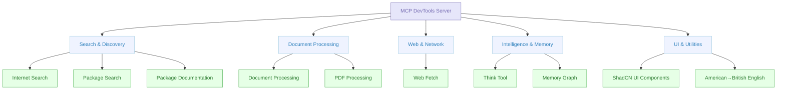

# MCP DevTools

A single, high-performance MCP server that replaces multiple Node.js and Python-based MCP servers with one efficient Go binary. Get access to essential developer tools through a unified, modular interface.



## Why MCP DevTools?

**🚀 Single Binary Solution**
- Replace multiple resource-heavy Node.js/Python MCP servers
- One binary, one configuration, consistent performance

**⚡ High Performance**
- Built in Go for speed and efficiency
- Minimal memory footprint compared to multiple separate servers
- Fast startup and response times

**🛠 Comprehensive Tool Suite**
- 10+ essential developer tools in one package
- No need to manage multiple MCP server installations
- Consistent API across all tools

**🔧 Simple Setup**
- Download one binary, configure once
- Optional dependencies only for specific tools
- Works out of the box for most tools

## Quick Start

### Installation

**Option 1: Go Install**
```bash
go install github.com/sammcj/mcp-devtools@HEAD
```

**Option 2: Build from Source**
```bash
git clone https://github.com/sammcj/mcp-devtools.git
cd mcp-devtools
make build
```

**Option 3: Download Release**
Download the latest binary from [releases](https://github.com/sammcj/mcp-devtools/releases) and place in your PATH.

### Basic MCP Configuration

**Minimal Setup (Most Tools Work):**
```json
{
  "mcpServers": {
    "dev-tools": {
      "type": "stdio",
      "command": "/path/to/mcp-devtools"
    }
  }
}
```

**Enhanced Setup (All Tools Available):**
```json
{
  "mcpServers": {
    "dev-tools": {
      "type": "stdio",
      "command": "/path/to/mcp-devtools",
      "env": {
        "BRAVE_API_KEY": "your-brave-api-key",
        "SEARXNG_BASE_URL": "https://your-searxng-instance.com"
      }
    }
  }
}
```

Replace `/path/to/mcp-devtools` with your actual binary path (e.g., `/Users/yourname/go/bin/mcp-devtools`).

## Available Tools

| Tool | Purpose | Dependencies | Quick Example |
|------|---------|--------------|---------------|
| **[Internet Search](docs/tools/internet-search.md)** | Multi-provider web search | Brave API key (optional) | Web, image, news, video search |
| **[Document Processing](docs/tools/document-processing.md)** | Convert documents to Markdown | Python 3.10+ | PDF, DOCX → Markdown with OCR |
| **[Package Search](docs/tools/package-search.md)** | Check package versions | None | NPM, Python, Go, Java, Docker |
| **[Think](docs/tools/think.md)** | Structured reasoning space | None | Complex problem analysis |
| **[Memory](docs/tools/memory.md)** | Persistent knowledge graphs | None | Store entities and relationships |
| **[PDF Processing](docs/tools/pdf-processing.md)** | Fast PDF text extraction | None | Quick PDF to Markdown |
| **[Web Fetch](docs/tools/web-fetch.md)** | Retrieve web content as Markdown | None | Documentation and articles |
| **[Package Documentation](docs/tools/package-documentation.md)** | Library documentation lookup | None | React, Django, TensorFlow docs |
| **[ShadCN UI](docs/tools/shadcn-ui.md)** | Component information | None | Button, Dialog, Form components |
| **[American→English](docs/tools/american-to-english.md)** | Convert to British spelling | None | Organise, colour, centre |

👉 **[See detailed tool documentation](docs/tools/overview.md)**

## Transport Options

MCP DevTools supports three transport modes for different use cases:

### STDIO Transport (Default)
**Best for**: MCP clients like Claude Desktop, Cline, etc.

```json
{
  "mcpServers": {
    "dev-tools": {
      "type": "stdio",
      "command": "/path/to/mcp-devtools",
      "env": {
        "BRAVE_API_KEY": "your-api-key-if-needed"
      }
    }
  }
}
```

### Streamable HTTP Transport
**Best for**: Web applications, API integration, production deployments

```bash
# Basic HTTP mode
mcp-devtools --transport http --port 8080

# With authentication
mcp-devtools --transport http --port 8080 --auth-token mysecrettoken

# With OAuth (see OAuth documentation)
mcp-devtools --transport http --port 8080 --oauth-enabled
```

**Client Configuration:**
```json
{
  "mcpServers": {
    "dev-tools": {
      "type": "streamableHttp",
      "url": "http://localhost:8080/http",
      "headers": {
        "Authorization": "Bearer mysecrettoken"
      }
    }
  }
}
```

### SSE Transport
**Best for**: Real-time applications, web dashboards

```bash
mcp-devtools --transport sse --port 18080 --base-url http://localhost
```

**Client Configuration:**
```json
{
  "mcpServers": {
    "dev-tools": {
      "type": "sse",
      "url": "http://localhost:18080/sse"
    }
  }
}
```

## Configuration Options

### Environment Variables

**Core Tools:**
- `BRAVE_API_KEY` - Enable Brave Search provider ([Get API key](https://brave.com/search/api/))
- `SEARXNG_BASE_URL` - Enable SearXNG search provider
- `MEMORY_FILE_PATH` - Memory storage location (default: `~/.mcp-devtools/`)
- `DISABLED_FUNCTIONS` - Comma-separated list of functions to disable

**Document Processing:**
- `DOCLING_PYTHON_PATH` - Python executable path (auto-detected)
- `DOCLING_CACHE_ENABLED` - Enable processing cache (default: `true`)
- `DOCLING_HARDWARE_ACCELERATION` - Hardware acceleration (`auto`, `mps`, `cuda`, `cpu`)

### Command-Line Options

- `--transport`, `-t` - Transport type (`stdio`, `sse`, `http`). Default: `stdio`
- `--port` - Port for HTTP transports. Default: `18080`
- `--base-url` - Base URL for HTTP transports. Default: `http://localhost`
- `--auth-token` - Authentication token for HTTP transport
- `--debug`, `-d` - Enable debug logging

## Architecture

MCP DevTools uses a modular architecture:

- **Tool Registry**: Central registry managing tool discovery and registration
- **Tool Interface**: Standardised interface all tools implement
- **Transport Layer**: Supports STDIO, HTTP, and SSE transports
- **Plugin System**: Easy to add new tools following the interface

Each tool is self-contained and registers automatically when the binary starts.

## Advanced Features

### OAuth 2.0/2.1 Authentication
For production deployments requiring user authentication:

👉 **[Complete OAuth Setup Guide](docs/oauth/README.md)**

Quick example:
```bash
# Browser-based authentication
mcp-devtools --transport http --oauth-browser-auth --oauth-client-id="your-client"

# Resource server mode  
mcp-devtools --transport http --oauth-enabled --oauth-issuer="https://auth.example.com"
```

### Docker Support
```bash
# Pull latest image
docker pull ghcr.io/sammcj/mcp-devtools:latest

# Run with environment variables
docker run -e BRAVE_API_KEY="your-key" ghcr.io/sammcj/mcp-devtools:latest
```

### Creating New Tools
Want to add your own tools? See the **[Development Guide](docs/development/creating-new-tools.md)**.

## Common Workflows

### Research & Documentation
```
Internet Search → Web Fetch → Document Processing → Memory
```

### Package Management  
```
Package Search → Package Documentation → Think → Memory
```

### Content Analysis
```
Document Processing → Think → Memory → American→English
```

### UI Development
```
ShadCN UI → Package Search → Web Fetch → Think
```

## Getting Help

- **Tool Documentation**: [docs/tools/overview.md](docs/tools/overview.md)
- **OAuth Setup**: [docs/oauth/README.md](docs/oauth/README.md)  
- **Development**: [docs/development/creating-new-tools.md](docs/development/creating-new-tools.md)
- **Issues**: [GitHub Issues](https://github.com/sammcj/mcp-devtools/issues)

## Contributing

Contributions welcome! This project follows standard Go development practices and includes comprehensive tests.

```bash
# Development setup
git clone https://github.com/sammcj/mcp-devtools.git
cd mcp-devtools
make deps
make test
make build
```

## Performance Benefits

**Compared to running 5+ separate MCP servers:**

| Metric | Multiple Servers | MCP DevTools |
|---------|------------------|--------------|
| **Memory Usage** | ~500MB+ | ~50MB |
| **Startup Time** | 10-30 seconds | 1-2 seconds |
| **Configuration** | 5+ separate configs | Single config |
| **Updates** | 5+ separate updates | One binary update |
| **Dependencies** | Node.js + Python + packages | One binary |

## License

Apache Public License 2.0 - Copyright 2025 Sam McLeod

---

**⭐ Star this repo if MCP DevTools saves you time and system resources!**
