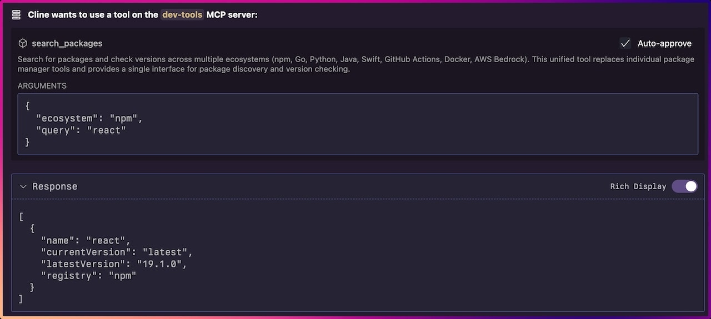

# MCP DevTools

This is a modular MCP server that provides various developer tools that I find useful when working with agentic coding tools such as Cline.

It started as a solution for having to install and run many nodejs and python based MCP servers that were eating up resources and hard to maintain. The goal is to have a single server that can handle multiple tools and provide a consistent interface for them with a modular architecture to support additional tools that I may add as I find a need for them.

```mermaid
graph TD
    A[MCP DevTools Server] --> B[Search Package Versions]
    A --> C[Internet Search]
    A --> D[Fetch Webpage]
    A --> E[Think]
    A --> F[ShadCN UI Components]
    A --> G[Memory]
    A --> H[Document Processing]
    A --> I[Package Documentation]
    A --> J[American to Intl. English]
    A --> K[PDF Processing]
    A --> L[OAuth 2.0/2.1 Authorisation]

    C --> C1[Brave]
    C --> C2[SearXNG]
    C --> C3[DuckDuckGo]

    D --> D1[Fetch URL as Markdown]

    H --> H5[OCR]
    H --> H6[vLLM]

    K --> K1[Text Extraction]
    K --> K2[Image Extraction]
    K --> K3[Markdown Output]

    classDef toolCategory fill:#E6E6FA,stroke:#756BB1,color:#756BB1
    classDef tool fill:#EFF3FF,stroke:#9ECAE1,color:#3182BD
    classDef searchTool fill:#E6FFE6,stroke:#4CAF50,color:#2E7D32
    classDef memoryTool fill:#FFF3E6,stroke:#FF9800,color:#F57C00
    classDef webTool fill:#E6F7FF,stroke:#2196F3,color:#1976D2
    classDef docTool fill:#F0E6FF,stroke:#9C27B0,color:#7B1FA2
    classDef packageTool fill:#FFF0E6,stroke:#FF6B35,color:#D84315
    classDef pdfTool fill:#FFE6E6,stroke:#E91E63,color:#C2185B

    class B,C,D,E,F,H,I,J,K toolCategory
    class B1,B2,E1,F1 tool
    class B1,C1,C2,C3 searchTool
    class G memoryTool
    class D1 webTool
    class H1,H2,H3,H4,H5,H6 docTool
    class I1,I2 packageTool
    class K1,K2,K3 pdfTool
```



---

- [MCP DevTools](#mcp-devtools)
  - [Features](#features)
    - [Package Versions](#package-versions)
    - [Internet Search](#internet-search)
    - [Think Tool](#think-tool)
    - [Memory Tool](#memory-tool)
    - [American to English Converter](#american-to-english-converter)
    - [Document Processing](#document-processing)
    - [Package Documentation](#package-documentation)
    - [PDF Processing](#pdf-processing)
    - [shadcn ui Components](#shadcn-ui-components)
  - [Screenshots](#screenshots)
  - [Installation](#installation)
    - [Version Information](#version-information)
  - [Usage](#usage)
    - [Install](#install)
    - [Configuration](#configuration)
  - [Tools](#tools)
    - [Think Tool](#think-tool-1)
    - [Package Documentation](#package-documentation-1)
    - [PDF Processing](#pdf-processing-1)
    - [Unified Package Search](#unified-package-search)
    - [shadcn ui Components](#shadcn-ui-components-1)
    - [Document Processing](#document-processing-1)
    - [Internet Search](#internet-search-1)
    - [OAuth 2.0/2.1 Authorisation](#oauth-2021-authorisation)
  - [Configuration](#configuration-2)
    - [Environment Variables](#environment-variables)
  - [Architecture](#architecture)
    - [Docker Images](#docker-images-1)
  - [Creating New Tools](#creating-new-tools)
  - [License](#license)

## Features

Currently, the server provides the following tools that should work across both macOS and Linux:

### Package Versions

**Unified Package Search Tool**: A single tool that handles package version checking across all supported ecosystems:

- **NPM packages** - Node.js dependencies from package.json
- **Python packages** - PyPI packages from requirements.txt and pyproject.toml
- **Java packages** - Maven and Gradle dependencies
- **Go modules** - Dependencies from go.mod
- **Swift packages** - Swift Package Manager dependencies
- **Docker images** - Container image tags from Docker Hub, GHCR, and custom registries
- **AWS Bedrock models** - Search and list available foundation models
- **GitHub Actions** - Latest versions of GitHub Actions

All package ecosystems are now accessible through the single `search_packages` tool with a consistent interface.

### Internet Search

The server provides unified internet search capabilities through multiple providers:

#### Brave Search

**Note**: These tools require a `BRAVE_API_KEY` environment variable to be enabled.

- **Web Search**: General web search using Brave Search API
- **Image Search**: Search for images with metadata
- **News Search**: Search for news articles and recent events
- **Local Search**: Search for local businesses and points of interest (requires Pro API plan)
- **Video Search**: Search for videos with metadata

#### SearXNG

**Note**: These tools require a `SEARXNG_BASE_URL` environment variable to be enabled. Optional authentication can be configured with `SEARXNG_USERNAME` and `SEARXNG_PASSWORD`.

- **Web Search**: General web search using SearXNG instance
- **Image Search**: Search for images through SearXNG
- **News Search**: Search for news articles and recent events
- **Video Search**: Search for videos through SearXNG

#### DuckDuckGo

**Note**: DuckDuckGo is always available as it doesn't require an API key or configuration. However, it provides lower quality results compared to Brave Search or SearXNG and only supports web search.

- **Web Search**: General web search using DuckDuckGo HTML interface

**Provider Selection**: The internet search tool automatically detects available providers and prioritises them as follows:
1. **Brave** (if API key is configured) - Highest quality results
2. **SearXNG** (if base URL is configured) - Privacy-focused with good quality
3. **DuckDuckGo** (always available) - Basic web search, no API key required

You can override the default provider by specifying the `provider` parameter in your search request.

### Think Tool

**Structured Reasoning Tool**: A simple tool that provides a dedicated thinking space for AI agents during complex workflows. Based on [Anthropic's research](https://www.anthropic.com/engineering/claude-think-tool) showing significant performance improvements in complex, multi-step scenarios.

- **Purpose**: Enable structured reasoning and analysis during complex workflows
- **Use Cases**: Analysing tool outputs, breaking down multi-step problems, planning sequential actions
- **Benefits**: Up to 54% improvement in complex scenarios, better consistency, enhanced decision-making

### Memory Tool

**Persistent Knowledge Graph Storage**: A tool that provides persistent memory capabilities for AI agents using a structured knowledge graph approach.

- **Entities**: Named nodes with types and observations (facts)
- **Relations**: Directed connections between entities
- **Namespaces**: Separate memory spaces for different projects/contexts
- **Fuzzy Search**: Enhanced search capabilities with relevance scoring
- **Concurrent Access**: Safe file operations with locking mechanisms
- **Configurable Storage**: Environment variable configuration for storage location

### American to English Converter

**'murican-to-english Tool**: Converts American English text to standard International / British English spelling using the [m2e](https://github.com/sammcj/m2e) library.

- **Comprehensive Dictionary**: Extensive mapping of American to English spellings
- **Format Preservation**: Maintains capitalisation, punctuation, and text structure
- **Code-Aware Processing**: Avoids converting programming terms and code blocks
- **Smart Quote Normalisation**: Optional conversion of smart quotes and em-dashes
- **User-Defined Dictionaries**: Supports custom spelling overrides

### Document Processing

**Experimental!** This tool is in active development and has more than a few rough edges.

**Intelligent Document Conversion Tool**: A powerful tool that converts PDF, DOCX, XLSX, PPTX, HTML, CSV, PNG, and JPG documents to structured Markdown using the [Docling](https://docling-project.github.io/docling/) library.

- **Multi-format Support**: PDF, DOCX, XLSX, PPTX, HTML, CSV, PNG, JPG document processing
- **Processing Profiles**: Simplified interface with preset configurations for common use cases
- **Intelligent Conversion**: Preserves document structure and formatting
- **OCR Support**: Extract text from scanned documents
- **Hardware Acceleration**: Supports MPS (macOS), CUDA, and CPU processing
- **Caching System**: Intelligent caching to avoid reprocessing identical documents
- **Metadata Extraction**: Extracts document metadata (title, author, page count, etc.)
- **Table & Image Extraction**: Preserves tables and images in markdown format
- **Diagram Analysis**: Advanced diagram detection and description using vision models
- **Mermaid Generation**: Convert diagrams to editable Mermaid syntax using external LLM
- **Auto-Save**: Automatically saves processed content to files by default

**Note**: The document processor tool requires Python 3.10+ (ideally 3.13+) with the Docling library installed (`pip install docling`). If you don't see the tool available in your client, check that you have docling installed and Python in your path. See the [Document Processing README](internal/tools/docprocessing/README.md) for detailed installation and configuration instructions.

### Package Documentation

**Library Documentation Retrieval**: Access comprehensive, up-to-date documentation for any library or framework through the Context7 API.

- **Library Resolution**: Intelligent matching of library names to Context7-compatible IDs
- **Documentation Retrieval**: Fetch comprehensive docs with configurable token limits (1K-100K)
- **Topic Filtering**: Focus on specific areas like "hooks", "routing", or "authentication"
- **Quality Metrics**: Trust scores, GitHub stars, and documentation coverage statistics
- **Alternative Suggestions**: Multiple library options with detailed selection rationale
- **AI-Optimised Content**: Documentation formatted specifically for AI consumption

The tool provides two main functions:
1. `resolve_library_id` - Find the correct library identifier from a name
2. `get_library_docs` - Retrieve documentation using the resolved ID

See the [Package Documentation README](internal/tools/packagedocs/README.md) for detailed usage instructions.

### PDF Processing

**PDF Text and Image Extraction Tool**: Extract text and images from PDF files using the [pdfcpu](https://github.com/pdfcpu/pdfcpu) library, converting them to well-formatted markdown with embedded image references.

- **Text Extraction**: Extracts readable text content from PDF pages while attempting to preserve layout
- **Image Extraction**: Extracts embedded images with proper naming and organisation
- **Markdown Output**: Generates structured markdown files with page-by-page content
- **Multi-page Support**: Process all pages or specific page ranges (e.g., "1-5", "1,3,5")
- **Automatic Linking**: Links extracted images in the correct locations within the markdown
- **Flexible Output**: Choose output directory or use the same directory as the source PDF

**Note**: The PDF processor tool uses pdfcpu for content extraction. Text extraction quality depends on the PDF structure and may not be perfect for complex layouts or scanned documents.

See the [PDF Processing README](internal/tools/pdf/README.md) for detailed usage instructions.

### shadcn ui Components

- List all available shadcn ui components
- Search for shadcn ui components by keyword
- Get detailed information (description, installation, usage, props) for a specific component
- Get usage examples for a specific component

## Screenshots



## Installation

```bash
go install github.com/sammcj/mcp-devtools@HEAD
```

Or clone the repository and build it:

```bash
git clone https://github.com/sammcj/mcp-devtools.git
cd mcp-devtools
make
```

### Version Information

You can check the version of the installed binary:

```bash
mcp-devtools version
```

## Usage

### Install

To install mcp-devtools you can either:

- Use go install: `go install github.com/sammcj/mcp-devtools@HEAD`
- Clone the repo and build it with `make build`
- Download the latest release binary from the [releases page](https://github.com/sammcj/mcp-devtools/releases) and save it in your PATH (e.g. /usr/local/bin/mcp-devtools)

### Configuration

The server supports three transport modes: stdio (default), SSE (Server-Sent Events), and Streamable HTTP (with optional SSE upgrade).

#### STDIO Transport

To run it in STDIO mode add it to your MCP configuration file:

```json
{
  "mcpServers": {
    "dev-tools": {
      "type": "stdio",
      "command": "/Users/samm/go/bin/mcp-devtools",
      "env": {
        "BRAVE_API_KEY": "your-brave-api-key-here-if-you-want-to-use-it"
      }
    }
  }
}
```

_Note: replace `/Users/samm/go/bin/mcp-devtools` with the path to your installed binary._

#### Streamable HTTP Transport

The new Streamable HTTP transport provides a more robust HTTP-based communication with optional authentication:

```bash
# Basic Streamable HTTP
mcp-devtools --transport http --port 8080

# With simple authentication
mcp-devtools --transport http --port 8080 --auth-token mysecrettoken

# With OAuth 2.0/2.1 authorisation
mcp-devtools --transport http --port 8080 \
    --oauth-enabled \
    --oauth-issuer="https://auth.example.com" \
    --oauth-audience="https://mcp.example.com" \
    --oauth-jwks-url="https://auth.example.com/.well-known/jwks.json"

# With custom endpoint path
mcp-devtools --transport http --port 8080 --endpoint-path /api/mcp
```

Configure your MCP client to connect to the Streamable HTTP transport:

```json
{
  "mcpServers": {
    "dev-tools": {
      "type": "streamableHttp",
      "url": "http://localhost:8080/http"
    }
  }
}
```

Or with authentication:

```json
{
  "mcpServers": {
    "dev-tools": {
      "type": "streamableHttp",
      "url": "http://localhost:8080/http",
      "headers": {
        "Authorization": "Bearer mysecrettoken"
      }
    }
  }
}
```

#### SSE (Only) Transport

```bash
mcp-devtools --transport sse --port 18080 --base-url http://localhost
```

Or if you built it locally:

```bash
./bin/mcp-devtools --transport sse --port 18080 --base-url http://localhost
```

And configure your MCP client to connect to the SSE transport:

```json
{
  "mcpServers": {
    "dev-tools": {
      "type": "sse",
      "url": "http://localhost:18080/sse"
    }
  }
}
```

#### Command-line Options

- `--transport`, `-t`: Transport type (stdio, sse, or http). Default: stdio
- `--port`: Port to use for HTTP transports (SSE and Streamable HTTP). Default: 18080
- `--base-url`: Base URL for HTTP transports. Default: http://localhost
- `--auth-token`: Authentication token for Streamable HTTP transport (optional)
- `--endpoint-path`: Endpoint path for Streamable HTTP transport. Default: /http
- `--session-timeout`: Session timeout for Streamable HTTP transport. Default: 30m0s
- `--debug`, `-d`: Enable debug logging. Default: false

## Tools

### Think Tool

The `think` tool provides a structured thinking space for AI agents during complex workflows:

```json
{
  "name": "think",
  "arguments": {
    "thought": "I need to analyse the API response before deciding which action to take next..."
  }
}
```

**When to use the think tool:**
- Analysing tool outputs before taking action
- Breaking down complex multi-step problems
- Reasoning through policy decisions or constraints
- Planning sequential actions where mistakes are costly
- Processing and reflecting on information gathered from previous tool calls

**Benefits:** Based on Anthropic's research, the think tool provides significant improvements in complex scenarios:
- 54% relative improvement in complex airline domain scenarios
- Better consistency across multiple trials
- Enhanced handling of edge cases and unusual scenarios

### Package Documentation

The package documentation tools provide access to comprehensive library documentation through the Context7 API:

#### `resolve_library_id`

Resolves a library name to a Context7-compatible library ID:

```json
{
  "name": "resolve_library_id",
  "arguments": {
    "libraryName": "react"
  }
}
```

**Parameters:**
- `libraryName` (required): Library name to search for (e.g., "react", "tensorflow", "express")

**Response:** Returns the best matching library ID with alternatives and selection rationale based on name similarity, trust scores, and documentation coverage.

#### `get_library_docs`

Fetches comprehensive documentation for a specific library:

```json
{
  "name": "get_library_docs",
  "arguments": {
    "context7CompatibleLibraryID": "/facebook/react",
    "topic": "hooks",
    "tokens": 15000
  }
}
```

**Parameters:**
- `context7CompatibleLibraryID` (required): Exact library ID from `resolve_library_id`
- `topic` (optional): Focus on specific topics (e.g., "hooks", "routing", "authentication")
- `tokens` (optional): Maximum tokens to retrieve (default: 10,000, max: 100,000)

**Response:** Returns formatted documentation with metadata including topic focus, token limits, and content length.

**Workflow:**
1. Use `resolve_library_id` to find the correct library identifier
2. Use `get_library_docs` with the resolved ID to fetch documentation

See the [Package Documentation README](internal/tools/packagedocs/README.md) for detailed information.

### PDF Processing

The `pdf` tool extracts text and images from PDF files, creating markdown output with embedded image references:

#### Basic Usage

```json
{
  "name": "pdf",
  "arguments": {
    "file_path": "/absolute/path/to/document.pdf"
  }
}
```

#### Advanced Usage

```json
{
  "name": "pdf",
  "arguments": {
    "file_path": "/absolute/path/to/document.pdf",
    "output_dir": "/absolute/path/to/output",
    "extract_images": true,
    "pages": "1-5"
  }
}
```

**Parameters:**
- `file_path` (required): Absolute file path to the PDF document to process
- `output_dir` (optional): Output directory for markdown and images (defaults to same directory as PDF)
- `extract_images` (optional): Whether to extract images from the PDF (default: true)
- `pages` (optional): Page range to process. Options:
  - `"all"` - Process all pages (default)
  - `"1-5"` - Process pages 1 through 5
  - `"1,3,5"` - Process pages 1, 3, and 5
  - `"1-3,7,10-12"` - Process pages 1-3, 7, and 10-12

**Response:** Returns paths to generated markdown file, extracted images, and processing statistics.

**Output:** Creates a markdown file with page-by-page content and an images directory with extracted images properly linked in the markdown.

See the [PDF Processing README](internal/tools/pdf/README.md) for detailed information.

### Unified Package Search

The `search_packages` tool provides a single interface for checking package versions across all supported ecosystems. Use the `ecosystem` parameter to specify which package manager to query:

#### NPM Packages

Search for NPM packages:

```json
{
  "name": "search_packages",
  "arguments": {
    "ecosystem": "npm",
    "query": "lodash"
  }
}
```

Or check multiple packages with constraints:

```json
{
  "name": "search_packages",
  "arguments": {
    "ecosystem": "npm",
    "data": {
      "react": "^17.0.2",
      "react-dom": "^17.0.2",
      "lodash": "4.17.21"
    },
    "constraints": {
      "react": {
        "majorVersion": 17
      }
    }
  }
}
```

#### Python Packages

Search for Python packages (PyPI):

```json
{
  "name": "search_packages",
  "arguments": {
    "ecosystem": "python",
    "query": "requests"
  }
}
```

Or check packages from requirements.txt format:

```json
{
  "name": "search_packages",
  "arguments": {
    "ecosystem": "python",
    "data": [
      "requests==2.28.1",
      "flask>=2.0.0",
      "numpy"
    ]
  }
}
```

For pyproject.toml format:

```json
{
  "name": "search_packages",
  "arguments": {
    "ecosystem": "python-pyproject",
    "data": {
      "dependencies": {
        "requests": "^2.28.1",
        "flask": ">=2.0.0"
      }
    }
  }
}
```

#### Go Modules

Search for Go modules:

```json
{
  "name": "search_packages",
  "arguments": {
    "ecosystem": "go",
    "query": "github.com/gin-gonic/gin"
  }
}
```

#### Java Packages

Search for Maven dependencies:

```json
{
  "name": "search_packages",
  "arguments": {
    "ecosystem": "java-maven",
    "data": [
      {
        "groupId": "org.springframework.boot",
        "artifactId": "spring-boot-starter-web",
        "version": "2.7.0"
      }
    ]
  }
}
```

Search for Gradle dependencies:

```json
{
  "name": "search_packages",
  "arguments": {
    "ecosystem": "java-gradle",
    "data": [
      {
        "configuration": "implementation",
        "group": "org.springframework.boot",
        "name": "spring-boot-starter-web",
        "version": "2.7.0"
      }
    ]
  }
}
```

#### Swift Packages

Search for Swift Package Manager dependencies:

```json
{
  "name": "search_packages",
  "arguments": {
    "ecosystem": "swift",
    "data": [
      {
        "url": "https://github.com/apple/swift-argument-parser",
        "version": "1.1.4"
      }
    ],
    "constraints": {
      "swift-argument-parser": {
        "majorVersion": 1
      }
    }
  }
}
```

#### Docker Images

Search for Docker image tags:

```json
{
  "name": "search_packages",
  "arguments": {
    "ecosystem": "docker",
    "query": "nginx",
    "registry": "dockerhub",
    "limit": 5,
    "includeDetails": true
  }
}
```

#### GitHub Actions

Search for GitHub Actions:

```json
{
  "name": "search_packages",
  "arguments": {
    "ecosystem": "github-actions",
    "query": "actions/checkout@v3",
    "includeDetails": true
  }
}
```

#### AWS Bedrock Models

List all AWS Bedrock models:

```json
{
  "name": "search_packages",
  "arguments": {
    "ecosystem": "bedrock",
    "action": "list"
  }
}
```

Search for specific models:

```json
{
  "name": "search_packages",
  "arguments": {
    "ecosystem": "bedrock",
    "action": "search",
    "query": "claude"
  }
}
```

### shadcn ui Components

The `shadcn` tool provides a unified interface for working with shadcn ui components. Use the `action` parameter to specify what you want to do:

List all available shadcn ui components:

```json
{
  "name": "shadcn",
  "arguments": {
    "action": "list"
  }
}
```

Search for shadcn ui components:

```json
{
  "name": "shadcn",
  "arguments": {
    "action": "search",
    "query": "button"
  }
}
```

Get detailed information for a specific shadcn ui component:

```json
{
  "name": "shadcn",
  "arguments": {
    "action": "details",
    "componentName": "alert-dialog"
  }
}
```

Get usage examples for a specific shadcn ui component:

```json
{
  "name": "shadcn",
  "arguments": {
    "action": "examples",
    "componentName": "accordion"
  }
}
```

### Document Processing

The `process_document` tool provides intelligent document conversion capabilities for PDF, DOCX, XLSX, PPTX, HTML, CSV, PNG, and JPG files:

#### Simple Usage (Recommended)

Process a document using the simplified interface with processing profiles:

```json
{
  "name": "process_document",
  "arguments": {
    "source": "/path/to/document.pdf"
  }
}
```

This uses the default `text-and-image` profile and automatically saves the processed content to `/path/to/document.md`.

#### Processing Profiles

Choose from preset profiles that configure multiple parameters automatically:

**Basic Text Extraction:**
```json
{
  "name": "process_document",
  "arguments": {
    "source": "/path/to/document.pdf",
    "profile": "basic"
  }
}
```

**Scanned Document Processing:**
```json
{
  "name": "process_document",
  "arguments": {
    "source": "/path/to/scanned-document.pdf",
    "profile": "scanned"
  }
}
```

**Advanced Diagram Processing (requires LLM configuration):**
```json
{
  "name": "process_document",
  "arguments": {
    "source": "/path/to/document.pdf",
    "profile": "llm-external"
  }
}
```

**Return Content Inline:**
```json
{
  "name": "process_document",
  "arguments": {
    "source": "/path/to/document.pdf",
    "inline": true
  }
}
```

#### Available Profiles

- **`basic`**: Fast text extraction only
- **`text-and-image`**: Text and image extraction with tables (default)
- **`scanned`**: OCR-focused processing for scanned documents
- **`llm-smoldocling`**: Enhanced with SmolDocling vision model
- **`llm-external`**: Full diagram-to-Mermaid conversion (requires LLM configuration)

#### Advanced Usage

For fine-grained control, you can still use individual parameters:

```json
{
  "name": "process_document",
  "arguments": {
    "source": "/path/to/document.pdf",
    "processing_mode": "advanced",
    "enable_ocr": true,
    "ocr_languages": ["en", "fr"],
    "preserve_images": true,
    "vision_mode": "smoldocling",
    "diagram_description": true,
    "cache_enabled": true,
    "timeout": 600
  }
}
```

#### Configuration

The document processing tool can be configured via environment variables:

```bash
# Python Configuration
DOCLING_PYTHON_PATH="/path/to/python"  # Auto-detected if not set

# Cache Configuration
DOCLING_CACHE_DIR="~/.mcp-devtools/docling-cache"
DOCLING_CACHE_ENABLED="true"

# Hardware Acceleration
DOCLING_HARDWARE_ACCELERATION="auto"  # auto, mps, cuda, cpu

# Processing Configuration
DOCLING_TIMEOUT="300"        # 5 minutes
DOCLING_MAX_FILE_SIZE="100"  # 100 MB

# OCR Configuration
DOCLING_OCR_LANGUAGES="en,fr,de"
```

**Prerequisites**: This tool requires Python 3.10+ (ideally 3.13+) with Docling installed:
```bash
pip install docling
```

**Use With Custom MITM Certs**: The document processing tool performs a pip install docling (if it's not found) and if you choose to use the advanced vLLM processing also has to download the SmolDocling model, as such some corporate environments that use MITM privacy-breaking proxies may need additional certs provided. Set the `DOCLING_EXTRA_CA_CERTS` environment variable to point to your certificate bundle:

```bash
DOCLING_EXTRA_CA_CERTS="/path/to/mitm-ca-bundle.pem"
```

For detailed installation and configuration instructions, see the [Document Processing README](internal/tools/docprocessing/README.md).

### Internet Search

**Configuration**: The internet search tool supports multiple providers. Configure the appropriate environment variables:

**For Brave Search:**
```bash
BRAVE_API_KEY="your-brave-api-key-here"
```
Get your API key from: https://brave.com/search/api/

**For SearXNG:**
```bash
SEARXNG_BASE_URL="https://your-searxng-instance.com"
# Optional authentication:
SEARXNG_USERNAME="your-username"
SEARXNG_PASSWORD="your-password"
```

The `internet_search` tool provides a unified interface for all internet search operations across different providers. Use the `type` parameter to specify the search type and `provider` to choose between available providers:

#### Web Search

Perform general web searches:

```json
{
  "name": "internet_search",
  "arguments": {
    "type": "web",
    "query": "golang best practices",
    "count": 10,
    "provider": "brave",
    "offset": 0,
    "freshness": "pw"
  }
}
```

#### Image Search

Search for images:

```json
{
  "name": "internet_search",
  "arguments": {
    "type": "image",
    "query": "golang gopher mascot",
    "count": 3,
    "provider": "searxng"
  }
}
```

#### News Search

Search for news articles and recent events:

```json
{
  "name": "internet_search",
  "arguments": {
    "type": "news",
    "query": "artificial intelligence breakthrough",
    "count": 10,
    "provider": "brave",
    "freshness": "pd"
  }
}
```

#### Video Search

Search for videos:

```json
{
  "name": "internet_search",
  "name": "internet_search",
  "arguments": {
    "type": "video",
    "query": "golang tutorial",
    "count": 10,
    "provider": "searxng",
    "time_range": "month"
  }
}
```

#### Local Search

Search for local businesses and places (Brave only, requires Pro API plan):

```json
{
  "name": "internet_search",
  "arguments": {
    "type": "local",
    "query": "Penny farthing bicycle shops in Fitzroy",
    "count": 5,
    "provider": "brave"
  }
}
```

#### DuckDuckGo Web Search

Basic web search using DuckDuckGo (no API key required):

```json
{
  "name": "internet_search",
  "arguments": {
    "type": "web",
    "query": "golang best practices",
    "count": 5,
    "provider": "duckduckgo"
  }
}
```

**Search Types:**
- `web`: General web search for broad information gathering
- `image`: Search for images (max 3 results)
- `news`: Search for recent news articles and events
- `video`: Search for video content and tutorials
- `local`: Search for local businesses and places (requires Pro API plan)

**Freshness Parameter Options:**
- `pd`: Discovered within the last 24 hours
- `pw`: Discovered within the last 7 days
- `pm`: Discovered within the last 31 days
- `py`: Discovered within the last 365 days
- `YYYY-MM-DDtoYYYY-MM-DD`: Custom date range (e.g., `2022-04-01to2022-07-30`)

### OAuth 2.0/2.1 Authorisation

**Optional OAuth 2.0/2.1 Support**: Enterprise-grade authorisation for HTTP-based MCP servers following the MCP 2025-06-18 specification.

#### Key Features:
- **🔐 JWT Token Validation**: Validates access tokens with JWKS support and audience checking
- **📋 Standards Compliant**: Implements OAuth 2.1, RFC8414, RFC9728, RFC7591, and RFC8707
- **🔑 Dynamic Client Registration**: RFC7591 compliant client registration endpoint
- **🛡️ PKCE Support**: Code challenge/verifier validation for enhanced security
- **⚙️ Environment Variables**: Configure via CLI flags or environment variables
- **🚀 Optional**: Completely optional, disabled by default

#### Quick Start:
```bash
# Via environment variables
OAUTH_ENABLED=true
OAUTH_ISSUER="https://auth.example.com"
OAUTH_AUDIENCE="https://mcp.example.com"
OAUTH_JWKS_URL="https://auth.example.com/.well-known/jwks.json"

./mcp-devtools --transport=http

# Or via CLI flags
./mcp-devtools --transport=http \
    --oauth-enabled \
    --oauth-issuer="https://auth.example.com" \
    --oauth-audience="https://mcp.example.com" \
    --oauth-jwks-url="https://auth.example.com/.well-known/jwks.json"
```

When enabled, OAuth metadata endpoints are available:
- `/.well-known/oauth-authorization-server` - Authorisation server metadata
- `/.well-known/oauth-protected-resource` - Protected resource metadata
- `/oauth/register` - Dynamic client registration _(if enabled)_

See [OAuth Documentation](internal/oauth/README.md) for complete configuration details.

## Configuration

### Environment Variables

#### Core Tools
- `BRAVE_API_KEY`: (optional) Required for Brave search tools to be enabled
- `SEARXNG_BASE_URL`: (optional) Required for SearXNG search tools to be enabled (e.g., `https://your-searxng-instance.com`)
- `SEARXNG_USERNAME`: (optional) Username for SearXNG authentication
- `SEARXNG_PASSWORD`: (optional) Password for SearXNG authentication
- `MEMORY_FILE_PATH`: (optional) Base directory or file path for memory storage (default: `~/.mcp-devtools/`)
- `MEMORY_ENABLE_FUZZY_SEARCH`: (optional) Enable fuzzy search capabilities for memory tool (default: `true`)
- `DISABLED_FUNCTIONS`: (optional) Comma-separated list of function names to disable, disabled functions will not appear in the tools list presented even if explicitly requested. e.g: `DISABLED_FUNCTIONS="shadcn_get_component_details,shadcn_get_component_examples,brave_local_search,brave_video_search"`

#### OAuth 2.0/2.1 Authorisation (Optional)
- `OAUTH_ENABLED` or `MCP_OAUTH_ENABLED`: Enable OAuth 2.0/2.1 authorisation (HTTP transport only)
- `OAUTH_ISSUER` or `MCP_OAUTH_ISSUER`: OAuth issuer URL (required if OAuth enabled)
- `OAUTH_AUDIENCE` or `MCP_OAUTH_AUDIENCE`: OAuth audience for this resource server
- `OAUTH_JWKS_URL` or `MCP_OAUTH_JWKS_URL`: JWKS URL for token validation
- `OAUTH_DYNAMIC_REGISTRATION` or `MCP_OAUTH_DYNAMIC_REGISTRATION`: Enable RFC7591 dynamic client registration
- `OAUTH_AUTHORIZATION_SERVER` or `MCP_OAUTH_AUTHORIZATION_SERVER`: Authorisation server URL (if different from issuer)
- `OAUTH_REQUIRE_HTTPS` or `MCP_OAUTH_REQUIRE_HTTPS`: Require HTTPS for OAuth endpoints (default: true)

See [OAuth Documentation](internal/oauth/README.md) for detailed OAuth configuration and usage examples.

## Architecture

The server is built with a modular architecture to make it easy to add new tools in the future. The main components are:

- **Core Tool Interface**: Defines the interface that all tools must implement.
- **Central Tool Registry**: Manages the registration and retrieval of tools.
- **Tool Modules**: Individual tool implementations organized by category.

### Docker Images

Docker images are available from GitHub Container Registry:

```bash
docker pull ghcr.io/sammcj/mcp-devtools:latest
```

Or with a specific version:

```bash
docker pull ghcr.io/sammcj/mcp-devtools:v1.0.0
```

## Creating New Tools

See [Creating New Tools](docs/creating-new-tools.md) for detailed instructions on how to create new tools for the MCP DevTools server.

## License

- Copyright 2025 Sam McLeod
- Apache Public License 2.0
