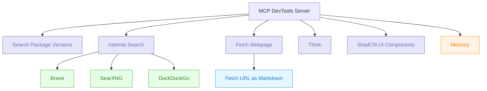

# MCP DevTools

This is a modular MCP server that provides various developer tools that I find useful when working with agentic coding tools such as Cline.

It started as a solution for having to install and run many nodejs and python based MCP servers that were eating up resources and hard to maintain. The goal is to have a single server that can handle multiple tools and provide a consistent interface for them with a modular architecture to support additional tools that I may add as I find a need for them.



---

- [MCP DevTools](#mcp-devtools)
  - [Features](#features)
    - [Package Versions](#package-versions)
    - [Internet Search](#internet-search)
    - [Think Tool](#think-tool)
    - [Memory Tool](#memory-tool)
    - [shadcn ui Components](#shadcn-ui-components)
  - [Screenshots](#screenshots)
  - [Installation](#installation)
    - [Version Information](#version-information)
  - [Usage](#usage)
    - [Install](#install)
    - [Configuration](#configuration)
  - [Tools](#tools)
    - [Think Tool](#think-tool-1)
    - [Unified Package Search](#unified-package-search)
    - [shadcn ui Components](#shadcn-ui-components-1)
    - [Internet Search](#internet-search-1)
  - [Configuration](#configuration-1)
    - [Environment Variables](#environment-variables)
  - [Architecture](#architecture)
  - [Creating New Tools](#creating-new-tools)
    - [Tool Interface](#tool-interface)
    - [Tool Structure](#tool-structure)
    - [Step-by-Step Guide](#step-by-step-guide)
    - [Example: Hello World Tool](#example-hello-world-tool)
    - [Testing Your Tool](#testing-your-tool)
  - [Testing](#testing)
  - [Releases and CI/CD](#releases-and-cicd)
    - [Creating a Release](#creating-a-release)
    - [Docker Images](#docker-images-1)
  - [License](#license)

## Features

Currently, the server provides the following tools:

### Package Versions

**Unified Package Search Tool**: A single tool that handles package version checking across all supported ecosystems:

- **NPM packages** - Node.js dependencies from package.json
- **Python packages** - PyPI packages from requirements.txt and pyproject.toml
- **Java packages** - Maven and Gradle dependencies
- **Go modules** - Dependencies from go.mod
- **Swift packages** - Swift Package Manager dependencies
- **Docker images** - Container image tags from Docker Hub, GHCR, and custom registries
- **AWS Bedrock models** - Search and list available foundation models
- **GitHub Actions** - Latest versions of GitHub Actions

All package ecosystems are now accessible through the single `search_packages` tool with a consistent interface.

### Internet Search

The server provides unified internet search capabilities through multiple providers:

#### Brave Search

**Note**: These tools require a `BRAVE_API_KEY` environment variable to be enabled.

- **Web Search**: General web search using Brave Search API
- **Image Search**: Search for images with metadata
- **News Search**: Search for news articles and recent events
- **Local Search**: Search for local businesses and points of interest (requires Pro API plan)
- **Video Search**: Search for videos with metadata

#### SearXNG

**Note**: These tools require a `SEARXNG_BASE_URL` environment variable to be enabled. Optional authentication can be configured with `SEARXNG_USERNAME` and `SEARXNG_PASSWORD`.

- **Web Search**: General web search using SearXNG instance
- **Image Search**: Search for images through SearXNG
- **News Search**: Search for news articles and recent events
- **Video Search**: Search for videos through SearXNG

#### DuckDuckGo

**Note**: DuckDuckGo is always available as it doesn't require an API key or configuration. However, it provides lower quality results compared to Brave Search or SearXNG and only supports web search.

- **Web Search**: General web search using DuckDuckGo HTML interface

**Provider Selection**: The internet search tool automatically detects available providers and prioritises them as follows:
1. **Brave** (if API key is configured) - Highest quality results
2. **SearXNG** (if base URL is configured) - Privacy-focused with good quality
3. **DuckDuckGo** (always available) - Basic web search, no API key required

You can override the default provider by specifying the `provider` parameter in your search request.

### Think Tool

**Structured Reasoning Tool**: A simple tool that provides a dedicated thinking space for AI agents during complex workflows. Based on [Anthropic's research](https://www.anthropic.com/engineering/claude-think-tool) showing significant performance improvements in complex, multi-step scenarios.

- **Purpose**: Enable structured reasoning and analysis during complex workflows
- **Use Cases**: Analysing tool outputs, breaking down multi-step problems, planning sequential actions
- **Benefits**: Up to 54% improvement in complex scenarios, better consistency, enhanced decision-making

### Memory Tool

**Persistent Knowledge Graph Storage**: A tool that provides persistent memory capabilities for AI agents using a structured knowledge graph approach.

- **Entities**: Named nodes with types and observations (facts)
- **Relations**: Directed connections between entities
- **Namespaces**: Separate memory spaces for different projects/contexts
- **Fuzzy Search**: Enhanced search capabilities with relevance scoring
- **Concurrent Access**: Safe file operations with locking mechanisms
- **Configurable Storage**: Environment variable configuration for storage location

### shadcn ui Components

- List all available shadcn ui components
- Search for shadcn ui components by keyword
- Get detailed information (description, installation, usage, props) for a specific component
- Get usage examples for a specific component

## Screenshots


## Installation

```bash
go install github.com/sammcj/mcp-devtools@HEAD
```

Or clone the repository and build it:

```bash
git clone https://github.com/sammcj/mcp-devtools.git
cd mcp-devtools
make
```

### Version Information

You can check the version of the installed binary:

```bash
mcp-devtools version
```

## Usage

### Install

To install mcp-devtools you can either:

- Use go install: `go install github.com/sammcj/mcp-devtools@HEAD`
- Clone the repo and build it with `make build`
- Download the latest release binary from the [releases page](https://github.com/sammcj/mcp-devtools/releases) and save it in your PATH (e.g. /usr/local/bin/mcp-devtools)

### Configuration

The server supports three transport modes: stdio (default), SSE (Server-Sent Events), and Streamable HTTP (with optional SSE upgrade).

#### STDIO Transport

To run it in STDIO mode add it to your MCP configuration file:

```json
{
  "mcpServers": {
    "dev-tools": {
      "type": "stdio",
      "command": "/Users/samm/go/bin/mcp-devtools",
      "env": {
        "BRAVE_API_KEY": "your-brave-api-key-here-if-you-want-to-use-it"
      }
    }
  }
}
```

_Note: replace `/Users/samm/go/bin/mcp-devtools` with the path to your installed binary._

#### Streamable HTTP Transport

The new Streamable HTTP transport provides a more robust HTTP-based communication with optional authentication:

```bash
# Basic Streamable HTTP
mcp-devtools --transport http --port 8080

# With authentication
mcp-devtools --transport http --port 8080 --auth-token mysecrettoken

# With custom endpoint path
mcp-devtools --transport http --port 8080 --endpoint-path /api/mcp
```

Configure your MCP client to connect to the Streamable HTTP transport:

```json
{
  "mcpServers": {
    "dev-tools": {
      "type": "streamableHttp",
      "url": "http://localhost:8080/http"
    }
  }
}
```

Or with authentication:

```json
{
  "mcpServers": {
    "dev-tools": {
      "type": "streamableHttp",
      "url": "http://localhost:8080/http",
      "headers": {
        "Authorization": "Bearer mysecrettoken"
      }
    }
  }
}
```

#### SSE (Only) Transport

```bash
mcp-devtools --transport sse --port 18080 --base-url http://localhost
```

Or if you built it locally:

```bash
./bin/mcp-devtools --transport sse --port 18080 --base-url http://localhost
```

And configure your MCP client to connect to the SSE transport:

```json
{
  "mcpServers": {
    "dev-tools": {
      "type": "sse",
      "url": "http://localhost:18080/sse"
    }
  }
}
```

#### Command-line Options

- `--transport`, `-t`: Transport type (stdio, sse, or http). Default: stdio
- `--port`: Port to use for HTTP transports (SSE and Streamable HTTP). Default: 18080
- `--base-url`: Base URL for HTTP transports. Default: http://localhost
- `--auth-token`: Authentication token for Streamable HTTP transport (optional)
- `--endpoint-path`: Endpoint path for Streamable HTTP transport. Default: /http
- `--session-timeout`: Session timeout for Streamable HTTP transport. Default: 30m0s
- `--debug`, `-d`: Enable debug logging. Default: false

## Tools

### Think Tool

The `think` tool provides a structured thinking space for AI agents during complex workflows:

```json
{
  "name": "think",
  "arguments": {
    "thought": "I need to analyse the API response before deciding which action to take next..."
  }
}
```

**When to use the think tool:**
- Analysing tool outputs before taking action
- Breaking down complex multi-step problems
- Reasoning through policy decisions or constraints
- Planning sequential actions where mistakes are costly
- Processing and reflecting on information gathered from previous tool calls

**Benefits:** Based on Anthropic's research, the think tool provides significant improvements in complex scenarios:
- 54% relative improvement in complex airline domain scenarios
- Better consistency across multiple trials
- Enhanced handling of edge cases and unusual scenarios

### Unified Package Search

The `search_packages` tool provides a single interface for checking package versions across all supported ecosystems. Use the `ecosystem` parameter to specify which package manager to query:

#### NPM Packages

Search for NPM packages:

```json
{
  "name": "search_packages",
  "arguments": {
    "ecosystem": "npm",
    "query": "lodash"
  }
}
```

Or check multiple packages with constraints:

```json
{
  "name": "search_packages",
  "arguments": {
    "ecosystem": "npm",
    "data": {
      "react": "^17.0.2",
      "react-dom": "^17.0.2",
      "lodash": "4.17.21"
    },
    "constraints": {
      "react": {
        "majorVersion": 17
      }
    }
  }
}
```

#### Python Packages

Search for Python packages (PyPI):

```json
{
  "name": "search_packages",
  "arguments": {
    "ecosystem": "python",
    "query": "requests"
  }
}
```

Or check packages from requirements.txt format:

```json
{
  "name": "search_packages",
  "arguments": {
    "ecosystem": "python",
    "data": [
      "requests==2.28.1",
      "flask>=2.0.0",
      "numpy"
    ]
  }
}
```

For pyproject.toml format:

```json
{
  "name": "search_packages",
  "arguments": {
    "ecosystem": "python-pyproject",
    "data": {
      "dependencies": {
        "requests": "^2.28.1",
        "flask": ">=2.0.0"
      }
    }
  }
}
```

#### Go Modules

Search for Go modules:

```json
{
  "name": "search_packages",
  "arguments": {
    "ecosystem": "go",
    "query": "github.com/gin-gonic/gin"
  }
}
```

#### Java Packages

Search for Maven dependencies:

```json
{
  "name": "search_packages",
  "arguments": {
    "ecosystem": "java-maven",
    "data": [
      {
        "groupId": "org.springframework.boot",
        "artifactId": "spring-boot-starter-web",
        "version": "2.7.0"
      }
    ]
  }
}
```

Search for Gradle dependencies:

```json
{
  "name": "search_packages",
  "arguments": {
    "ecosystem": "java-gradle",
    "data": [
      {
        "configuration": "implementation",
        "group": "org.springframework.boot",
        "name": "spring-boot-starter-web",
        "version": "2.7.0"
      }
    ]
  }
}
```

#### Swift Packages

Search for Swift Package Manager dependencies:

```json
{
  "name": "search_packages",
  "arguments": {
    "ecosystem": "swift",
    "data": [
      {
        "url": "https://github.com/apple/swift-argument-parser",
        "version": "1.1.4"
      }
    ],
    "constraints": {
      "swift-argument-parser": {
        "majorVersion": 1
      }
    }
  }
}
```

#### Docker Images

Search for Docker image tags:

```json
{
  "name": "search_packages",
  "arguments": {
    "ecosystem": "docker",
    "query": "nginx",
    "registry": "dockerhub",
    "limit": 5,
    "includeDetails": true
  }
}
```

#### GitHub Actions

Search for GitHub Actions:

```json
{
  "name": "search_packages",
  "arguments": {
    "ecosystem": "github-actions",
    "query": "actions/checkout@v3",
    "includeDetails": true
  }
}
```

#### AWS Bedrock Models

List all AWS Bedrock models:

```json
{
  "name": "search_packages",
  "arguments": {
    "ecosystem": "bedrock",
    "action": "list"
  }
}
```

Search for specific models:

```json
{
  "name": "search_packages",
  "arguments": {
    "ecosystem": "bedrock",
    "action": "search",
    "query": "claude"
  }
}
```

### shadcn ui Components

The `shadcn` tool provides a unified interface for working with shadcn ui components. Use the `action` parameter to specify what you want to do:

List all available shadcn ui components:

```json
{
  "name": "shadcn",
  "arguments": {
    "action": "list"
  }
}
```

Search for shadcn ui components:

```json
{
  "name": "shadcn",
  "arguments": {
    "action": "search",
    "query": "button"
  }
}
```

Get detailed information for a specific shadcn ui component:

```json
{
  "name": "shadcn",
  "arguments": {
    "action": "details",
    "componentName": "alert-dialog"
  }
}
```

Get usage examples for a specific shadcn ui component:

```json
{
  "name": "shadcn",
  "arguments": {
    "action": "examples",
    "componentName": "accordion"
  }
}
```

### Internet Search

**Configuration**: The internet search tool supports multiple providers. Configure the appropriate environment variables:

**For Brave Search:**
```bash
export BRAVE_API_KEY="your-brave-api-key-here"
```
Get your API key from: https://brave.com/search/api/

**For SearXNG:**
```bash
export SEARXNG_BASE_URL="https://your-searxng-instance.com"
# Optional authentication:
export SEARXNG_USERNAME="your-username"
export SEARXNG_PASSWORD="your-password"
```

The `internet_search` tool provides a unified interface for all internet search operations across different providers. Use the `type` parameter to specify the search type and `provider` to choose between available providers:

#### Web Search

Perform general web searches:

```json
{
  "name": "internet_search",
  "arguments": {
    "type": "web",
    "query": "golang best practices",
    "count": 10,
    "provider": "brave",
    "offset": 0,
    "freshness": "pw"
  }
}
```

#### Image Search

Search for images:

```json
{
  "name": "internet_search",
  "arguments": {
    "type": "image",
    "query": "golang gopher mascot",
    "count": 3,
    "provider": "searxng"
  }
}
```

#### News Search

Search for news articles and recent events:

```json
{
  "name": "internet_search",
  "arguments": {
    "type": "news",
    "query": "artificial intelligence breakthrough",
    "count": 10,
    "provider": "brave",
    "freshness": "pd"
  }
}
```

#### Video Search

Search for videos:

```json
{
  "name": "internet_search",
  "name": "internet_search",
  "arguments": {
    "type": "video",
    "query": "golang tutorial",
    "count": 10,
    "provider": "searxng",
    "time_range": "month"
  }
}
```

#### Local Search

Search for local businesses and places (Brave only, requires Pro API plan):

```json
{
  "name": "internet_search",
  "arguments": {
    "type": "local",
    "query": "Penny farthing bicycle shops in Fitzroy",
    "count": 5,
    "provider": "brave"
  }
}
```

#### DuckDuckGo Web Search

Basic web search using DuckDuckGo (no API key required):

```json
{
  "name": "internet_search",
  "arguments": {
    "type": "web",
    "query": "golang best practices",
    "count": 5,
    "provider": "duckduckgo"
  }
}
```

**Search Types:**
- `web`: General web search for broad information gathering
- `image`: Search for images (max 3 results)
- `news`: Search for recent news articles and events
- `video`: Search for video content and tutorials
- `local`: Search for local businesses and places (requires Pro API plan)

**Freshness Parameter Options:**
- `pd`: Discovered within the last 24 hours
- `pw`: Discovered within the last 7 days
- `pm`: Discovered within the last 31 days
- `py`: Discovered within the last 365 days
- `YYYY-MM-DDtoYYYY-MM-DD`: Custom date range (e.g., `2022-04-01to2022-07-30`)

## Configuration

### Environment Variables

- `BRAVE_API_KEY`: (optional) Required for Brave search tools to be enabled
- `SEARXNG_BASE_URL`: (optional) Required for SearXNG search tools to be enabled (e.g., `https://your-searxng-instance.com`)
- `SEARXNG_USERNAME`: (optional) Username for SearXNG authentication
- `SEARXNG_PASSWORD`: (optional) Password for SearXNG authentication
- `MEMORY_FILE_PATH`: (optional) Base directory or file path for memory storage (default: `~/.mcp-devtools/`)
- `MEMORY_ENABLE_FUZZY_SEARCH`: (optional) Enable fuzzy search capabilities for memory tool (default: `true`)
- `DISABLED_FUNCTIONS`: (optional) Comma-separated list of function names to disable, disabled functions will not appear in the tools list presented even if explicitly requested. e.g: `DISABLED_FUNCTIONS="shadcn_get_component_details,shadcn_get_component_examples,brave_local_search,brave_video_search"`

## Architecture

The server is built with a modular architecture to make it easy to add new tools in the future. The main components are:

- **Core Tool Interface**: Defines the interface that all tools must implement.
- **Central Tool Registry**: Manages the registration and retrieval of tools.
- **Tool Modules**: Individual tool implementations organized by category.

## Creating New Tools

The MCP DevTools server is designed to be easily extensible with new tools. This section provides detailed guidance on how to create and integrate new tools into the server.

### Tool Interface

All tools must implement the `tools.Tool` interface defined in `internal/tools/tools.go`:

```go
type Tool interface {
    // Definition returns the tool's definition for MCP registration
    Definition() mcp.Tool

    // Execute executes the tool's logic
    Execute(ctx context.Context, logger *logrus.Logger, cache *sync.Map, args map[string]interface{}) (*mcp.CallToolResult, error)
}
```

### Tool Structure

A typical tool implementation follows this structure:

1. **Tool Type**: Define a struct that will implement the Tool interface
2. **Registration**: Register the tool with the registry in an `init()` function
3. **Definition**: Implement the `Definition()` method to define the tool's name, description, and parameters
4. **Execution**: Implement the `Execute()` method to perform the tool's logic

### Step-by-Step Guide

#### 1. Create a New Package

Create a new package in the appropriate category under `internal/tools/` or create a new category if needed:

```bash
mkdir -p internal/tools/your-category/your-tool
touch internal/tools/your-category/your-tool/your-tool.go
```

#### 2. Implement the Tool Interface

Here's a template for implementing a new tool:

```go
package yourtool

import (
    "context"
    "fmt"
    "sync"

    "github.com/mark3labs/mcp-go/mcp"
    "github.com/sammcj/mcp-devtools/internal/registry"
    "github.com/sirupsen/logrus"
)

// YourTool implements the tools.Tool interface
type YourTool struct {
    // Add any fields your tool needs here
}

// init registers the tool with the registry
func init() {
    registry.Register(&YourTool{})
}

// Definition returns the tool's definition for MCP registration
func (t *YourTool) Definition() mcp.Tool {
    return mcp.NewTool(
        "your_tool_name",
        mcp.WithDescription("Description of your tool"),
        // Define required parameters
        mcp.WithString("param1",
            mcp.Required(),
            mcp.Description("Description of param1"),
        ),
        // Define optional parameters
        mcp.WithNumber("param2",
            mcp.Description("Description of param2"),
            mcp.DefaultNumber(10),
        ),
        // Add more parameters as needed
    )
}

// Execute executes the tool's logic
func (t *YourTool) Execute(ctx context.Context, logger *logrus.Logger, cache *sync.Map, args map[string]interface{}) (*mcp.CallToolResult, error) {
    // Log the start of execution
    logger.Info("Executing your tool")

    // Parse parameters
    param1, ok := args["param1"].(string)
    if !ok {
        return nil, fmt.Errorf("missing required parameter: param1")
    }

    // Parse optional parameters with defaults
    param2 := float64(10)
    if param2Raw, ok := args["param2"].(float64); ok {
        param2 = param2Raw
    }

    // Implement your tool's logic here
    result := map[string]interface{}{
        "message": fmt.Sprintf("Tool executed with param1=%s, param2=%f", param1, param2),
        // Add more result fields as needed
    }

    // Return the result
    return mcp.NewCallToolResult(result), nil
}
```

#### 3. Parameter Schema

The MCP framework supports various parameter types:

- **String**: `mcp.WithString("name", ...)`
- **Number**: `mcp.WithNumber("name", ...)`
- **Boolean**: `mcp.WithBoolean("name", ...)`
- **Array**: `mcp.WithArray("name", ...)`
- **Object**: `mcp.WithObject("name", ...)`

For each parameter, you can specify:

- **Required**: `mcp.Required()` - Mark the parameter as required
- **Description**: `mcp.Description("...")` - Provide a description
- **Default Value**: `mcp.DefaultString("...")`, `mcp.DefaultNumber(10)`, `mcp.DefaultBool(false)` - Set a default value
- **Enum**: `mcp.Enum("value1", "value2", ...)` - Restrict to a set of values
- **Properties**: `mcp.Properties(map[string]interface{}{...})` - Define properties for object parameters

#### 4. Result Schema

The result of a tool execution should be a `*mcp.CallToolResult` object, which can be created with:

```go
mcp.NewCallToolResult(result)
```

Where `result` is a `map[string]interface{}` containing the tool's output data.

For structured results, you can use:

```go
// Define a result struct
type Result struct {
    Message string `json:"message"`
    Count   int    `json:"count"`
}

// Create a result
result := Result{
    Message: "Tool executed successfully",
    Count:   42,
}

// Convert to JSON
resultJSON, err := json.Marshal(result)
if err != nil {
    return nil, fmt.Errorf("failed to marshal result: %w", err)
}

// Create a CallToolResult
return mcp.NewCallToolResultJSON(resultJSON)
```

#### 5. Caching

The `cache` parameter in the `Execute` method is a shared cache that can be used to store and retrieve data across tool executions:

```go
// Store a value in the cache
cache.Store("key", value)

// Retrieve a value from the cache
if cachedValue, ok := cache.Load("key"); ok {
    // Use cachedValue
}
```

#### 6. Import the Tool Package

Finally, import your tool package in `main.go` to ensure it's registered:

```go
import _ "github.com/sammcj/mcp-devtools/internal/tools/your-category/your-tool"
```

### Example: Hello World Tool

Here's a simple "Hello World" tool example:

```go
package hello

import (
    "context"
    "fmt"
    "sync"

    "github.com/mark3labs/mcp-go/mcp"
    "github.com/sammcj/mcp-devtools/internal/registry"
    "github.com/sirupsen/logrus"
)

// HelloTool implements a simple hello world tool
type HelloTool struct{}

// init registers the tool with the registry
func init() {
    registry.Register(&HelloTool{})
}

// Definition returns the tool's definition for MCP registration
func (t *HelloTool) Definition() mcp.Tool {
    return mcp.NewTool(
        "hello_world",
        mcp.WithDescription("A simple hello world tool"),
        mcp.WithString("name",
            mcp.Description("Name to greet"),
            mcp.DefaultString("World"),
        ),
    )
}

// Execute executes the tool's logic
func (t *HelloTool) Execute(ctx context.Context, logger *logrus.Logger, cache *sync.Map, args map[string]interface{}) (*mcp.CallToolResult, error) {
    // Parse parameters
    name := "World"
    if nameRaw, ok := args["name"].(string); ok && nameRaw != "" {
        name = nameRaw
    }

    // Create result
    result := map[string]interface{}{
        "message": fmt.Sprintf("Hello, %s!", name),
    }

    // Return the result
    return mcp.NewCallToolResult(result), nil
}
```

### Testing Your Tool

To test your tool:

1. Build the server: `make build`
2. Run the server: `make run`
3. Send a request to the server:

```json
{
  "name": "your_tool_name",
  "arguments": {
    "param1": "value1",
    "param2": 42
  }
}
```

## Testing

The project includes unit tests for core functionality. Tests are designed to be lightweight and fast, avoiding external dependencies.

```bash
# Run all tests
make test

# Run only fast tests (no external dependencies)
make test-fast
```

## Releases and CI/CD

This project uses GitHub Actions for continuous integration and deployment. The workflow automatically:

1. Builds and tests the application on every push to the main branch and pull requests
2. Creates a release when a tag with the format `v*` (e.g., `v1.0.0`) is pushed
3. Builds and pushes Docker images to GitHub Container Registry

### Creating a Release

To create a new release:

1. Update the version in your code if necessary
2. Tag the commit with a semantic version:
   ```bash
   git tag -a v1.0.0 -m "Release v1.0.0"
   git push origin v1.0.0
   ```
3. The GitHub Actions workflow will automatically:
   - Build and test the application
   - Create a GitHub release with the binary
   - Generate a changelog based on commits since the last release
   - Build and push Docker images with appropriate tags

### Docker Images

Docker images are available from GitHub Container Registry:

```bash
docker pull ghcr.io/sammcj/mcp-devtools:latest
```

Or with a specific version:

```bash
docker pull ghcr.io/sammcj/mcp-devtools:v1.0.0
```

## License

MIT
