# MCP DevTools

A single, high-performance MCP server that replaces many Node.js and Python-based MCP servers with one efficient Go binary, providing access to essential developer tools through a unified, modular interface that can be easily extended with new tools.

```mermaid
graph LR
    A[MCP DevTools<br>Server]

    A --> B[Search &<br>Discovery]
    A --> C[Document<br>Processing]
    A --> D[Security<br>Analysis]
    A --> E[Intelligence &<br>Memory]
    A --> F[Utilities]
    A --> G[Agents]

    B --> B_Tools[🌐 Internet Search<br>📡 Web Fetch<br>📦 Package Search<br>📚 Package Documentation<br>🐙 GitHub<br>🎨 ShadCN UI Components<br>🔌 API Integration<br>☁️ AWS Documentation<br📝>Terraform Documentation]

    C --> C_Tools[📄 Document Processing<br>📑 PDF Processing]

    D --> D_Tools[📋 SBOM Generation<br>🛡️ Vulnerability Scan<br>🔒 Security Framework<br>🛠️ Security Override]

    E --> E_Tools[🧠 Think Tool<br>🔢 Sequential Thinking<br>🕸️ Memory Graph]

    F --> F_Tools[🧮 Calculator<br>🇬🇧 American→English<br>📁 Filesystem<br>📝 Changelog Generation]

    G --> G_Tools[🤖 Claude Code<br>✨ Gemini CLI<br>🅰️ Q Developer]

    classDef inputOutput fill:#FEE0D2,stroke:#E6550D,color:#E6550D
    classDef llm fill:#E5F5E0,stroke:#31A354,color:#31A354
    classDef components fill:#E6E6FA,stroke:#756BB1,color:#756BB1
    classDef process fill:#EAF5EA,stroke:#C6E7C6,color:#77AD77
    classDef stop fill:#E5E1F2,stroke:#C7C0DE,color:#8471BF
    classDef data fill:#EFF3FF,stroke:#9ECAE1,color:#3182BD
    classDef decision fill:#FFF5EB,stroke:#FD8D3C,color:#E6550D
    classDef storage fill:#F2F0F7,stroke:#BCBDDC,color:#756BB1
    classDef api fill:#FFF5F0,stroke:#FD9272,color:#A63603
    classDef error fill:#FCBBA1,stroke:#FB6A4A,color:#CB181D

    class A components
    class B,B_Tools decision
    class C,C_Tools api
    class D,D_Tools error
    class E,E_Tools data
    class F,F_Tools process
    class G,G_Tools llm
```



## Why I Built MCP DevTools

**🚀 Single Binary Solution**
- Replace multiple potentially resource-heavy Node.js/Python MCP servers, each spawned for every client tool you use
- One binary, one configuration, consistent performance
- Built in Go for speed and efficiency and because I'm not smart enough to write Rust
- Minimal memory footprint compared to multiple separate servers
- Fast startup and response times
- Download one binary, configure once - or compile from source
- Optional dependencies only for specific tools
- Works out of the box for most tools

**🛠 Comprehensive Tool Suite**
- 16+ essential developer tools in one package
- No need to manage multiple MCP server installations
- Consistent API across all tools
- Modular design with tool registry allowing for easy addition of new tools

## Quickstart

You must have a recent version of Go installed.

1. Install the latest MCP DevTools binary:

```shell
go install github.com/sammcj/mcp-devtools@HEAD
echo "${GOPATH}/bin/mcp-devtools" # Use this path in your MCP configuration, if your GOPATH is not set, please check your Go installation / configuration.

# If you're on macOS, you'll also need to run the following command to allow the downloaded binary to run:
xattr -r -d com.apple.quarantine ${GOPATH}/bin/mcp-devtools
```

1. Update your MCP client to add the MCP DevTools server configuration, replacing `/path/to/mcp-devtools` with the actual path to the binary (e.g. `/Users/samm/go/bin/mcp-devtools`):
```json
{
  "mcpServers": {
    "dev-tools": {
      "type": "stdio",
      "command": "/path/to/mcp-devtools",
      "env": {
        "DISABLED_FUNCTIONS": "think", // Optional, disable specific tools if not needed
        "ENABLE_ADDITIONAL_TOOLS": "security,security_override,sbom,vulnerability_scan,memory" // Optional, enable security and analysis tools
      }
    }
  }
}
```

See below for various environment variables you can set to configure specific features.

## Available Tools

These tools can be disabled by adding their function name to the `DISABLED_FUNCTIONS` environment variable in your MCP configuration.

| Tool                                                             | Purpose                            | Dependencies                  | Example Usage                   |
|------------------------------------------------------------------|------------------------------------|-------------------------------|---------------------------------|
| **[Internet Search](docs/tools/internet-search.md)**             | Multi-provider web search          | None (Provider keys optional) | Web, image, news, video search  |
| **[Web Fetch](docs/tools/web-fetch.md)**                         | Retrieve web content as Markdown   | None                          | Documentation and articles      |
| **[GitHub](docs/tools/github.md)**                               | GitHub repositories and data       | None (GitHub token optional)  | Issues, PRs, repos, cloning     |
| **[Package Documentation](docs/tools/package-documentation.md)** | Library documentation lookup       | None                          | React, Django, TensorFlow docs  |
| **[Package Search](docs/tools/package-search.md)**               | Check package versions             | None                          | NPM, Python, Go, Java, Docker   |
| **[Think](docs/tools/think.md)**                                 | Structured reasoning space         | None                          | Complex problem analysis        |
| **[Find Long Files](docs/tools/find_long_files.md)**             | Identify files needing refactoring | None                          | Find files over 700 lines       |
| **[Calculator](docs/tools/calculator.md)**                       | Basic arithmetic calculations      | None                          | 2 + 3 * 4, batch processing     |
| **[DevTools Help](docs/tools/devtools_help.md)**                 | Extended info about DevTools tools | None                          | Usage examples, troubleshooting |

These tools can be enabled by setting the `ENABLE_ADDITIONAL_TOOLS` environment variable in your MCP configuration.

| Tool                                                                 | Purpose                                                            | `ENABLE_ADDITIONAL_TOOLS` | Example Usage                               |
|----------------------------------------------------------------------|--------------------------------------------------------------------|---------------------------|---------------------------------------------|
| **[American→English](docs/tools/american-to-english.md)**            | Convert to British spelling                                        | `murican_to_english`      | Organise, colour, centre                    |
| **[ShadCN UI Component Library](docs/tools/shadcn-ui.md)**           | Component information                                              | `shadcn`                  | Button, Dialog, Form components             |
| **[Memory](docs/tools/memory.md)**                                   | Persistent knowledge graphs                                        | `memory`                  | Store entities and relationships            |
| **[SBOM Generation](docs/tools/sbom.md)**                            | Generate Software Bill of Materials                                | `sbom`                    | Analyse project dependencies                |
| **[Vulnerability Scan](docs/tools/vulnerability_scan.md)**           | Security vulnerability scanning                                    | `vulnerability_scan`      | Find security issues                        |
| **[Generate Changelog](docs/tools/changelog.md)**                    | Generate changelogs from git commits                               | `generate_changelog`      | Release notes from local/remote repos       |
| **[Document Processing](docs/tools/document-processing.md)**         | Convert documents to Markdown                                      | `process_document`        | PDF, DOCX → Markdown with OCR               |
| **[PDF Processing](docs/tools/pdf-processing.md)**                   | Fast PDF text extraction                                           | `pdf`                     | Quick PDF to Markdown                       |
| **[AWS Documentation](docs/tools/aws_documentation.md)**             | AWS documentation search and retrieval                             | `aws_documentation`       | Search and read AWS docs, recommendations   |
| **[Terraform Documentation](docs/tools/terraform-documentation.md)** | Terraform Registry API access for providers, modules, and policies | `terraform_documentation` | Provider docs, module search, policy lookup |
| **[Security Framework](docs/security.md)** (BETA)                    | Context injection security protections                             | `security`                | Content analysis, access control            |
| **[Security Override](docs/security.md)**                            | Agent managed security warning overrides                           | `security_override`       | Bypass false positives                      |
| **[Sequential Thinking](docs/tools/sequential-thinking.md)**         | Dynamic problem-solving through structured thoughts                | `sequential-thinking`     | Step-by-step analysis, revision, branching  |
| **[API to MCP](docs/tools/api.md)**                                  | Dynamic REST API integration                                       | `api`                     | Configure any REST API via YAML             |
| **[Filesystem](docs/tools/filesystem.md)**                           | File and directory operations                                      | `filesystem`              | Read, write, edit, search files             |

**Agents as Tools** - In addition to the above tools, MCP DevTools can provide access to AI agents as tools by integrating with external LLMs.

| Agent                                                    | Purpose                   | `ENABLE_ADDITIONAL_TOOLS` |
|----------------------------------------------------------|---------------------------|---------------------------|
| **[Claude Agent](docs/tools/claude-agent.md)**           | Claude Code CLI Agent     | `claude-agent`            |
| **[Gemini Agent](docs/tools/gemini-agent.md)**           | Gemini CLI Agent          | `gemini-agent`            |
| **[Q Developer Agent](docs/tools/q-developer-agent.md)** | AWS Q Developer CLI Agent | `q-developer-agent`       |

👉 **[See detailed tool documentation](docs/tools/overview.md)**

## Quick Start

### Installation

**Option 1: Go Install** (recommended)
```bash
go install github.com/sammcj/mcp-devtools@HEAD
```

**Option 2: Build from Source**
```bash
git clone https://github.com/sammcj/mcp-devtools.git
cd mcp-devtools
make build
```

**Option 4: Download Release**
Download the latest binary from [releases](https://github.com/sammcj/mcp-devtools/releases) and place in your PATH and remember to check for updates!

### Basic MCP Configuration

**STDIO**

```json
{
  "mcpServers": {
    "dev-tools": {
      "type": "stdio",
      "command": "/path/to/mcp-devtools",
      "env": {
        "BRAVE_API_KEY": "This is optional ",
      }
    }
  }
}
```

Replacing `/path/to/mcp-devtools` with your actual binary path (e.g., `/Users/yourname/go/bin/mcp-devtools`).

_Note: The `BRAVE_API_KEY` is optional and only needed if you want to use the Brave Search provider, there are other providers available, see the various tools documentation for more details._

**Streamable HTTP**

```shell
mcp-devtools --transport http --port 18080
```

```json
{
  "mcpServers": {
    "dev-tools": {
      "type": "streamableHttp",
      "url": "http://localhost:18080/http"
    }
  }
}
```

## Transport Options

MCP DevTools supports three transport modes for different use cases:

### STDIO Transport (Default)
**Best for**: Simple, local use with MCP clients like Claude Desktop, Cline, etc.

```json
{
  "mcpServers": {
    "dev-tools": {
      "type": "stdio",
      "command": "/path/to/mcp-devtools",
      "env": {
        "BRAVE_API_KEY": "your-api-key-if-needed"
      }
    }
  }
}
```

### Streamable HTTP Transport
**Best for**: Production deployments, shared use, centralised configuration

```bash
# Basic HTTP mode
mcp-devtools --transport http --port 18080

# With authentication
mcp-devtools --transport http --port 18080 --auth-token mysecrettoken

# With OAuth (see OAuth documentation)
mcp-devtools --transport http --port 18080 --oauth-enabled
```

**Client Configuration:**
```json
{
  "mcpServers": {
    "dev-tools": {
      "type": "streamableHttp",
      "url": "http://localhost:18080/http",
    }
  }
}
```

## Configuration Options

### Environment Variables

All environment variables are optional, but if you want to use specific search providers or document processing features, you may need to provide the the appropriate variables.

**Core Tools:**
- `BRAVE_API_KEY` - Enable Brave Search provider by providing a ([free Brave search API key](https://brave.com/search/api/))
- `SEARXNG_BASE_URL` - Enable SearXNG search provider by providing the base URL (e.g. `https://searxng.example.com`)
- `CONTEXT7_API_KEY` - Optional Context7 API key for higher rate limits and authentication with package documentation tools
- `MEMORY_FILE_PATH` - Memory storage location (default: `~/.mcp-devtools/`)
- `DISABLED_FUNCTIONS` - Comma-separated list of functions to disable (e.g. `think,internet_search`)

**Security-Sensitive Tools:**
- `ENABLE_ADDITIONAL_TOOLS` - Comma-separated list to enable security-sensitive tools (e.g. `security,security_override,sbom,vulnerability_scan,filesystem,claude-agent,gemini-agent,q-developer-agent,generate_changelog,process_document,pdf,memory,terraform_documentation,sequential-thinking`)
- `FILESYSTEM_TOOL_ALLOWED_DIRS` - Colon-separated (Unix) list of allowed directories (only for filesystem tool)

**Document Processing:**
- `DOCLING_PYTHON_PATH` - Python executable path (default: auto-detected)
- `DOCLING_CACHE_ENABLED` - Enable processed document cache (default: `true`)
- `DOCLING_HARDWARE_ACCELERATION` - Hardware acceleration (`auto` (default), `mps`, `cuda`, `cpu`)

### Command-Line Options

- `--transport`, `-t` - Transport type (`stdio`, `sse`, `http`). Default: `stdio`
- `--port` - Port for HTTP transports. Default: `18080`
- `--base-url` - Base URL for HTTP transports. Default: `http://localhost`
- `--auth-token` - Authentication token for HTTP transport
- `--debug`, `-d` - Enable debug logging

## Architecture

MCP DevTools uses a modular architecture:

- **Tool Registry**: Central registry managing tool discovery and registration
- **Tool Interface**: Standardised interface all tools implement
- **Transport Layer**: Supports STDIO, HTTP, and SSE transports
- **Plugin System**: Easy to add new tools following the interface

Each tool is self-contained and registers automatically when the binary starts.


## Security Framework

MCP DevTools includes a configurable security system that provides multi-layered protection for tools that access files or make HTTP requests.

Important: This feature should be considered in **BETA**, if you find bugs and have solutions please feel free to raise a PR.

### Key Features
- **Access Control**: Prevents tools from accessing sensitive files and domains
- **Content Analysis**: Scans returned content for security threats using pattern matching
- **YAML-Based Configuration**: Easy-to-manage rules with automatic reloading
- **Security Overrides**: Allow bypassing false positives with audit logging
- **Performance Optimised**: Minimal impact when disabled, efficient when enabled

### Built-in Protection
- **Shell Injection Detection**: Command injection, eval execution, backtick commands
- **Data Exfiltration Prevention**: DNS exfiltration, credential theft, keychain access
- **Prompt Injection Mitigation**: "Ignore instructions" attacks, conversation extraction
- **Persistence Mechanism Detection**: Launchctl, systemd, crontab modifications
- **Sensitive File Protection**: SSH keys, AWS credentials, certificates

### Quick Setup
```bash
# Enable security framework and override tool
# You may optionally also add 'security_override' if you want a tool the agent can use to override security warnings
ENABLE_ADDITIONAL_TOOLS="security"
```

Configuration is managed through `~/.mcp-devtools/security.yaml` with sensible defaults.

👉 **[Complete Security Documentation](docs/security.md)**

## Advanced Features

### SBOM/Vulnerability Tools Build (Increases File Size)
Includes all tools including SBOM generation and vulnerability scanning capabilities with Anchore Syft/Grype dependencies (~170MB binary).

```bash
# Build with SBOM and vulnerability tools
make build-sbom-vuln-tools
```

**Additional tools**: `sbom`, `vulnerability_scan`

The SBOM and vulnerability scanning tools are disabled by default in both builds but can be enabled via the `ENABLE_ADDITIONAL_TOOLS` environment variable. In the standard build, these tools will return appropriate error messages indicating they require the SBOM/vulnerability tools build variant.

### OAuth 2.0/2.1 Authentication
For production deployments requiring centralised user authentication:

👉 **[Complete OAuth Setup Guide](docs/oauth/README.md)**

Quick example:
```bash
# Browser-based authentication
mcp-devtools --transport http --oauth-browser-auth --oauth-client-id="your-client"

# Resource server mode
mcp-devtools --transport http --oauth-enabled --oauth-issuer="https://auth.example.com"
```

### Docker Support

```bash
# Pull the image (main is latest)
docker pull ghcr.io/sammcj/mcp-devtools:main

# Run
docker run -e BRAVE_API_KEY="your-key" ghcr.io/sammcj/mcp-devtools:main
docker run -d --name mcp-devtools -p 18080:18080 --restart always docker.io/library/mcp-devtools:main
```

### Creating New Tools

Want to add your own tools? See the **[Development Guide](docs/creating-new-tools.md)**.

## Getting Help

- **Tool Documentation**: [docs/tools/overview.md](docs/tools/overview.md)
- **Security Framework**: [docs/security.md](docs/security.md)
- **OAuth Setup**: [docs/oauth/README.md](docs/oauth/README.md)
- **Development**: [docs/creating-new-tools.md](docs/creating-new-tools.md)
- **Issues**: [GitHub Issues](https://github.com/sammcj/mcp-devtools/issues), please note that I built this tool for my own use and it is not a commercially supported product, so if you can - please raise a PR instead of an issue.

## Contributing

Contributions welcome! This project follows standard Go development practices and includes comprehensive tests.

```bash
# Development setup
git clone https://github.com/sammcj/mcp-devtools.git
cd mcp-devtools
make deps
make test
make build
# Run security checks, see make help
make inspect # launches the MCP inspector tool
```

## Disclaimer

No warranty is provided for this software. Use at your own risk. The author is not responsible for any damages or issues arising from its use.

## License

Apache Public License 2.0 - Copyright 2025 Sam McLeod
