# MCP DevTools

This is a modular MCP server that provides various developer tools that I find useful when working with agentic coding tools such as Cline.

It started as a solution for having to install and run many nodejs and python based MCP servers that were eating up resources and hard to maintain. The goal is to have a single server that can handle multiple tools and provide a consistent interface for them with a modular architecture to support additional tools that I may add as I find a need for them.


---

- [MCP DevTools](#mcp-devtools)
  - [Architecture](#architecture)
  - [Screenshots](#screenshots)
  - [Installation](#installation)
  - [Usage](#usage)
    - [Install](#install)
    - [Configuration](#configuration)
  - [Tools \& Features](#tools--features)
    - [Think Tool](#think-tool)
    - [Package Documentation](#package-documentation)
    - [PDF Processing](#pdf-processing)
    - [Unified Package Search](#unified-package-search)
    - [shadcn ui Components](#shadcn-ui-components)
    - [Document Processing](#document-processing)
    - [Internet Search](#internet-search)
  - [Configuration](#configuration-2)
    - [Environment Variables](#environment-variables)
    - [Docker Images](#docker-images-1)
  - [Creating New Tools](#creating-new-tools)
  - [OAuth 2.0/2.1 Authorisation](#oauth-2021-authorisation)
    - [Two OAuth Modes](#two-oauth-modes)
    - [Key Features](#key-features)
    - [Browser Authentication Quick Start](#browser-authentication-quick-start)
    - [Resource Server Quick Start](#resource-server-quick-start)
    - [OAuth Endpoints (Resource Server Mode)](#oauth-endpoints-resource-server-mode)
    - [When to Use Which Mode](#when-to-use-which-mode)
  - [License](#license)

## Architecture

The server is built with a modular architecture to make it easy to add new tools in the future. The main components are:

- **Core Tool Interface**: Defines the interface that all tools must implement.
- **Central Tool Registry**: Manages the registration and retrieval of tools.
- **Tool Modules**: Individual tool implementations organized by category.

## Screenshots


## Installation

```bash
go install github.com/sammcj/mcp-devtools@HEAD
```

Or clone the repository and build it:

```bash
git clone https://github.com/sammcj/mcp-devtools.git
cd mcp-devtools
make
```

## Usage

### Install

To install mcp-devtools you can either:

- Use go install: `go install github.com/sammcj/mcp-devtools@HEAD`
- Clone the repo and build it with `make build`
- Download the latest release binary from the [releases page](https://github.com/sammcj/mcp-devtools/releases) and save it in your PATH (e.g. /usr/local/bin/mcp-devtools)

### Configuration

The server supports three transport modes: stdio (default), SSE (Server-Sent Events), and Streamable HTTP (with optional SSE upgrade).

#### STDIO Transport

To run it in STDIO mode add it to your MCP configuration file:

```json
{
  "mcpServers": {
    "dev-tools": {
      "type": "stdio",
      "command": "/Users/samm/go/bin/mcp-devtools",
      "env": {
        "BRAVE_API_KEY": "your-brave-api-key-here-if-you-want-to-use-it"
      }
    }
  }
}
```

_Note: replace `/Users/samm/go/bin/mcp-devtools` with the path to your installed binary._

#### Streamable HTTP Transport

The Streamable HTTP transport provides a more robust HTTP-based communication with optional authentication:

```bash
# Basic Streamable HTTP
mcp-devtools --transport http --port 8080

# With simple authentication
mcp-devtools --transport http --port 8080 --auth-token mysecrettoken

# With OAuth 2.0/2.1 authorisation
# (See the [OAuth Setup Example](docs/oauth-authentik-setup.md) for more information)
mcp-devtools --transport http --port 8080 \
    --oauth-enabled \
    --oauth-issuer="https://auth.example.com" \
    --oauth-audience="https://mcp.example.com" \
    --oauth-jwks-url="https://auth.example.com/.well-known/jwks.json"


# With custom endpoint path
mcp-devtools --transport http --port 8080 --endpoint-path /api/mcp
```

Configure your MCP client to connect to the Streamable HTTP transport:

```json
{
  "mcpServers": {
    "dev-tools": {
      "type": "streamableHttp",
      "url": "http://localhost:8080/http"
    }
  }
}
```

Or with authentication:

```json
{
  "mcpServers": {
    "dev-tools": {
      "type": "streamableHttp",
      "url": "http://localhost:8080/http",
      "headers": {
        "Authorization": "Bearer mysecrettoken"
      }
    }
  }
}
```

#### SSE (Only) Transport

```bash
mcp-devtools --transport sse --port 18080 --base-url http://localhost
```

Or if you built it locally:

```bash
./bin/mcp-devtools --transport sse --port 18080 --base-url http://localhost
```

And configure your MCP client to connect to the SSE transport:

```json
{
  "mcpServers": {
    "dev-tools": {
      "type": "sse",
      "url": "http://localhost:18080/sse"
    }
  }
}
```

#### Command-line Options

- `--transport`, `-t`: Transport type (stdio, sse, or http). Default: stdio
- `--port`: Port to use for HTTP transports (SSE and Streamable HTTP). Default: 18080
- `--base-url`: Base URL for HTTP transports. Default: http://localhost
- `--auth-token`: Authentication token for Streamable HTTP transport (optional)
- `--endpoint-path`: Endpoint path for Streamable HTTP transport. Default: /http
- `--session-timeout`: Session timeout for Streamable HTTP transport. Default: 30m0s
- `--debug`, `-d`: Enable debug logging. Default: false

## Tools & Features

Currently, the server provides the following tools that should work across both macOS and Linux:

### Think Tool

The `think` tool provides a structured thinking space for AI agents during complex workflows:

```json
{
  "name": "think",
  "arguments": {
    "thought": "I need to analyse the API response before deciding which action to take next..."
  }
}
```

**When to use the think tool:**
- Analysing tool outputs before taking action
- Breaking down complex multi-step problems
- Reasoning through policy decisions or constraints
- Planning sequential actions where mistakes are costly
- Processing and reflecting on information gathered from previous tool calls

**Benefits:** Based on Anthropic's research, the think tool provides significant improvements in complex scenarios:
- 54% relative improvement in complex airline domain scenarios
- Better consistency across multiple trials
- Enhanced handling of edge cases and unusual scenarios

### Package Documentation

The package documentation tools provide access to comprehensive library documentation through the Context7 API:

#### `resolve_library_id`

Resolves a library name to a Context7-compatible library ID:

```json
{
  "name": "resolve_library_id",
  "arguments": {
    "libraryName": "react"
  }
}
```

**Parameters:**
- `libraryName` (required): Library name to search for (e.g., "react", "tensorflow", "express")

**Response:** Returns the best matching library ID with alternatives and selection rationale based on name similarity, trust scores, and documentation coverage.

#### `get_library_docs`

Fetches comprehensive documentation for a specific library:

```json
{
  "name": "get_library_docs",
  "arguments": {
    "context7CompatibleLibraryID": "/facebook/react",
    "topic": "hooks",
    "tokens": 15000
  }
}
```

**Parameters:**
- `context7CompatibleLibraryID` (required): Exact library ID from `resolve_library_id`
- `topic` (optional): Focus on specific topics (e.g., "hooks", "routing", "authentication")
- `tokens` (optional): Maximum tokens to retrieve (default: 10,000, max: 100,000)

**Response:** Returns formatted documentation with metadata including topic focus, token limits, and content length.

**Workflow:**
1. Use `resolve_library_id` to find the correct library identifier
2. Use `get_library_docs` with the resolved ID to fetch documentation

See the [Package Documentation README](internal/tools/packagedocs/README.md) for detailed information.

### PDF Processing

The `pdf` tool extracts text and images from PDF files, creating markdown output with embedded image references:

#### Basic Usage

```json
{
  "name": "pdf",
  "arguments": {
    "file_path": "/absolute/path/to/document.pdf"
  }
}
```

#### Advanced Usage

```json
{
  "name": "pdf",
  "arguments": {
    "file_path": "/absolute/path/to/document.pdf",
    "output_dir": "/absolute/path/to/output",
    "extract_images": true,
    "pages": "1-5"
  }
}
```

**Parameters:**
- `file_path` (required): Absolute file path to the PDF document to process
- `output_dir` (optional): Output directory for markdown and images (defaults to same directory as PDF)
- `extract_images` (optional): Whether to extract images from the PDF (default: true)
- `pages` (optional): Page range to process. Options:
  - `"all"` - Process all pages (default)
  - `"1-5"` - Process pages 1 through 5
  - `"1,3,5"` - Process pages 1, 3, and 5
  - `"1-3,7,10-12"` - Process pages 1-3, 7, and 10-12

**Response:** Returns paths to generated markdown file, extracted images, and processing statistics.

**Output:** Creates a markdown file with page-by-page content and an images directory with extracted images properly linked in the markdown.

See the [PDF Processing README](internal/tools/pdf/README.md) for detailed information.

### Unified Package Search

The `search_packages` tool provides a single interface for checking package versions across all supported ecosystems. Use the `ecosystem` parameter to specify which package manager to query:

#### NPM Packages

Search for NPM packages:

```json
{
  "name": "search_packages",
  "arguments": {
    "ecosystem": "npm",
    "query": "lodash"
  }
}
```

Or check multiple packages with constraints:

```json
{
  "name": "search_packages",
  "arguments": {
    "ecosystem": "npm",
    "data": {
      "react": "^17.0.2",
      "react-dom": "^17.0.2",
      "lodash": "4.17.21"
    },
    "constraints": {
      "react": {
        "majorVersion": 17
      }
    }
  }
}
```

#### Python Packages

Search for Python packages (PyPI):

```json
{
  "name": "search_packages",
  "arguments": {
    "ecosystem": "python",
    "query": "requests"
  }
}
```

Or check packages from requirements.txt format:

```json
{
  "name": "search_packages",
  "arguments": {
    "ecosystem": "python",
    "data": [
      "requests==2.28.1",
      "flask>=2.0.0",
      "numpy"
    ]
  }
}
```

For pyproject.toml format:

```json
{
  "name": "search_packages",
  "arguments": {
    "ecosystem": "python-pyproject",
    "data": {
      "dependencies": {
        "requests": "^2.28.1",
        "flask": ">=2.0.0"
      }
    }
  }
}
```

#### Go Modules

Search for Go modules:

```json
{
  "name": "search_packages",
  "arguments": {
    "ecosystem": "go",
    "query": "github.com/gin-gonic/gin"
  }
}
```

#### Java Packages

Search for Maven dependencies:

```json
{
  "name": "search_packages",
  "arguments": {
    "ecosystem": "java-maven",
    "data": [
      {
        "groupId": "org.springframework.boot",
        "artifactId": "spring-boot-starter-web",
        "version": "2.7.0"
      }
    ]
  }
}
```

Search for Gradle dependencies:

```json
{
  "name": "search_packages",
  "arguments": {
    "ecosystem": "java-gradle",
    "data": [
      {
        "configuration": "implementation",
        "group": "org.springframework.boot",
        "name": "spring-boot-starter-web",
        "version": "2.7.0"
      }
    ]
  }
}
```

#### Swift Packages

Search for Swift Package Manager dependencies:

```json
{
  "name": "search_packages",
  "arguments": {
    "ecosystem": "swift",
    "data": [
      {
        "url": "https://github.com/apple/swift-argument-parser",
        "version": "1.1.4"
      }
    ],
    "constraints": {
      "swift-argument-parser": {
        "majorVersion": 1
      }
    }
  }
}
```

#### Docker Images

Search for Docker image tags:

```json
{
  "name": "search_packages",
  "arguments": {
    "ecosystem": "docker",
    "query": "nginx",
    "registry": "dockerhub",
    "limit": 5,
    "includeDetails": true
  }
}
```

#### GitHub Actions

Search for GitHub Actions:

```json
{
  "name": "search_packages",
  "arguments": {
    "ecosystem": "github-actions",
    "query": "actions/checkout@v3",
    "includeDetails": true
  }
}
```

#### AWS Bedrock Models

List all AWS Bedrock models:

```json
{
  "name": "search_packages",
  "arguments": {
    "ecosystem": "bedrock",
    "action": "list"
  }
}
```

Search for specific models:

```json
{
  "name": "search_packages",
  "arguments": {
    "ecosystem": "bedrock",
    "action": "search",
    "query": "claude"
  }
}
```

### shadcn ui Components

The `shadcn` tool provides a unified interface for working with shadcn ui components. Use the `action` parameter to specify what you want to do:

List all available shadcn ui components:

```json
{
  "name": "shadcn",
  "arguments": {
    "action": "list"
  }
}
```

Search for shadcn ui components:

```json
{
  "name": "shadcn",
  "arguments": {
    "action": "search",
    "query": "button"
  }
}
```

Get detailed information for a specific shadcn ui component:

```json
{
  "name": "shadcn",
  "arguments": {
    "action": "details",
    "componentName": "alert-dialog"
  }
}
```

Get usage examples for a specific shadcn ui component:

```json
{
  "name": "shadcn",
  "arguments": {
    "action": "examples",
    "componentName": "accordion"
  }
}
```

### Document Processing

The `process_document` tool provides intelligent document conversion capabilities for PDF, DOCX, XLSX, PPTX, HTML, CSV, PNG, and JPG files:

#### Simple Usage (Recommended)

Process a document using the simplified interface with processing profiles:

```json
{
  "name": "process_document",
  "arguments": {
    "source": "/path/to/document.pdf"
  }
}
```

This uses the default `text-and-image` profile and automatically saves the processed content to `/path/to/document.md`.

#### Processing Profiles

Choose from preset profiles that configure multiple parameters automatically:

**Basic Text Extraction:**
```json
{
  "name": "process_document",
  "arguments": {
    "source": "/path/to/document.pdf",
    "profile": "basic"
  }
}
```

**Scanned Document Processing:**
```json
{
  "name": "process_document",
  "arguments": {
    "source": "/path/to/scanned-document.pdf",
    "profile": "scanned"
  }
}
```

**Advanced Diagram Processing (requires LLM configuration):**
```json
{
  "name": "process_document",
  "arguments": {
    "source": "/path/to/document.pdf",
    "profile": "llm-external"
  }
}
```

**Return Content Inline:**
```json
{
  "name": "process_document",
  "arguments": {
    "source": "/path/to/document.pdf",
    "inline": true
  }
}
```

#### Available Profiles

- **`basic`**: Fast text extraction only
- **`text-and-image`**: Text and image extraction with tables (default)
- **`scanned`**: OCR-focused processing for scanned documents
- **`llm-smoldocling`**: Enhanced with SmolDocling vision model
- **`llm-external`**: Full diagram-to-Mermaid conversion (requires LLM configuration)

#### Advanced Usage

For fine-grained control, you can still use individual parameters:

```json
{
  "name": "process_document",
  "arguments": {
    "source": "/path/to/document.pdf",
    "processing_mode": "advanced",
    "enable_ocr": true,
    "ocr_languages": ["en", "fr"],
    "preserve_images": true,
    "vision_mode": "smoldocling",
    "diagram_description": true,
    "cache_enabled": true,
    "timeout": 600
  }
}
```

#### Configuration

The document processing tool can be configured via environment variables:

```bash
# Python Configuration
DOCLING_PYTHON_PATH="/path/to/python"  # Auto-detected if not set

# Cache Configuration
DOCLING_CACHE_DIR="~/.mcp-devtools/docling-cache"
DOCLING_CACHE_ENABLED="true"

# Hardware Acceleration
DOCLING_HARDWARE_ACCELERATION="auto"  # auto, mps, cuda, cpu

# Processing Configuration
DOCLING_TIMEOUT="300"        # 5 minutes
DOCLING_MAX_FILE_SIZE="100"  # 100 MB

# OCR Configuration
DOCLING_OCR_LANGUAGES="en,fr,de"
```

**Prerequisites**: This tool requires Python 3.10+ (ideally 3.13+) with Docling installed:
```bash
pip install docling
```

**Use With Custom MITM Certs**: The document processing tool performs a pip install docling (if it's not found) and if you choose to use the advanced vLLM processing also has to download the SmolDocling model, as such some corporate environments that use MITM privacy-breaking proxies may need additional certs provided. Set the `DOCLING_EXTRA_CA_CERTS` environment variable to point to your certificate bundle:

```bash
DOCLING_EXTRA_CA_CERTS="/path/to/mitm-ca-bundle.pem"
```

For detailed installation and configuration instructions, see the [Document Processing README](internal/tools/docprocessing/README.md).

### Internet Search

**Configuration**: The internet search tool supports multiple providers. Configure the appropriate environment variables:

**For Brave Search:**
```bash
BRAVE_API_KEY="your-brave-api-key-here"
```
Get your API key from: https://brave.com/search/api/

**For SearXNG:**
```bash
SEARXNG_BASE_URL="https://your-searxng-instance.com"
# Optional authentication:
SEARXNG_USERNAME="your-username"
SEARXNG_PASSWORD="your-password"
```

The `internet_search` tool provides a unified interface for all internet search operations across different providers. Use the `type` parameter to specify the search type and `provider` to choose between available providers:

#### Web Search

Perform general web searches:

```json
{
  "name": "internet_search",
  "arguments": {
    "type": "web",
    "query": "golang best practices",
    "count": 10,
    "provider": "brave",
    "offset": 0,
    "freshness": "pw"
  }
}
```

#### Image Search

Search for images:

```json
{
  "name": "internet_search",
  "arguments": {
    "type": "image",
    "query": "golang gopher mascot",
    "count": 3,
    "provider": "searxng"
  }
}
```

#### News Search

Search for news articles and recent events:

```json
{
  "name": "internet_search",
  "arguments": {
    "type": "news",
    "query": "artificial intelligence breakthrough",
    "count": 10,
    "provider": "brave",
    "freshness": "pd"
  }
}
```

#### Video Search

Search for videos:

```json
{
  "name": "internet_search",
  "name": "internet_search",
  "arguments": {
    "type": "video",
    "query": "golang tutorial",
    "count": 10,
    "provider": "searxng",
    "time_range": "month"
  }
}
```

#### Local Search

Search for local businesses and places (Brave only, requires Pro API plan):

```json
{
  "name": "internet_search",
  "arguments": {
    "type": "local",
    "query": "Penny farthing bicycle shops in Fitzroy",
    "count": 5,
    "provider": "brave"
  }
}
```

#### DuckDuckGo Web Search

Basic web search using DuckDuckGo (no API key required):

```json
{
  "name": "internet_search",
  "arguments": {
    "type": "web",
    "query": "golang best practices",
    "count": 5,
    "provider": "duckduckgo"
  }
}
```

**Search Types:**
- `web`: General web search for broad information gathering
- `image`: Search for images (max 3 results)
- `news`: Search for recent news articles and events
- `video`: Search for video content and tutorials
- `local`: Search for local businesses and places (requires Pro API plan)

**Freshness Parameter Options:**
- `pd`: Discovered within the last 24 hours
- `pw`: Discovered within the last 7 days
- `pm`: Discovered within the last 31 days
- `py`: Discovered within the last 365 days
- `YYYY-MM-DDtoYYYY-MM-DD`: Custom date range (e.g., `2022-04-01to2022-07-30`)


## Configuration

### Environment Variables

#### Core Tools
- `BRAVE_API_KEY`: (optional) Required for Brave search tools to be enabled
- `SEARXNG_BASE_URL`: (optional) Required for SearXNG search tools to be enabled (e.g., `https://your-searxng-instance.com`)
- `SEARXNG_USERNAME`: (optional) Username for SearXNG authentication
- `SEARXNG_PASSWORD`: (optional) Password for SearXNG authentication
- `MEMORY_FILE_PATH`: (optional) Base directory or file path for memory storage (default: `~/.mcp-devtools/`)
- `MEMORY_ENABLE_FUZZY_SEARCH`: (optional) Enable fuzzy search capabilities for memory tool (default: `true`)
- `DISABLED_FUNCTIONS`: (optional) Comma-separated list of function names to disable, disabled functions will not appear in the tools list presented even if explicitly requested. e.g: `DISABLED_FUNCTIONS="shadcn_get_component_details,shadcn_get_component_examples,brave_local_search,brave_video_search"`

#### OAuth 2.0/2.1 Authorisation (Optional)

**Resource Server Mode** (validates incoming tokens):
- `OAUTH_ENABLED` or `MCP_OAUTH_ENABLED`: Enable OAuth 2.0/2.1 authorisation (HTTP transport only)
- `OAUTH_ISSUER` or `MCP_OAUTH_ISSUER`: OAuth issuer URL (required if OAuth enabled)
- `OAUTH_AUDIENCE` or `MCP_OAUTH_AUDIENCE`: OAuth audience for this resource server
- `OAUTH_JWKS_URL` or `MCP_OAUTH_JWKS_URL`: JWKS URL for token validation
- `OAUTH_DYNAMIC_REGISTRATION` or `MCP_OAUTH_DYNAMIC_REGISTRATION`: Enable RFC7591 dynamic client registration
- `OAUTH_AUTHORIZATION_SERVER` or `MCP_OAUTH_AUTHORIZATION_SERVER`: Authorisation server URL (if different from issuer)
- `OAUTH_REQUIRE_HTTPS` or `MCP_OAUTH_REQUIRE_HTTPS`: Require HTTPS for OAuth endpoints (default: true)

**Browser Authentication Mode** (interactive user authentication):
- `OAUTH_BROWSER_AUTH` or `MCP_OAUTH_BROWSER_AUTH`: Enable browser-based OAuth authentication flow at startup
- `OAUTH_CLIENT_ID` or `MCP_OAUTH_CLIENT_ID`: OAuth client ID for browser authentication (required if browser auth enabled)
- `OAUTH_CLIENT_SECRET` or `MCP_OAUTH_CLIENT_SECRET`: OAuth client secret for browser authentication (optional for public clients)
- `OAUTH_SCOPE` or `MCP_OAUTH_SCOPE`: OAuth scopes to request during browser authentication (e.g., "mcp:tools mcp:resources")
- `OAUTH_CALLBACK_PORT` or `MCP_OAUTH_CALLBACK_PORT`: Port for OAuth callback server (default: 0 for random port)
- `OAUTH_AUTH_TIMEOUT` or `MCP_OAUTH_AUTH_TIMEOUT`: Timeout for browser authentication flow (default: 5m)

**Shared Configuration** (used by both modes):
- `OAUTH_ISSUER` or `MCP_OAUTH_ISSUER`: OAuth issuer URL for endpoint discovery
- `OAUTH_AUDIENCE` or `MCP_OAUTH_AUDIENCE`: OAuth audience for resource parameter (RFC8707)
- `OAUTH_REQUIRE_HTTPS` or `MCP_OAUTH_REQUIRE_HTTPS`: Require HTTPS for OAuth endpoints (default: true)

See [OAuth Documentation](internal/oauth/README.md) and [OAuth Client Documentation](internal/oauth/client/README.md) for detailed configuration and usage examples.

---

### Docker Images

Docker images are available from GitHub Container Registry:

```bash
docker pull ghcr.io/sammcj/mcp-devtools:latest
```

Or with a specific version:

```bash
docker pull ghcr.io/sammcj/mcp-devtools:v1.0.0
```

## Creating New Tools

See [Creating New Tools](docs/creating-new-tools.md) for detailed instructions on how to create new tools for the MCP DevTools server.

---

## OAuth 2.0/2.1 Authorisation

**Comprehensive OAuth 2.0/2.1 Support**: MCP DevTools provides both resource server and client functionality for OAuth 2.0/2.1 following the MCP 2025-06-18 specification.

```mermaid
graph TD
    User[👤 User] --> Browser{Browser Available?}
    Browser -->|Yes| BrowserAuth[🌐 Browser Authentication]
    Browser -->|No/Server| ResourceServer[🛡️ Resource Server Mode]

    BrowserAuth --> |User initiated| AuthFlow[Authorization Code Flow + PKCE]
    AuthFlow --> CallbackServer[📡 Localhost Callback Server]
    CallbackServer --> TokenExchange[🔑 Token Exchange]
    TokenExchange --> ServerReady[✅ MCP Server Ready with Token]

    ResourceServer --> |Client requests| TokenValidation[🔍 JWT Token Validation]
    TokenValidation --> |Valid token| ProtectedResources[🔒 Protected MCP Resources]
    TokenValidation --> |Invalid token| Unauthorized[❌ 401 Unauthorized]

    subgraph "OAuth Components"
        direction TB
        ClientComp[📱 OAuth Client<br/>Browser Authentication]
        ServerComp[🛡️ OAuth Resource Server<br/>Token Validation]

        ClientComp --> |Stores token for| ServerComp
    end

    subgraph "Use Cases"
        direction LR
        UC1[🖥️ Desktop/Development<br/>→ Browser Auth]
        UC2[🏢 Production Server<br/>→ Resource Server]
        UC3[🔄 API Integration<br/>→ Both Components]
    end

    subgraph "Standards Compliance"
        direction TB
        OAuth21[📋 OAuth 2.1]
        PKCE[🔐 RFC7636 PKCE]
        Discovery[🔍 RFC8414 Discovery]
        Resource[🎯 RFC8707 Resource Indicators]
        Protected[🛡️ RFC9728 Protected Resource]
        Registration[📝 RFC7591 Dynamic Registration]
    end

    classDef browser fill:#e1f5fe,stroke:#0277bd,color:#000
    classDef server fill:#f3e5f5,stroke:#7b1fa2,color:#000
    classDef security fill:#e8f5e8,stroke:#2e7d32,color:#000
    classDef standards fill:#fff3e0,stroke:#ef6c00,color:#000

    class BrowserAuth,AuthFlow,CallbackServer,TokenExchange browser
    class ResourceServer,TokenValidation,ProtectedResources server
    class PKCE,OAuth21,Discovery,Resource security
    class Standards,Registration,Protected standards
```



### Two OAuth Modes

**🌐 Browser Authentication (OAuth Client)**
- Interactive user authentication via browser
- Authorization code flow with PKCE
- Suitable for development and desktop environments
- Authenticates before MCP server starts

**🛡️ Resource Server (OAuth Token Validation)**
- Validates incoming JWT tokens from clients
- Protects MCP resources with OAuth authorization
- Suitable for production API servers
- Validates tokens on each request

### Key Features

- **🔐 JWT Token Validation**: Validates access tokens with JWKS support and audience checking
- **📋 Standards Compliant**: Implements OAuth 2.1, RFC8414, RFC9728, RFC7591, and RFC8707
- **🔑 Dynamic Client Registration**: RFC7591 compliant client registration endpoint
- **🛡️ PKCE Support**: Full PKCE implementation for authorization code flow
- **🌐 Browser Integration**: Cross-platform browser launching for authentication
- **⚙️ Environment Variables**: Configure via CLI flags or environment variables
- **🚀 Optional**: Completely optional, disabled by default

### Browser Authentication Quick Start

```bash
# Browser-based authentication for development/desktop
OAUTH_BROWSER_AUTH=true
OAUTH_CLIENT_ID="mcp-devtools-client"
OAUTH_ISSUER="https://auth.example.com"
OAUTH_AUDIENCE="https://mcp.example.com"

./mcp-devtools --transport=http

# With custom scopes and callback port
./mcp-devtools --transport=http \
    --oauth-browser-auth \
    --oauth-client-id="your-client-id" \
    --oauth-issuer="https://auth.example.com" \
    --oauth-scope="mcp:tools mcp:resources" \
    --oauth-callback-port=8888
```

### Resource Server Quick Start

```bash
# Resource server mode for production APIs
OAUTH_ENABLED=true
OAUTH_ISSUER="https://auth.example.com"
OAUTH_AUDIENCE="https://mcp.example.com"
OAUTH_JWKS_URL="https://auth.example.com/.well-known/jwks.json"

./mcp-devtools --transport=http

# Or via CLI flags
./mcp-devtools --transport=http \
    --oauth-enabled \
    --oauth-issuer="https://auth.example.com" \
    --oauth-audience="https://mcp.example.com" \
    --oauth-jwks-url="https://auth.example.com/.well-known/jwks.json"
```

### OAuth Endpoints (Resource Server Mode)
When resource server mode is enabled, OAuth metadata endpoints are available:
- `/.well-known/oauth-authorization-server` - Authorisation server metadata
- `/.well-known/oauth-protected-resource` - Protected resource metadata
- `/oauth/register` - Dynamic client registration _(if enabled)_

### When to Use Which Mode

| Scenario                  | Browser Auth   | Resource Server | Both                   |
|---------------------------|----------------|-----------------|------------------------|
| **Development/Testing**   | ✅ Primary      | Optional        | Recommended            |
| **Desktop Applications**  | ✅ Required     | ❌ Not needed    | ✅ If serving APIs      |
| **Production API Server** | ❌ Not suitable | ✅ Required      | ❌ Choose one           |
| **Microservice**          | ❌ Not suitable | ✅ Required      | ❌ Resource server only |
| **CLI Tools**             | ✅ Perfect fit  | ❌ Not needed    | ❌ Browser auth only    |

See [OAuth Documentation](internal/oauth/README.md) and [OAuth Client Documentation](internal/oauth/client/README.md) for complete configuration details and [OAuth Setup Example](docs/oauth-authentik-setup.md) for provider configuration.

## License

- Copyright 2025 Sam McLeod
- Apache Public License 2.0
