# MCP DevTools

A single, high-performance MCP server that replaces multiple Node.js and Python-based MCP servers with one efficient Go binary, providing access to essential developer tools through a unified, modular interface that can be easily extended with new tools.

```mermaid
graph TD
    A[MCP DevTools Server] --> B[Search & Discovery]
    A --> C[Document Processing]
    A --> D[Security Analysis]
    A --> E[Intelligence & Memory]
    A --> F[Utilities]
    A --> G[Agents]

    B --> B1[Internet Search]
    B --> B2[Package Search]
    B --> B3[Package Documentation]
    B --> B4[GitHub]
    B --> B5[ShadCN UI Components]
    B --> B6[Web Fetch]

    C --> C1[Document Processing]
    C --> C2[PDF Processing]

    D --> D1[SBOM Generation]
    D --> D2[Vulnerability Scan]

    E --> E1[Think Tool]
    E --> E2[Memory Graph]

    F --> F3[American→English]
    F --> F4[Filesystem]

    G --> G1[Claude Code]
    G --> G2[Gemini CLI]

    classDef server fill:#E6E6FA,stroke:#756BB1,color:#756BB1
    classDef category fill:#EFF3FF,stroke:#9ECAE1,color:#3182BD
    classDef utility fill:#E6FFE6,stroke:#4CAF50,color:#2E7D32
    classDef searchDiscovery fill:#FFF3E6,stroke:#FF9800,color:#F57C00
    classDef intelligence fill:#E6F7FF,stroke:#81D4FA,color:#0288D1
    classDef documentProcessing fill:#FFF0F0,stroke:#FFCDD2,color:#C62828
    classDef security fill:#FFE6E6,stroke:#FF6B6B,color:#D63031
    classDef agents fill:#F0E6FF,stroke:#9575CD,color:#5E35B1

    class A server
    class B,C,D,E,F,G category
    class F3,F4 utility
    class B1,B2,B3,B4,B5,B6 searchDiscovery
    class C1,C2 documentProcessing
    class D1,D2 security
    class E1,E2 intelligence
    class G1,G2 agents
```



## Why I Built MCP DevTools

**🚀 Single Binary Solution**
- Replace multiple potentially resource-heavy Node.js/Python MCP servers, each spawned for every client tool you use
- One binary, one configuration, consistent performance
- Built in Go for speed and efficiency
- Minimal memory footprint compared to multiple separate servers
- Fast startup and response times
- Download one binary, configure once - or compile from source
- Optional dependencies only for specific tools
- Works out of the box for most tools

**🛠 Comprehensive Tool Suite**
- 15+ essential developer tools in one package
- No need to manage multiple MCP server installations
- Consistent API across all tools

## Quickstart

You must have a recent version of Go installed.

1. Install the latest MCP DevTools binary:

```shell
go install github.com/sammcj/mcp-devtools@HEAD
echo "${GOPATH}/bin/mcp-devtools" # Use this path in your MCP configuration, if your GOPATH is not set, please check your Go installation / configuration.

# If you're on macOS, you'll also need to run the following command to allow the downloaded binary to run:
xattr -r -d com.apple.quarantine ${GOPATH}/bin/mcp-devtools
```

2. Update your MCP client to add the MCP DevTools server configuration, replacing `/path/to/mcp-devtools` with the actual path to the binary (e.g. `/Users/samm/go/bin/mcp-devtools`):
```json
{
  "mcpServers": {
    "dev-tools": {
      "type": "stdio",
      "command": "/path/to/mcp-devtools",
      "env": {
        "DISABLED_FUNCTIONS": "brave_local_search,brave_video_search", // Optional, disable specific tools if not needed
        "ENABLE_ADDITIONAL_TOOLS": "sbom,vulnerability_scan" // Optional, enable security analysis tools
      }
    }
  }
}
```

See below for various environment variables you can set to configure specific features.

## Available Tools

| Tool                                                             | Purpose                             | Dependencies                                 | Quick Example                    |
|------------------------------------------------------------------|-------------------------------------|----------------------------------------------|----------------------------------|
| **[Web Fetch](docs/tools/web-fetch.md)**                         | Retrieve web content as Markdown    | None                                         | Documentation and articles       |
| **[Internet Search](docs/tools/internet-search.md)**             | Multi-provider web search           | None (Provider keys optional)                | Web, image, news, video search   |
| **[Package Search](docs/tools/package-search.md)**               | Check package versions              | None                                         | NPM, Python, Go, Java, Docker    |
| **[Package Documentation](docs/tools/package-documentation.md)** | Library documentation lookup        | None                                         | React, Django, TensorFlow docs   |
| **[PDF Processing](docs/tools/pdf-processing.md)**               | Fast PDF text extraction            | None                                         | Quick PDF to Markdown            |
| **[Document Processing](docs/tools/document-processing.md)**     | Convert documents to Markdown       | `pip install -U docling`                     | PDF, DOCX → Markdown with OCR    |
| **[Think](docs/tools/think.md)**                                 | Structured reasoning space          | None                                         | Complex problem analysis         |
| **[Memory](docs/tools/memory.md)**                               | Persistent knowledge graphs         | None                                         | Store entities and relationships |
| **[ShadCN UI](docs/tools/shadcn-ui.md)**                         | Component information               | None                                         | Button, Dialog, Form components  |
| **[American→English](docs/tools/american-to-english.md)**        | Convert to British spelling         | None                                         | Organise, colour, centre         |
| **[GitHub](docs/tools/github.md)**                               | GitHub repositories and data        | None (GitHub token optional)                 | Issues, PRs, repos, cloning      |
| **[Find Long Files](docs/tools/find_long_files.md)**             | Identify files needing refactoring  | None                                         | Find files over 700 lines        |
| **[DevTools Help](docs/tools/devtools_help.md)**                 | Extended info about DevTools tools  | None                                         | Usage examples, troubleshooting  |
| **[Filesystem](docs/tools/filesystem.md)**                       | File and directory operations       | `ENABLE_ADDITIONAL_TOOLS=filesystem`         | Read, write, edit, search files  |
| **[SBOM Generation](docs/tools/sbom.md)**                        | Generate Software Bill of Materials | `ENABLE_ADDITIONAL_TOOLS=sbom`               | Analyse project dependencies     |
| **[Vulnerability Scan](docs/tools/vulnerability_scan.md)**       | Security vulnerability scanning     | `ENABLE_ADDITIONAL_TOOLS=vulnerability_scan` | Find security issues             |
| **[Gemini Agent](docs/tools/gemini-agent.md)**                   | Gemini CLI Agent                    | `ENABLE_ADDITIONAL_TOOLS=gemini-agent`       | Code analysis, generation        |
| **[Claude Agent](docs/tools/claude-agent.md)**                   | Claude Code CLI Agent               | `ENABLE_ADDITIONAL_TOOLS=claude-agent`       | Code analysis, generation        |

👉 **[See detailed tool documentation](docs/tools/overview.md)**

## Quick Start

### Installation

**Option 1: Go Install**
```bash
go install github.com/sammcj/mcp-devtools@HEAD
```

**Option 2: Build from Source**
```bash
git clone https://github.com/sammcj/mcp-devtools.git
cd mcp-devtools
make build
```

**Option 3: Download Release**
Download the latest binary from [releases](https://github.com/sammcj/mcp-devtools/releases) and place in your PATH and remember to check for updates!

### Basic MCP Configuration

**STDIO**

```json
{
  "mcpServers": {
    "dev-tools": {
      "type": "stdio",
      "command": "/path/to/mcp-devtools",
      "env": {
        "BRAVE_API_KEY": "This is optional - remove if not needed",
      }
    }
  }
}
```

Replacing `/path/to/mcp-devtools` with your actual binary path (e.g., `/Users/yourname/go/bin/mcp-devtools`).

_Note: The `BRAVE_API_KEY` is optional and only needed if you want to use the Brave Search provider, there are other providers available, see the various tools documentation for more details._

**Streamable HTTP**

```shell
mcp-devtools --transport http --port 8080
```

```json
{
  "mcpServers": {
    "dev-tools": {
      "type": "streamableHttp",
      "url": "http://localhost:8080/http"
    }
  }
}
```

## Transport Options

MCP DevTools supports three transport modes for different use cases:

### STDIO Transport (Default)
**Best for**: Simple, local use with MCP clients like Claude Desktop, Cline, etc.

```json
{
  "mcpServers": {
    "dev-tools": {
      "type": "stdio",
      "command": "/path/to/mcp-devtools",
      "env": {
        "BRAVE_API_KEY": "your-api-key-if-needed"
      }
    }
  }
}
```

### Streamable HTTP Transport
**Best for**: Production deployments, shared use, centralised configuration

```bash
# Basic HTTP mode
mcp-devtools --transport http --port 8080

# With authentication
mcp-devtools --transport http --port 8080 --auth-token mysecrettoken

# With OAuth (see OAuth documentation)
mcp-devtools --transport http --port 8080 --oauth-enabled
```

**Client Configuration:**
```json
{
  "mcpServers": {
    "dev-tools": {
      "type": "streamableHttp",
      "url": "http://localhost:8080/http",
      "headers": {
        "Authorization": "Bearer mysecrettoken"
      }
    }
  }
}
```

### SSE Transport
**Best for**: Real-time applications, web dashboards

```bash
mcp-devtools --transport sse --port 18080 --base-url http://localhost
```

**Client Configuration:**
```json
{
  "mcpServers": {
    "dev-tools": {
      "type": "sse",
      "url": "http://localhost:18080/sse"
    }
  }
}
```

## Configuration Options

### Environment Variables

All environment variables are optional, but if you want to use specific search providers or document processing features, you may need to provide the the appropriate variables.

**Core Tools:**
- `BRAVE_API_KEY` - Enable Brave Search provider by providing a ([free Brave search API key](https://brave.com/search/api/))
- `SEARXNG_BASE_URL` - Enable SearXNG search provider by providing the base URL (e.g. `https://searxng.example.com`)
- `MEMORY_FILE_PATH` - Memory storage location (default: `~/.mcp-devtools/`)
- `DISABLED_FUNCTIONS` - Comma-separated list of functions to disable (e.g. `think,internet_search`)

**Security-Sensitive Tools:**
- `ENABLE_ADDITIONAL_TOOLS` - Comma-separated list to enable security-sensitive tools (e.g. `sbom,vulnerability_scan,filesystem,claude-agent,gemini-agent`)
- `FILESYSTEM_TOOL_ALLOWED_DIRS` - Colon-separated (Unix) list of allowed directories (only for filesystem tool)

**Document Processing:**
- `DOCLING_PYTHON_PATH` - Python executable path (default: auto-detected)
- `DOCLING_CACHE_ENABLED` - Enable processed document cache (default: `true`)
- `DOCLING_HARDWARE_ACCELERATION` - Hardware acceleration (`auto` (default), `mps`, `cuda`, `cpu`)

### Command-Line Options

- `--transport`, `-t` - Transport type (`stdio`, `sse`, `http`). Default: `stdio`
- `--port` - Port for HTTP transports. Default: `18080`
- `--base-url` - Base URL for HTTP transports. Default: `http://localhost`
- `--auth-token` - Authentication token for HTTP transport
- `--debug`, `-d` - Enable debug logging

## Architecture

MCP DevTools uses a modular architecture:

- **Tool Registry**: Central registry managing tool discovery and registration
- **Tool Interface**: Standardised interface all tools implement
- **Transport Layer**: Supports STDIO, HTTP, and SSE transports
- **Plugin System**: Easy to add new tools following the interface

Each tool is self-contained and registers automatically when the binary starts.


## Advanced Features

### OAuth 2.0/2.1 Authentication
For production deployments requiring centralised user authentication:

👉 **[Complete OAuth Setup Guide](docs/oauth/README.md)**

Quick example:
```bash
# Browser-based authentication
mcp-devtools --transport http --oauth-browser-auth --oauth-client-id="your-client"

# Resource server mode
mcp-devtools --transport http --oauth-enabled --oauth-issuer="https://auth.example.com"
```

### Docker Support

```bash
# Pull latest image
docker pull ghcr.io/sammcj/mcp-devtools:latest

# Run with environment variables
docker run -e BRAVE_API_KEY="your-key" ghcr.io/sammcj/mcp-devtools:latest
```

### Creating New Tools

Want to add your own tools? See the **[Development Guide](docs/creating-new-tools.md)**.

## Getting Help

- **Tool Documentation**: [docs/tools/overview.md](docs/tools/overview.md)
- **OAuth Setup**: [docs/oauth/README.md](docs/oauth/README.md)
- **Development**: [docs/development/creating-new-tools.md](docs/creating-new-tools.md)
- **Issues**: [GitHub Issues](https://github.com/sammcj/mcp-devtools/issues), please note that I built this tool for my own use and it is not a commercially supported product, so if you can - please raise a PR instead of an issue.

## Contributing

Contributions welcome! This project follows standard Go development practices and includes comprehensive tests.

```bash
# Development setup
git clone https://github.com/sammcj/mcp-devtools.git
cd mcp-devtools
make deps
make test
make build
# Run security checks, see make help
```

## Disclaimer

No warranty is provided for this software. Use at your own risk. The author is not responsible for any damages or issues arising from its use.

## License

Apache Public License 2.0 - Copyright 2025 Sam McLeod
