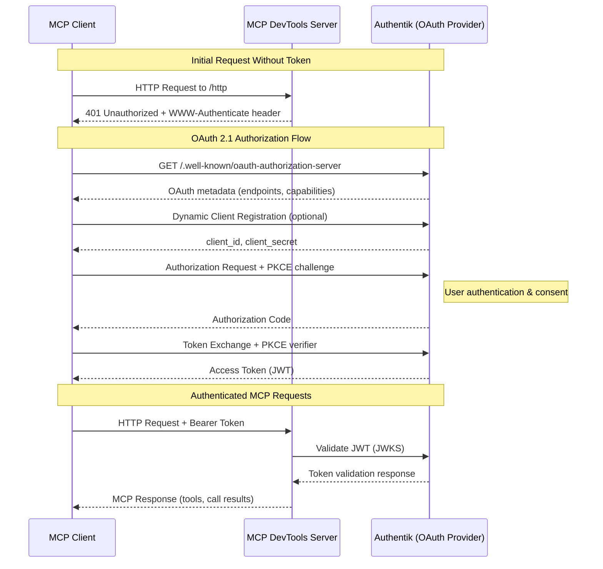

# OAuth 2.0/2.1 Setup Guide with Authentik

This guide demonstrates how to configure [Authentik](https://goauthentik.io/) as an OAuth 2.0/2.1 provider for the MCP DevTools server, following the MCP 2025-03-26 specification.

## Overview

The MCP DevTools server implements optional OAuth 2.0/2.1 authorisation for HTTP-based transports only. When configured with Authentik, it provides:

- **JWT token validation** with JWKS support
- **OAuth 2.1 compliance** with PKCE support  
- **Dynamic client registration** (RFC7591)
- **Standards-compliant metadata** endpoints (RFC8414, RFC9728)
- **Audience validation** for token security

## Prerequisites

- Running Authentik instance (version 2024.2 or later recommended)
- MCP DevTools server built with OAuth support
- HTTPS endpoints (required for production; HTTP allowed for development)

## Architecture Flow



## Authentik Configuration

### Step 1: Create OAuth 2.0 Provider

1. **Access Authentik Admin Interface**
   - Navigate to your Authentik instance
   - Log in as an administrator

2. **Create Provider**
   - Go to **Applications** → **Providers**
   - Click **Create** and select **OAuth2/OpenID Provider**

3. **Provider Configuration**
   ```
   Name: MCP DevTools OAuth Provider
   Authorization flow: default-authorization-flow
   Client type: Confidential (or Public for development)
   Client ID: (auto-generated or custom)
   Client Secret: (auto-generated - save this)
   Redirect URIs: 
     - https://your-mcp-client.example.com/oauth/callback
     - http://localhost:3000/oauth/callback  (for development)
   Signing Key: (select a certificate for JWT signing)
   ```

4. **Advanced Settings**
   ```
   Include claims in id_token: Yes
   Issuer mode: Each provider has a different issuer
   Subject mode: Based on the User's hashed ID
   Access token validity: 10 minutes (recommended)
   Refresh token validity: 30 days
   ```

### Step 2: Configure Scopes

1. **Create Custom Scopes** (if needed)
   - Go to **Customisation** → **Property Mappings**
   - Create scope mappings for:
     - `mcp:tools` - Access to MCP tools
     - `mcp:admin` - Administrative access

2. **Assign Scopes to Provider**
   - Edit your OAuth provider
   - Under **Scope Mappings**, select:
     - `openid` (required)
     - `profile`
     - `email`
     - `offline_access` (for refresh tokens)
     - Your custom MCP scopes

### Step 3: Create Application

1. **Create Application**
   - Go to **Applications** → **Applications**
   - Click **Create**

2. **Application Settings**
   ```
   Name: MCP DevTools
   Slug: mcp-devtools
   Provider: MCP DevTools OAuth Provider (from Step 1)
   ```

3. **Access Control**
   - Assign appropriate users/groups who can access the MCP server

### Step 4: Note Important URLs

From your Authentik provider configuration, note these URLs:

```
Issuer URL: https://your-authentik.example.com/application/o/mcp-devtools/
Authorization Endpoint: https://your-authentik.example.com/application/o/authorize/
Token Endpoint: https://your-authentik.example.com/application/o/token/
JWKS URL: https://your-authentik.example.com/application/o/mcp-devtools/jwks/
OpenID Configuration: https://your-authentik.example.com/application/o/mcp-devtools/.well-known/openid-configuration
```

## MCP DevTools Server Configuration

### Environment Variables

Configure the MCP DevTools server with these environment variables:

```bash
# Enable OAuth
OAUTH_ENABLED=true

# Authentik OAuth Configuration
OAUTH_ISSUER="https://your-authentik.example.com/application/o/mcp-devtools/"
OAUTH_AUDIENCE="https://your-mcp-server.example.com"
OAUTH_JWKS_URL="https://your-authentik.example.com/application/o/mcp-devtools/jwks/"

# Optional: Enable dynamic client registration
OAUTH_DYNAMIC_REGISTRATION=true

# Security Settings
OAUTH_REQUIRE_HTTPS=true  # Set to false for development only

# Server Configuration
BRAVE_API_KEY="your-api-key-if-needed"
```

### Command Line Configuration

Alternatively, configure via command-line flags:

```bash
./mcp-devtools --transport=http --port=8080 \
    --oauth-enabled \
    --oauth-issuer="https://your-authentik.example.com/application/o/mcp-devtools/" \
    --oauth-audience="https://your-mcp-server.example.com" \
    --oauth-jwks-url="https://your-authentik.example.com/application/o/mcp-devtools/jwks/" \
    --oauth-dynamic-registration
```

## Client Configuration

### MCP Client Setup

Configure your MCP client to use the authenticated server:

```json
{
  "mcpServers": {
    "dev-tools": {
      "type": "streamableHttp",
      "url": "https://your-mcp-server.example.com/http",
      "oauth": {
        "authorization_url": "https://your-authentik.example.com/application/o/authorize/",
        "token_url": "https://your-authentik.example.com/application/o/token/",
        "client_id": "your-client-id-from-authentik",
        "client_secret": "your-client-secret-from-authentik",
        "scopes": ["openid", "profile", "mcp:tools"]
      }
    }
  }
}
```

## Development Setup

For development environments, you can relax HTTPS requirements:

### Authentik Development Configuration

1. **Create HTTP-only provider** for local development
2. **Configure redirect URIs**:
   ```
   http://localhost:18080/oauth/callback
   http://127.0.0.1:18080/oauth/callback
   ```

### MCP DevTools Development Configuration

```bash
# Allow HTTP for development
OAUTH_REQUIRE_HTTPS=false
OAUTH_ISSUER="http://localhost:8080/application/o/mcp-devtools/"
OAUTH_AUDIENCE="http://localhost:18080"
OAUTH_JWKS_URL="http://localhost:8080/application/o/mcp-devtools/jwks/"

./mcp-devtools --transport=http --port=18080
```

## Testing the Setup

### 1. Verify OAuth Metadata Endpoints

Test that the MCP server exposes OAuth metadata:

```bash
# Check authorization server metadata
curl https://your-mcp-server.example.com/.well-known/oauth-authorization-server

# Check protected resource metadata  
curl https://your-mcp-server.example.com/.well-known/oauth-protected-resource
```

### 2. Test Unauthenticated Request

Verify that requests without tokens are properly rejected:

```bash
curl -i https://your-mcp-server.example.com/http
# Should return 401 with WWW-Authenticate header
```

### 3. Test Authentication Flow

1. **Get authorization URL** from your MCP client
2. **Complete browser flow** in Authentik
3. **Exchange code for token**
4. **Make authenticated request** to MCP server

## Troubleshooting

### Common Issues

1. **401 Unauthorized Errors**
   - Check JWT token expiration
   - Verify audience claim matches `OAUTH_AUDIENCE`
   - Ensure JWKS URL is accessible

2. **Invalid Token Errors**
   - Verify Authentik signing key configuration
   - Check that JWKS URL matches provider
   - Ensure token was issued by correct issuer

3. **HTTPS Requirement Errors**
   - Set `OAUTH_REQUIRE_HTTPS=false` for development
   - Use HTTPS endpoints in production

### Debug Commands

Enable debug logging:

```bash
./mcp-devtools --transport=http --debug \
    --oauth-enabled \
    --oauth-issuer="..." \
    --oauth-audience="..." \
    --oauth-jwks-url="..."
```

Check OAuth metadata:

```bash
# Test Authentik OpenID configuration
curl https://your-authentik.example.com/application/o/mcp-devtools/.well-known/openid-configuration

# Test JWKS endpoint
curl https://your-authentik.example.com/application/o/mcp-devtools/jwks/
```

## Security Considerations

1. **Use HTTPS in Production**: Always use HTTPS for OAuth endpoints in production
2. **Short Token Lifetimes**: Configure short access token lifetimes (10-15 minutes)
3. **Refresh Tokens**: Use refresh tokens for long-lived access
4. **Scope Restrictions**: Limit OAuth scopes to minimum required permissions
5. **Audience Validation**: Ensure tokens are bound to the correct resource server
6. **Regular Key Rotation**: Rotate signing keys regularly in Authentik

## Advanced Configuration

### Custom Claims

Add custom claims to JWT tokens in Authentik:

1. **Create Property Mapping**:
   ```python
   # Example custom claim
   return {
       "mcp_permissions": ["tools", "admin"] if request.user.is_superuser else ["tools"],
       "organisation": request.user.attributes.get("organisation", "default")
   }
   ```

2. **Assign to Provider**: Add the property mapping to your OAuth provider

### Scope-based Authorization

Configure different access levels:

```python
# Authentik expression policy example
if "mcp:admin" in request.context["oauth_scopes"]:
    return ak_is_group_member(request.user, name="mcp-administrators")
elif "mcp:tools" in request.context["oauth_scopes"]:
    return ak_is_group_member(request.user, name="mcp-users")
return False
```

## References

- [MCP Authorization Specification](https://modelcontextprotocol.io/specification/2025-03-26/basic/authorization)
- [Authentik OAuth2 Provider Documentation](https://docs.goauthentik.io/docs/add-secure-apps/providers/oauth2/)
- [OAuth 2.1 Specification](https://datatracker.ietf.org/doc/html/draft-ietf-oauth-v2-1-12)
- [RFC8414: OAuth 2.0 Authorization Server Metadata](https://datatracker.ietf.org/doc/html/rfc8414)
- [RFC7591: OAuth 2.0 Dynamic Client Registration](https://datatracker.ietf.org/doc/html/rfc7591)