# OAuth 2.0/2.1 Setup Guide with Authentik

This guide demonstrates how to configure [Authentik](https://goauthentik.io/) as an OAuth 2.0/2.1 provider for the MCP DevTools server, following the MCP 2025-06-18 specification.

## Overview

The MCP DevTools server implements comprehensive OAuth 2.0/2.1 support with two distinct modes for HTTP-based transports:

**🌐 Browser Authentication Mode (OAuth Client)**
- Interactive user authentication via browser
- Authorisation code flow with PKCE
- Automatic browser launching and localhost callback handling
- Perfect for development and desktop environments

**🛡️ Resource Server Mode (OAuth Token Validation)**
- Validates incoming JWT tokens from external clients
- Protects MCP resources with OAuth authorisation
- Suitable for production API servers

When configured with Authentik, both modes provide:

- **JWT token validation** with JWKS support
- **OAuth 2.1 compliance** with mandatory PKCE support
- **Dynamic client registration** (RFC7591)
- **Standards-compliant metadata** endpoints (RFC8414, RFC9728)
- **Audience validation** for token security
- **Cross-platform browser integration** (macOS, Linux, Windows)

## Prerequisites

- Running Authentik instance (version 2024.2 or later recommended)
- MCP DevTools server built with OAuth support
- HTTPS endpoints (required for production; HTTP allowed for development)

## Architecture Overview

```mermaid
graph TD
    subgraph "MCP DevTools OAuth Architecture"
        direction TB

        subgraph "OAuth Modes"
            BrowserMode[🌐 Browser Authentication Mode<br/>OAuth Client]
            ResourceMode[🛡️ Resource Server Mode<br/>Token Validation]
        end

        subgraph "Authentik OAuth Provider"
            AuthProvider[OAuth 2.1 Provider]
            AuthServer[Authorization Server]
            TokenEndpoint[Token Endpoint]
            JWKSEndpoint[JWKS Endpoint]
        end

        subgraph "Browser Auth Flow"
            Browser[🌏 System Browser]
            CallbackServer[📡 Localhost Callback Server]
            PKCEGen[🔐 PKCE Challenge Generator]
        end

        subgraph "Resource Server Flow"
            TokenValidator[🔍 JWT Token Validator]
            JWKSFetch[🔑 JWKS Fetcher]
            AudienceCheck[🎯 Audience Validator]
        end

        User[👤 User] --> BrowserMode
        MCP_Client[📱 External MCP Client] --> ResourceMode

        BrowserMode --> PKCEGen
        BrowserMode --> Browser
        BrowserMode --> CallbackServer

        Browser --> AuthServer
        CallbackServer --> TokenEndpoint

        ResourceMode --> TokenValidator
        TokenValidator --> JWKSFetch
        TokenValidator --> AudienceCheck

        JWKSFetch --> JWKSEndpoint
        AudienceCheck --> AuthProvider
    end

    classDef browserAuth fill:#e1f5fe,stroke:#0277bd,color:#000
    classDef resourceAuth fill:#f3e5f5,stroke:#7b1fa2,color:#000
    classDef authentik fill:#e8f5e8,stroke:#2e7d32,color:#000
    classDef user fill:#fff3e0,stroke:#ef6c00,color:#000

    class BrowserMode,Browser,CallbackServer,PKCEGen browserAuth
    class ResourceMode,TokenValidator,JWKSFetch,AudienceCheck resourceAuth
    class AuthProvider,AuthServer,TokenEndpoint,JWKSEndpoint authentik
    class User,MCP_Client user
```



## Authentication Flow Diagrams

### Browser Authentication Flow

```mermaid
sequenceDiagram
    participant User as 👤 User
    participant MCPServer as MCP DevTools Server
    participant Browser as 🌏 System Browser
    participant Callback as 📡 Callback Server
    participant Authentik as Authentik (OAuth Provider)

    Note over User, Authentik: Browser Authentication Mode Startup
    User->>MCPServer: Start with --oauth-browser-auth
    MCPServer->>MCPServer: Generate PKCE challenge
    MCPServer->>Callback: Start localhost callback server
    MCPServer->>Authentik: Discover OAuth endpoints
    Authentik-->>MCPServer: Authorisation & token endpoints

    Note over User, Authentik: Browser-Based Authentication
    MCPServer->>Browser: Launch browser with auth URL + PKCE
    Browser->>Authentik: Authorisation request + code_challenge
    Note right of Authentik: User login & consent
    Authentik->>Browser: Redirect with authorisation code
    Browser->>Callback: GET /callback?code=xyz&state=abc

    Note over User, Authentik: Token Exchange
    Callback->>MCPServer: Authorisation code received
    MCPServer->>Authentik: Exchange code + PKCE verifier for token
    Authentik-->>MCPServer: Access token (JWT)
    MCPServer->>MCPServer: Store token securely
    MCPServer->>Callback: Stop callback server

    Note over User, Authentik: MCP Server Ready
    MCPServer-->>User: Authentication complete, server ready
```



### Resource Server Validation Flow

```mermaid
sequenceDiagram
    participant Client as 📱 External MCP Client
    participant MCPServer as MCP DevTools Server
    participant Authentik as Authentik (OAuth Provider)

    Note over Client, Authentik: Client Obtains Token (External Process)
    Client->>Authentik: OAuth flow (outside MCP scope)
    Authentik-->>Client: Access token

    Note over Client, Authentik: Protected Resource Access
    Client->>MCPServer: HTTP Request + Bearer token
    MCPServer->>MCPServer: Extract & validate token format
    MCPServer->>Authentik: Fetch JWKS for token validation
    Authentik-->>MCPServer: Public keys (JWKS)
    MCPServer->>MCPServer: Validate JWT signature & claims
    MCPServer->>MCPServer: Check audience & expiration

    alt Valid Token
        MCPServer-->>Client: MCP Response (tools, calls)
    else Invalid Token
        MCPServer-->>Client: 401 Unauthorised + WWW-Authenticate header
    end
```



## Authentik Configuration

### Step 1: Create OAuth 2.0 Provider

1. **Access Authentik Admin Interface**
   - Navigate to your Authentik instance
   - Log in as an administrator

2. **Create Provider**
   - Go to **Applications** → **Providers**
   - Click **Create** and select **OAuth2/OpenID Provider**

3. **Provider Configuration**
   ```
   Name: MCP DevTools OAuth Provider
   Authorization flow: default-authorization-flow
   Client type: Public (recommended for browser auth) or Confidential
   Client ID: (auto-generated or custom - save this for MCP configuration)
   Client Secret: (auto-generated - save this, optional for public clients)
   Redirect URIs:
     # For Browser Authentication Mode (localhost callbacks)
     - http://127.0.0.1:8080/callback     (for browser auth on port 8080)
     - http://127.0.0.1:8888/callback     (for browser auth on port 8888)
     - http://localhost:*/callback         (wildcard for development)

     # For External MCP Clients (if using resource server mode)
     - https://your-mcp-client.example.com/oauth/callback
     - http://localhost:3000/oauth/callback  (for development)
   Signing Key: (select a certificate for JWT signing)

```

   **Important for Browser Authentication:**
   - Use `Public` client type for browser authentication mode
   - Add localhost redirect URIs for the callback server
   - The port number should match your `--oauth-callback-port` setting

4. **Advanced Settings**
   ```
   Include claims in id_token: Yes
   Issuer mode: Each provider has a different issuer
   Subject mode: Based on the User's hashed ID
   Access token validity: 10 minutes (recommended)
   Refresh token validity: 30 days

```

### Step 2: Configure Scopes

1. **Create Custom Scopes** (if needed)
   - Go to **Customisation** → **Property Mappings**
   - Create scope mappings for:
     - `mcp:tools` - Access to MCP tools
     - `mcp:admin` - Administrative access

2. **Assign Scopes to Provider**
   - Edit your OAuth provider
   - Under **Scope Mappings**, select:
     - `openid` (required)
     - `profile`
     - `email`
     - `offline_access` (for refresh tokens)
     - Your custom MCP scopes

### Step 3: Create Application

1. **Create Application**
   - Go to **Applications** → **Applications**
   - Click **Create**

2. **Application Settings**
   ```
   Name: MCP DevTools
   Slug: mcp-devtools
   Provider: MCP DevTools OAuth Provider (from Step 1)

```

3. **Access Control**
   - Assign appropriate users/groups who can access the MCP server

### Step 4: Note Important URLs

From your Authentik provider configuration, note these URLs:

```
Issuer URL: https://your-authentik.example.com/application/o/mcp-devtools/
Authorisation Endpoint: https://your-authentik.example.com/application/o/authorize/
Token Endpoint: https://your-authentik.example.com/application/o/token/
JWKS URL: https://your-authentik.example.com/application/o/mcp-devtools/jwks/
OpenID Configuration: https://your-authentik.example.com/application/o/mcp-devtools/.well-known/openid-configuration
```

## MCP DevTools Server Configuration

### Browser Authentication Mode Configuration

Configure MCP DevTools for interactive browser authentication:

```bash
# Enable Browser Authentication Mode
OAUTH_BROWSER_AUTH=true

# OAuth Client Configuration for Authentik
OAUTH_CLIENT_ID="your-client-id-from-authentik"
OAUTH_CLIENT_SECRET="your-client-secret"  # Optional for public clients
OAUTH_ISSUER="https://your-authentik.example.com/application/o/mcp-devtools/"
OAUTH_AUDIENCE="https://your-mcp-server.example.com"  # For token binding
OAUTH_SCOPE="openid profile mcp:tools"

# Callback Server Configuration
OAUTH_CALLBACK_PORT=8888  # 0 for random port
OAUTH_AUTH_TIMEOUT=5m

# Security Settings
OAUTH_REQUIRE_HTTPS=true  # Set to false for development only

# Server Configuration
BRAVE_API_KEY="your-api-key-if-needed"
```

### Resource Server Mode Configuration

Configure MCP DevTools to validate tokens from external clients:

```bash
# Enable OAuth Resource Server Mode
OAUTH_ENABLED=true

# Authentik OAuth Configuration
OAUTH_ISSUER="https://your-authentik.example.com/application/o/mcp-devtools/"
OAUTH_AUDIENCE="https://your-mcp-server.example.com"
OAUTH_JWKS_URL="https://your-authentik.example.com/application/o/mcp-devtools/jwks/"

# Optional: Enable dynamic client registration
OAUTH_DYNAMIC_REGISTRATION=true

# Security Settings
OAUTH_REQUIRE_HTTPS=true  # Set to false for development only

# Server Configuration
BRAVE_API_KEY="your-api-key-if-needed"
```

### Command Line Configuration

Alternatively, configure via command-line flags:

**Browser Authentication Mode:**
```bash
./mcp-devtools --transport=http --port=18080 \
    --oauth-browser-auth \
    --oauth-client-id="your-client-id-from-authentik" \
    --oauth-issuer="https://your-authentik.example.com/application/o/mcp-devtools/" \
    --oauth-scope="openid profile mcp:tools" \
    --oauth-callback-port=8888
```

**Resource Server Mode:**
```bash
./mcp-devtools --transport=http --port=8080 \
    --oauth-enabled \
    --oauth-issuer="https://your-authentik.example.com/application/o/mcp-devtools/" \
    --oauth-audience="https://your-mcp-server.example.com" \
    --oauth-jwks-url="https://your-authentik.example.com/application/o/mcp-devtools/jwks/" \
    --oauth-dynamic-registration
```

## OAuth Mode Selection Guide

### When to Use Browser Authentication Mode

**🌐 Browser Authentication Mode** is ideal for:

- **Development environments** where you want interactive authentication
- **Desktop applications** that can launch a browser
- **CLI tools** that need user authentication
- **Personal use** where the server runs on your local machine
- **Prototyping** with OAuth providers

**Example Use Cases:**
```bash
# Development with automatic browser login
OAUTH_BROWSER_AUTH=true \
OAUTH_CLIENT_ID="dev-client-123" \
OAUTH_ISSUER="https://auth.company.com/application/o/mcp-dev/" \
./mcp-devtools --transport=http

# CLI tool that needs user auth
./mcp-devtools --oauth-browser-auth \
    --oauth-client-id="cli-tool-client" \
    --oauth-issuer="https://auth.example.com/o/mcp/"
```

### When to Use Resource Server Mode

**🛡️ Resource Server Mode** is ideal for:

- **Production API servers** that validate external client tokens
- **Microservices** that need to authenticate incoming requests
- **Server-to-server** communication
- **Multi-tenant** environments
- **Headless servers** without browser access

**Example Use Cases:**
```bash
# Production API server
OAUTH_ENABLED=true \
OAUTH_ISSUER="https://auth.company.com/application/o/mcp-prod/" \
OAUTH_AUDIENCE="https://api.company.com/mcp" \
./mcp-devtools --transport=http --port=443

# Microservice validation
./mcp-devtools --oauth-enabled \
    --oauth-audience="https://internal.company.com/mcp-service"
```

### Using Both Modes Together

You can use both modes simultaneously for advanced scenarios:

```bash
# Server that authenticates on startup AND validates external tokens
OAUTH_BROWSER_AUTH=true \
OAUTH_CLIENT_ID="server-startup-client" \
OAUTH_ENABLED=true \
OAUTH_AUDIENCE="https://api.company.com/mcp" \
./mcp-devtools --transport=http
```

This configuration:
1. **Authenticates the server** on startup via browser
2. **Validates external client tokens** for incoming requests
3. **Stores the startup token** for server-initiated operations

## Client Configuration

### MCP Client Setup

Configure your MCP client to use the authenticated server:

```json
{
  "mcpServers": {
    "dev-tools": {
      "type": "streamableHttp",
      "url": "https://your-mcp-server.example.com/http",
      "oauth": {
        "authorization_url": "https://your-authentik.example.com/application/o/authorize/",
        "token_url": "https://your-authentik.example.com/application/o/token/",
        "client_id": "your-client-id-from-authentik",
        "client_secret": "your-client-secret-from-authentik",
        "scopes": ["openid", "profile", "mcp:tools"]
      }
    }
  }
}
```

## Development Setup

For development environments, you can relax HTTPS requirements:

### Authentik Development Configuration

1. **Create HTTP-only provider** for local development
2. **Configure redirect URIs for both modes**:
   ```
   # For Browser Authentication Mode (localhost callbacks)
   http://127.0.0.1:8080/callback
   http://127.0.0.1:8888/callback
   http://localhost:*/callback         # Wildcard for development

   # For External MCP Clients (resource server mode)
   http://localhost:18080/oauth/callback
   http://127.0.0.1:18080/oauth/callback

```

### Browser Authentication Development

```bash
# Allow HTTP for development with browser auth
OAUTH_REQUIRE_HTTPS=false
OAUTH_BROWSER_AUTH=true
OAUTH_CLIENT_ID="dev-client-from-authentik"
OAUTH_ISSUER="http://localhost:8080/application/o/mcp-devtools/"
OAUTH_AUDIENCE="http://localhost:18080"
OAUTH_SCOPE="openid profile mcp:tools"
OAUTH_CALLBACK_PORT=8888

./mcp-devtools --transport=http --port=18080 --debug
```

### Resource Server Development

```bash
# Allow HTTP for development with resource server mode
OAUTH_REQUIRE_HTTPS=false
OAUTH_ENABLED=true
OAUTH_ISSUER="http://localhost:8080/application/o/mcp-devtools/"
OAUTH_AUDIENCE="http://localhost:18080"
OAUTH_JWKS_URL="http://localhost:8080/application/o/mcp-devtools/jwks/"

./mcp-devtools --transport=http --port=18080 --debug
```

## Testing the Setup

### 1. Verify OAuth Metadata Endpoints

Test that the MCP server exposes OAuth metadata:

```bash
# Check authorisation server metadata
curl https://your-mcp-server.example.com/.well-known/oauth-authorisation-server

# Check protected resource metadata
curl https://your-mcp-server.example.com/.well-known/oauth-protected-resource
```

### 2. Test Unauthenticated Request

Verify that requests without tokens are properly rejected:

```bash
curl -i https://your-mcp-server.example.com/http
# Should return 401 with WWW-Authenticate header
```

### 3. Test Browser Authentication Flow

Test the browser authentication mode:

```bash
# Start MCP server with browser auth
OAUTH_BROWSER_AUTH=true \
OAUTH_CLIENT_ID="your-client-id" \
OAUTH_ISSUER="https://your-authentik.example.com/application/o/mcp-devtools/" \
./mcp-devtools --transport=http --debug

# Expected output:
# INFO Browser-based OAuth authentication enabled
# INFO Starting browser authentication flow...
# INFO Please complete the authentication in your browser
# (Browser opens automatically)
# INFO Browser authentication completed successfully
# INFO MCP DevTools is now authenticated and ready to start
```

### 4. Test Resource Server Authentication Flow

1. **Get authorisation URL** from your MCP client
2. **Complete browser flow** in Authentik
3. **Exchange code for token**
4. **Make authenticated request** to MCP server

## Troubleshooting

### Common Issues

#### Browser Authentication Issues

1. **Browser doesn't open automatically**
   - Ensure your system has a default browser configured
   - Check that `xdg-open` (Linux), `open` (macOS), or `rundll32` (Windows) is available
   - Try running the command manually to test browser launching

2. **Callback server port conflicts**
   - Use `OAUTH_CALLBACK_PORT=0` for random port assignment
   - Check that the chosen port isn't already in use
   - Ensure firewall allows localhost connections

3. **Authentication timeout**
   - Increase `OAUTH_AUTH_TIMEOUT` (default is 5 minutes)
   - Complete the browser authentication more quickly
   - Check for network connectivity issues

4. **Redirect URI mismatch**
   - Ensure Authentik redirect URIs include your callback port
   - Use `http://127.0.0.1:PORT/callback` format
   - Check that `OAUTH_CALLBACK_PORT` matches Authentik configuration

#### Resource Server Issues

1. **401 Unauthorised Errors**
   - Check JWT token expiration
   - Verify audience claim matches `OAUTH_AUDIENCE`
   - Ensure JWKS URL is accessible

2. **Invalid Token Errors**
   - Verify Authentik signing key configuration
   - Check that JWKS URL matches provider
   - Ensure token was issued by correct issuer

3. **HTTPS Requirement Errors**
   - Set `OAUTH_REQUIRE_HTTPS=false` for development
   - Use HTTPS endpoints in production

### Debug Commands

Enable debug logging for browser authentication:

```bash
# Debug browser authentication
./mcp-devtools --transport=http --debug \
    --oauth-browser-auth \
    --oauth-client-id="your-client-id" \
    --oauth-issuer="..." \
    --oauth-callback-port=8888

# Debug resource server mode
./mcp-devtools --transport=http --debug \
    --oauth-enabled \
    --oauth-issuer="..." \
    --oauth-audience="..." \
    --oauth-jwks-url="..."
```

Check OAuth metadata:

```bash
# Test Authentik OpenID configuration
curl https://your-authentik.example.com/application/o/mcp-devtools/.well-known/openid-configuration

# Test JWKS endpoint
curl https://your-authentik.example.com/application/o/mcp-devtools/jwks/
```

## Security Considerations

1. **Use HTTPS in Production**: Always use HTTPS for OAuth endpoints in production
2. **Short Token Lifetimes**: Configure short access token lifetimes (10-15 minutes)
3. **Refresh Tokens**: Use refresh tokens for long-lived access
4. **Scope Restrictions**: Limit OAuth scopes to minimum required permissions
5. **Audience Validation**: Ensure tokens are bound to the correct resource server
6. **Regular Key Rotation**: Rotate signing keys regularly in Authentik

## Advanced Configuration

### Custom Claims

Add custom claims to JWT tokens in Authentik:

1. **Create Property Mapping**:
   ```python
   # Example custom claim
   return {
       "mcp_permissions": ["tools", "admin"] if request.user.is_superuser else ["tools"],
       "organisation": request.user.attributes.get("organisation", "default")
   }
   ```

2. **Assign to Provider**: Add the property mapping to your OAuth provider

### Scope-based Authorisation

Configure different access levels:

```python
# Authentik expression policy example
if "mcp:admin" in request.context["oauth_scopes"]:
    return ak_is_group_member(request.user, name="mcp-administrators")
elif "mcp:tools" in request.context["oauth_scopes"]:
    return ak_is_group_member(request.user, name="mcp-users")
return False
```

## References

- [MCP Authorisation Specification](https://modelcontextprotocol.io/specification/2025-06-18/basic/authorization)
- [Authentik OAuth2 Provider Documentation](https://docs.goauthentik.io/docs/add-secure-apps/providers/oauth2/)
- [OAuth 2.1 Specification](https://datatracker.ietf.org/doc/html/draft-ietf-oauth-v2-1-12)
- [RFC8414: OAuth 2.0 Authorisation Server Metadata](https://datatracker.ietf.org/doc/html/rfc8414)
- [RFC7636: Proof Key for Code Exchange (PKCE)](https://datatracker.ietf.org/doc/html/rfc7636)
- [RFC8707: Resource Indicators for OAuth 2.0](https://datatracker.ietf.org/doc/html/rfc8707)
- [RFC9728: OAuth 2.0 Protected Resource Metadata](https://datatracker.ietf.org/doc/html/rfc9728)
- [RFC7591: OAuth 2.0 Dynamic Client Registration](https://datatracker.ietf.org/doc/html/rfc7591)
