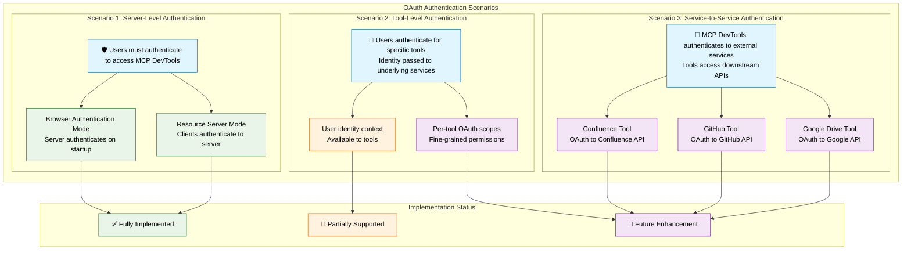
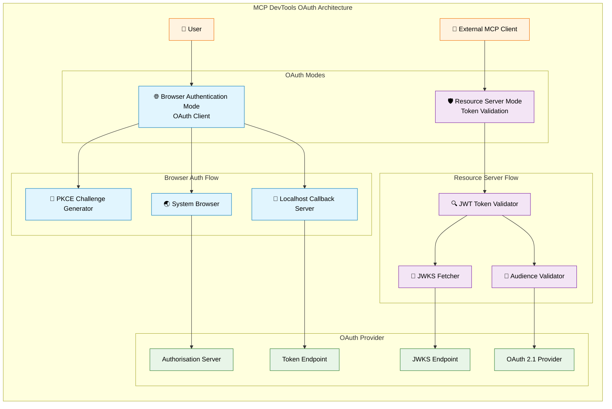
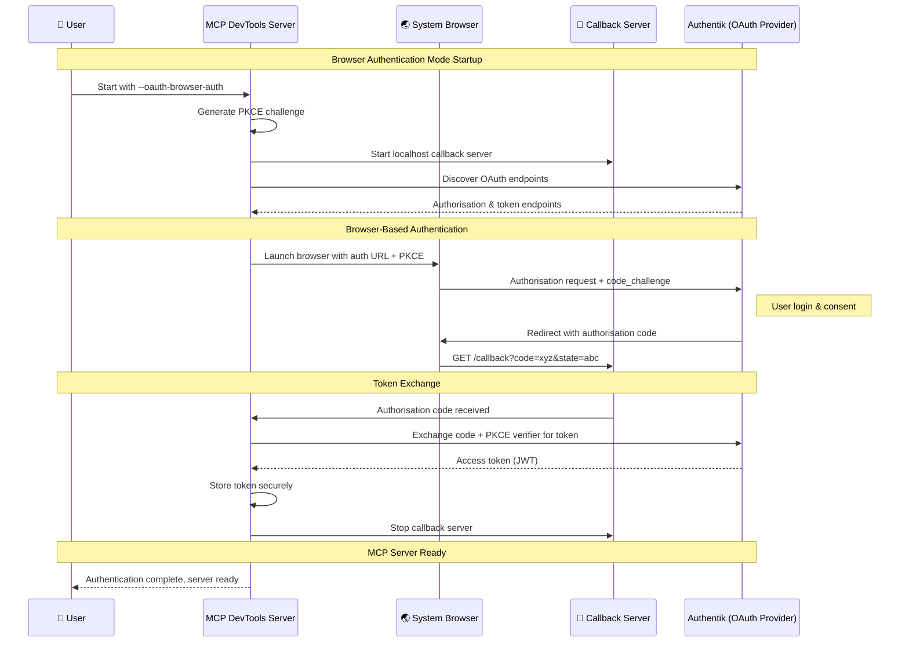

# OAuth 2.0/2.1 Authentication for MCP DevTools

MCP DevTools provides OAuth 2.0/2.1 support for the HTTP transport, implementing both resource server and client functionality according to the MCP 2026-07-28 specification.

## Overview

OAuth authentication in MCP DevTools operates in two distinct modes:

**🌐 Browser Authentication Mode (OAuth Client)**
- Interactive user authentication via browser
- Authorisation code flow with PKCE
- Perfect for development and desktop environments
- Authenticates before MCP server starts

**🛡️ Resource Server Mode (OAuth Token Validation)**
- Validates incoming JWT tokens from clients
- Protects MCP resources with OAuth authorisation
- Suitable for production API servers
- Validates tokens on each request

## When Do You Need OAuth?

You may want OAuth if you need:
- **User authentication** for accessing the MCP server
- **Token-based security** for production deployments
- **Integration with existing identity providers** (Authentik, Keycloak, etc.)
- **Compliance with organisational authentication** requirements

Most users can skip OAuth and use simple bearer tokens or run without authentication for development as long as the MCP Server is running locally - or does not have access to sensitive data.

## OAuth Authentication Scenarios

MCP DevTools supports three main OAuth authentication patterns:


```mermaid
graph TD
    subgraph "OAuth Authentication Scenarios"
        direction TB

        subgraph "Scenario 1: Server-Level Authentication"
            S1[🛡️ Users must authenticate to access MCP DevTools]
            S1A[Browser Authentication Mode<br/>Server authenticates on startup]
            S1B[Resource Server Mode<br/>Clients authenticate to server]
            S1 --> S1A
            S1 --> S1B
        end

        subgraph "Scenario 2: Tool-Level Authentication"
            S2[🔐 Users authenticate for specific tools<br/>Identity passed to underlying services]
            S2A[Per-tool OAuth scopes<br/>Fine-grained permissions]
            S2B[User identity context<br/>Available to tools]
            S2 --> S2A
            S2 --> S2B
        end

        subgraph "Scenario 3: Service-to-Service Authentication"
            S3[🔌 MCP DevTools authenticates to external services<br/>Tools access downstream APIs]
            S3A[Confluence Tool<br/>OAuth to Confluence API]
            S3B[GitHub Tool<br/>OAuth to GitHub API]
            S3C[Google Drive Tool<br/>OAuth to Google API]
            S3 --> S3A
            S3 --> S3B
            S3 --> S3C
        end
    end

    subgraph "Implementation Status"
        direction LR
        Implemented[✅ Fully Implemented]
        Partial[🔄 Partially Supported]
        Future[🚧 Future Enhancement]
    end

    S1A --> Implemented
    S1B --> Implemented
    S2B --> Partial
    S2A --> Future
    S3A --> Future
    S3B --> Future
    S3C --> Future

    classDef implemented fill:#e8f5e8,stroke:#2e7d32,color:#000
    classDef partial fill:#fff3e0,stroke:#ef6c00,color:#000
    classDef future fill:#f3e5f5,stroke:#7b1fa2,color:#000
    classDef scenario fill:#e1f5fe,stroke:#0277bd,color:#000

    class S1A,S1B,Implemented implemented
    class S2B,Partial partial
    class S2A,S3A,S3B,S3C,Future future
    class S1,S2,S3 scenario
```

## Configuration Guide by Scenario

### 🛡️ Scenario 1: Server-Level Authentication
**"Users must authenticate to access MCP DevTools"**

#### Browser Authentication Mode (Personal/Development)
```bash
# Server authenticates on startup
OAUTH_BROWSER_AUTH=true
OAUTH_CLIENT_ID="mcp-devtools-client"
OAUTH_ISSUER="https://auth.example.com"
./mcp-devtools --transport=http
```

**MCP Client Config:**
```json
{
  "mcpServers": {
    "dev-tools": {
      "type": "streamableHttp",
      "url": "http://localhost:18080/http"
    }
  }
}
```

#### Resource Server Mode (Production/Shared)
```bash
# Server validates client tokens
OAUTH_ENABLED=true
OAUTH_ISSUER="https://auth.example.com"
OAUTH_AUDIENCE="https://mcp.example.com"
OAUTH_JWKS_URL="https://auth.example.com/.well-known/jwks.json"
./mcp-devtools --transport=http
```

**MCP Client Config:**
```json
{
  "mcpServers": {
    "dev-tools": {
      "type": "streamableHttp",
      "url": "https://mcp.example.com/http",
      "oauth": {
        "authorization_url": "https://auth.example.com/authorize/",
        "token_url": "https://auth.example.com/token/",
        "client_id": "mcp-client-id",
        "scopes": ["openid", "profile", "mcp:tools"]
      }
    }
  }
}
```

### 🔐 Scenario 2: Tool-Level Authentication
**"Users authenticate for specific tools, identity passed to services"**

#### Current Support (Partial)
```bash
# Server-level OAuth provides user context to tools
OAUTH_BROWSER_AUTH=true
OAUTH_CLIENT_ID="mcp-devtools-client"
OAUTH_ISSUER="https://auth.example.com"
OAUTH_SCOPE="openid profile mcp:search mcp:documents"
./mcp-devtools --transport=http
```

Tools can access user identity from OAuth claims in request context.

#### Future Enhancement
```bash
# Per-tool scopes and fine-grained permissions
OAUTH_TOOL_SCOPES="search:read,documents:write,memory:admin"
OAUTH_TOOL_DELEGATION=true
```

### 🔌 Scenario 3: Service-to-Service Authentication
**"MCP DevTools authenticates to external services for tools"**

#### Future Implementation Example
```bash
# Tool-specific OAuth configurations
CONFLUENCE_OAUTH_CLIENT_ID="confluence-tool-client"
CONFLUENCE_OAUTH_CLIENT_SECRET="secret"
CONFLUENCE_OAUTH_ISSUER="https://auth.atlassian.com"

GITHUB_OAUTH_CLIENT_ID="github-tool-client"
GITHUB_OAUTH_CLIENT_SECRET="secret"
GITHUB_OAUTH_ISSUER="https://github.com"

./mcp-devtools --transport=http
```

Tools would handle their own OAuth flows to external services.

## Quick Decision Guide: Which OAuth Mode Should I Use?

### 🌐 Use Browser Authentication Mode When
- **You're running MCP DevTools locally** (development, personal use)
- **You want interactive login** before the server starts
- **You're using it as a CLI tool** or desktop application
- **You have browser access** on the machine running the server
- **You want the simplest setup** with your OAuth provider

**Example**: Running MCP DevTools on your laptop for personal development work.

### 🛡️ Use Resource Server Mode When
- **You're deploying MCP DevTools as a service** (production, shared environments)
- **External clients will connect** with their own tokens
- **You're building a microservice** that validates incoming tokens
- **You're running headless** (no browser access)
- **You need to validate tokens from multiple different clients**

**Example**: Deploying MCP DevTools on a server that multiple team members access via their MCP clients.

### 🔄 Use Both Modes When
- **The server needs its own authentication** AND **validates external client tokens**
- **You're building a complex multi-tenant system**

**Most users should start with Browser Authentication Mode** - it's simpler and works great for personal/development use.

## Architecture Overview


```mermaid
graph TD
    subgraph "MCP DevTools OAuth Architecture"
        direction TB

        subgraph "OAuth Modes"
            BrowserMode[🌐 Browser Authentication Mode<br/>OAuth Client]
            ResourceMode[🛡️ Resource Server Mode<br/>Token Validation]
        end

        subgraph "OAuth Provider"
            AuthProvider[OAuth 2.1 Provider]
            AuthServer[Authorisation Server]
            TokenEndpoint[Token Endpoint]
            JWKSEndpoint[JWKS Endpoint]
        end

        subgraph "Browser Auth Flow"
            Browser[🌏 System Browser]
            CallbackServer[📡 Localhost Callback Server]
            PKCEGen[🔐 PKCE Challenge Generator]
        end

        subgraph "Resource Server Flow"
            TokenValidator[🔍 JWT Token Validator]
            JWKSFetch[🔑 JWKS Fetcher]
            AudienceCheck[🎯 Audience Validator]
        end

        User[👤 User] --> BrowserMode
        MCP_Client[📱 External MCP Client] --> ResourceMode

        BrowserMode --> PKCEGen
        BrowserMode --> Browser
        BrowserMode --> CallbackServer

        Browser --> AuthServer
        CallbackServer --> TokenEndpoint

        ResourceMode --> TokenValidator
        TokenValidator --> JWKSFetch
        TokenValidator --> AudienceCheck

        JWKSFetch --> JWKSEndpoint
        AudienceCheck --> AuthProvider
    end

    classDef browserAuth fill:#e1f5fe,stroke:#0277bd,color:#000
    classDef resourceAuth fill:#f3e5f5,stroke:#7b1fa2,color:#000
    classDef oauthProvider fill:#e8f5e8,stroke:#2e7d32,color:#000
    classDef user fill:#fff3e0,stroke:#ef6c00,color:#000

    class BrowserMode,Browser,CallbackServer,PKCEGen browserAuth
    class ResourceMode,TokenValidator,JWKSFetch,AudienceCheck resourceAuth
    class AuthProvider,AuthServer,TokenEndpoint,JWKSEndpoint oauthProvider
    class User,MCP_Client user
```

## Quick Start

### Browser Authentication (Development/Desktop)

For interactive authentication during server startup:

```bash
# Enable browser authentication
OAUTH_BROWSER_AUTH=true
OAUTH_CLIENT_ID="your-client-id"
OAUTH_ISSUER="https://auth.example.com"
OAUTH_AUDIENCE="https://mcp.example.com"

./mcp-devtools --transport=http
```

The server will open your browser for authentication before starting.

### Resource Server (Production)

For validating external client tokens:

```bash
# Enable resource server mode
OAUTH_ENABLED=true
OAUTH_ISSUER="https://auth.example.com"
OAUTH_AUDIENCE="https://mcp.example.com"
OAUTH_JWKS_URL="https://auth.example.com/.well-known/jwks.json"

./mcp-devtools --transport=http
```

## Configuration Options

### Environment Variables

| Variable              | Description                   | Browser Auth | Resource Server |
|-----------------------|-------------------------------|--------------|-----------------|
| `OAUTH_BROWSER_AUTH`  | Enable browser authentication | ✅ Required   | ❌               |
| `OAUTH_ENABLED`       | Enable token validation       | ❌            | ✅ Required      |
| `OAUTH_CLIENT_ID`     | OAuth client identifier       | ✅ Required   | ❌               |
| `OAUTH_CLIENT_SECRET` | OAuth client secret           | 🔶 Optional  | ❌               |
| `OAUTH_ISSUER`        | OAuth issuer URL              | ✅ Required   | ✅ Required      |
| `OAUTH_AUDIENCE`      | Token audience                | ✅ Required   | ✅ Required      |
| `OAUTH_JWKS_URL`      | JWKS endpoint for validation  | ❌            | ✅ Required      |
| `OAUTH_SCOPE`         | Requested scopes              | 🔶 Optional  | ❌               |
| `OAUTH_CALLBACK_PORT` | Callback server port          | 🔶 Optional  | ❌               |
| `OAUTH_REQUIRE_HTTPS` | Enforce HTTPS                 | 🔶 Optional  | 🔶 Optional     |

### CLI Flags

All environment variables have corresponding CLI flags:

```bash
./mcp-devtools --transport=http \
    --oauth-browser-auth \
    --oauth-client-id="your-client-id" \
    --oauth-issuer="https://auth.example.com"
```

## OAuth Modes Comparison

| Scenario                  | Browser Auth   | Resource Server | Both                   |
|---------------------------|----------------|-----------------|------------------------|
| **Development/Testing**   | ✅ Primary      | 🔶 Optional     | ✅ Recommended          |
| **Desktop Applications**  | ✅ Required     | ❌ Not needed    | 🔶 If serving APIs     |
| **Production API Server** | ❌ Not suitable | ✅ Required      | ❌ Choose one           |
| **Microservice**          | ❌ Not suitable | ✅ Required      | ❌ Resource server only |
| **CLI Tools**             | ✅ Perfect fit  | ❌ Not needed    | ❌ Browser auth only    |

## Available Endpoints

When OAuth is enabled, metadata endpoints are available:

- `/.well-known/oauth-authorization-server` - Authorisation server metadata (RFC8414)
- `/.well-known/oauth-protected-resource` - Protected resource metadata (RFC9728)
- `/oauth/register` - Dynamic client registration (RFC7591) _(if enabled, deprecated)_

mcp-devtools is a resource server: it validates tokens issued by your identity provider and serves no authorisation or token endpoint of its own, so the authorisation server metadata does not advertise one. Clients discover the real authorisation server through the protected resource metadata.

### Client identification

MCP 2026-07-28 deprecates dynamic client registration in favour of **Client ID Metadata Documents**: a client uses an `https` URL it controls as its `client_id`, and the authorisation server fetches that URL to read the client metadata. There is no registration call and no stored client secret.

mcp-devtools is a resource server, not an authorisation server, so there is nothing for it to implement on the server side. As a client, put the URL of your metadata document in the configured client ID (`PROXY_<UPSTREAM_NAME>_CLIENT_ID` for the proxy) and no registration call is made.

Dynamic registration still works for existing clients but logs a deprecation warning on use, and the `/oauth/register` endpoint is only advertised when `DynamicRegistration` is enabled.

### Authorisation response validation

- `state` is required and checked in constant time before anything else in the callback, and can only be redeemed once. A callback that fails validation is dropped without notifying the waiter, so a stray request cannot cancel an authorisation in progress
- RFC 9207 `iss` is validated when present. A promised-but-missing `iss`, and an `iss` with no known issuer to compare against, are both rejected. Configure the issuer URL if your provider sends `iss`
- The issuer from discovery is bound to the stored credentials; a later discovery claiming a different issuer is refused
- PKCE `S256` only; the `plain` method is neither advertised nor accepted

## Detailed Guides

- **[OAuth Provider Setup with Authentik](authentik-setup.md)** - Complete setup guide for Authentik
- **[Browser Authentication Details](browser-auth.md)** - Comprehensive browser authentication documentation
- **[API Documentation](../api/README.md)** - Technical implementation details and tool registry

## Authentication Flow Diagrams

(Authentik used as example OAuth provider in these diagrams)

### Browser Authentication Flow


```mermaid
sequenceDiagram
    participant User as 👤 User
    participant MCPServer as MCP DevTools Server
    participant Browser as 🌏 System Browser
    participant Callback as 📡 Callback Server
    participant Authentik as Authentik (OAuth Provider)

    Note over User, Authentik: Browser Authentication Mode Startup
    User->>MCPServer: Start with --oauth-browser-auth
    MCPServer->>MCPServer: Generate PKCE challenge
    MCPServer->>Callback: Start localhost callback server
    MCPServer->>Authentik: Discover OAuth endpoints
    Authentik-->>MCPServer: Authorisation & token endpoints

    Note over User, Authentik: Browser-Based Authentication
    MCPServer->>Browser: Launch browser with auth URL + PKCE
    Browser->>Authentik: Authorisation request + code_challenge
    Note right of Authentik: User login & consent
    Authentik->>Browser: Redirect with authorisation code
    Browser->>Callback: GET /callback?code=xyz&state=abc

    Note over User, Authentik: Token Exchange
    Callback->>MCPServer: Authorisation code received
    MCPServer->>Authentik: Exchange code + PKCE verifier for token
    Authentik-->>MCPServer: Access token (JWT)
    MCPServer->>MCPServer: Store token securely
    MCPServer->>Callback: Stop callback server

    Note over User, Authentik: MCP Server Ready
    MCPServer-->>User: Authentication complete, server ready
```

## Standards Compliance

This implementation follows these RFCs:

- **OAuth 2.1** (draft-ietf-oauth-v2-1-12): Core authorisation framework
- **RFC8414**: OAuth 2.0 Authorisation Server Metadata
- **RFC9728**: OAuth 2.0 Protected Resource Metadata
- **RFC7591**: OAuth 2.0 Dynamic Client Registration Protocol (deprecated, superseded by Client ID Metadata Documents)
- **RFC8707**: Resource Indicators for OAuth 2.0
- **RFC9207**: OAuth 2.0 Authorisation Server Issuer Identification
- **MCP 2026-07-28**: Model Context Protocol authorisation specification

## Security Considerations

1. **Use HTTPS in Production**: Always use HTTPS for OAuth endpoints in production
2. **Short Token Lifetimes**: Configure short access token lifetimes (10-15 minutes)
3. **Scope Restrictions**: Limit OAuth scopes to minimum required permissions
4. **Audience Validation**: Ensure tokens are bound to the correct resource server
5. **Regular Key Rotation**: Rotate signing keys regularly in your OAuth provider

---

**Note**: OAuth support is completely optional and disabled by default. The server works perfectly without OAuth for development and simple deployments.
