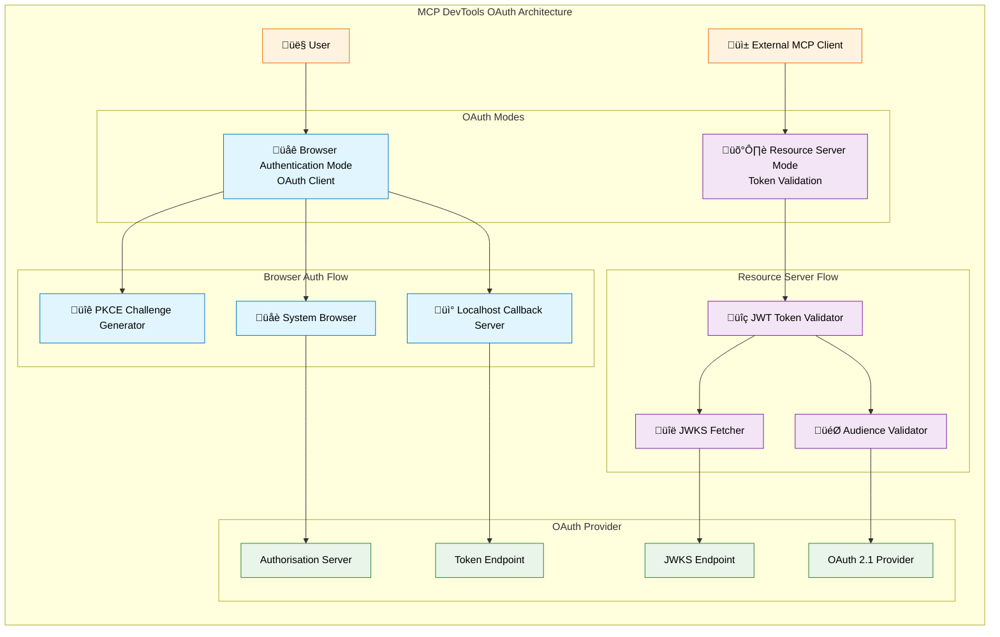

# OAuth 2.0/2.1 Authentication for MCP DevTools

MCP DevTools provides comprehensive OAuth 2.0/2.1 support for HTTP-based transports, implementing both resource server and client functionality according to the MCP 2025-06-18 specification.

## Overview

OAuth authentication in MCP DevTools operates in two distinct modes:

**🌐 Browser Authentication Mode (OAuth Client)**
- Interactive user authentication via browser
- Authorisation code flow with PKCE
- Perfect for development and desktop environments
- Authenticates before MCP server starts

**🛡️ Resource Server Mode (OAuth Token Validation)**
- Validates incoming JWT tokens from clients
- Protects MCP resources with OAuth authorisation
- Suitable for production API servers
- Validates tokens on each request

## When Do You Need OAuth?

You may want OAuth if you need:
- **User authentication** for accessing the MCP server
- **Token-based security** for production deployments
- **Integration with existing identity providers** (Authentik, Keycloak, etc.)
- **Compliance with organisational authentication** requirements

Most users can skip OAuth and use simple bearer tokens or run without authentication for development as long as the MCP Server is running locally - or does not have access to sensitive data.

## OAuth Authentication Scenarios

MCP DevTools supports three main OAuth authentication patterns:

```mermaid
graph TD
    subgraph "OAuth Authentication Scenarios"
        direction TB

        subgraph "Scenario 1: Server-Level Authentication"
            S1[🛡️ Users must authenticate to access MCP DevTools]
            S1A[Browser Authentication Mode<br/>Server authenticates on startup]
            S1B[Resource Server Mode<br/>Clients authenticate to server]
            S1 --> S1A
            S1 --> S1B
        end

        subgraph "Scenario 2: Tool-Level Authentication"
            S2[🔐 Users authenticate for specific tools<br/>Identity passed to underlying services]
            S2A[Per-tool OAuth scopes<br/>Fine-grained permissions]
            S2B[User identity context<br/>Available to tools]
            S2 --> S2A
            S2 --> S2B
        end

        subgraph "Scenario 3: Service-to-Service Authentication"
            S3[🔌 MCP DevTools authenticates to external services<br/>Tools access downstream APIs]
            S3A[Confluence Tool<br/>OAuth to Confluence API]
            S3B[GitHub Tool<br/>OAuth to GitHub API]
            S3C[Google Drive Tool<br/>OAuth to Google API]
            S3 --> S3A
            S3 --> S3B
            S3 --> S3C
        end
    end

    subgraph "Implementation Status"
        direction LR
        Implemented[✅ Fully Implemented]
        Partial[🔄 Partially Supported]
        Future[🚧 Future Enhancement]
    end

    S1A --> Implemented
    S1B --> Implemented
    S2B --> Partial
    S2A --> Future
    S3A --> Future
    S3B --> Future
    S3C --> Future

    classDef implemented fill:#e8f5e8,stroke:#2e7d32,color:#000
    classDef partial fill:#fff3e0,stroke:#ef6c00,color:#000
    classDef future fill:#f3e5f5,stroke:#7b1fa2,color:#000
    classDef scenario fill:#e1f5fe,stroke:#0277bd,color:#000

    class S1A,S1B,Implemented implemented
    class S2B,Partial partial
    class S2A,S3A,S3B,S3C,Future future
    class S1,S2,S3 scenario
```



## Configuration Guide by Scenario

### 🛡️ Scenario 1: Server-Level Authentication
**"Users must authenticate to access MCP DevTools"**

#### Browser Authentication Mode (Personal/Development)
```bash
# Server authenticates on startup
OAUTH_BROWSER_AUTH=true
OAUTH_CLIENT_ID="mcp-devtools-client"
OAUTH_ISSUER="https://auth.example.com"
./mcp-devtools --transport=http
```

**MCP Client Config:**
```json
{
  "mcpServers": {
    "dev-tools": {
      "type": "streamableHttp",
      "url": "http://localhost:18080/http"
    }
  }
}
```

#### Resource Server Mode (Production/Shared)
```bash
# Server validates client tokens
OAUTH_ENABLED=true
OAUTH_ISSUER="https://auth.example.com"
OAUTH_AUDIENCE="https://mcp.example.com"
OAUTH_JWKS_URL="https://auth.example.com/.well-known/jwks.json"
./mcp-devtools --transport=http
```

**MCP Client Config:**
```json
{
  "mcpServers": {
    "dev-tools": {
      "type": "streamableHttp",
      "url": "https://mcp.example.com/http",
      "oauth": {
        "authorization_url": "https://auth.example.com/authorize/",
        "token_url": "https://auth.example.com/token/",
        "client_id": "mcp-client-id",
        "scopes": ["openid", "profile", "mcp:tools"]
      }
    }
  }
}
```

### 🔐 Scenario 2: Tool-Level Authentication
**"Users authenticate for specific tools, identity passed to services"**

#### Current Support (Partial)
```bash
# Server-level OAuth provides user context to tools
OAUTH_BROWSER_AUTH=true
OAUTH_CLIENT_ID="mcp-devtools-client"
OAUTH_ISSUER="https://auth.example.com"
OAUTH_SCOPE="openid profile mcp:search mcp:documents"
./mcp-devtools --transport=http
```

Tools can access user identity from OAuth claims in request context.

#### Future Enhancement
```bash
# Per-tool scopes and fine-grained permissions
OAUTH_TOOL_SCOPES="search:read,documents:write,memory:admin"
OAUTH_TOOL_DELEGATION=true
```

### 🔌 Scenario 3: Service-to-Service Authentication
**"MCP DevTools authenticates to external services for tools"**

#### Future Implementation Example
```bash
# Tool-specific OAuth configurations
CONFLUENCE_OAUTH_CLIENT_ID="confluence-tool-client"
CONFLUENCE_OAUTH_CLIENT_SECRET="secret"
CONFLUENCE_OAUTH_ISSUER="https://auth.atlassian.com"

GITHUB_OAUTH_CLIENT_ID="github-tool-client"
GITHUB_OAUTH_CLIENT_SECRET="secret"
GITHUB_OAUTH_ISSUER="https://github.com"

./mcp-devtools --transport=http
```

Tools would handle their own OAuth flows to external services.

## Quick Decision Guide: Which OAuth Mode Should I Use?

### 🌐 Use Browser Authentication Mode When
- **You're running MCP DevTools locally** (development, personal use)
- **You want interactive login** before the server starts
- **You're using it as a CLI tool** or desktop application
- **You have browser access** on the machine running the server
- **You want the simplest setup** with your OAuth provider

**Example**: Running MCP DevTools on your laptop for personal development work.

### 🛡️ Use Resource Server Mode When
- **You're deploying MCP DevTools as a service** (production, shared environments)
- **External clients will connect** with their own tokens
- **You're building a microservice** that validates incoming tokens
- **You're running headless** (no browser access)
- **You need to validate tokens from multiple different clients**

**Example**: Deploying MCP DevTools on a server that multiple team members access via their MCP clients.

### 🔄 Use Both Modes When
- **The server needs its own authentication** AND **validates external client tokens**
- **You're building a complex multi-tenant system**

**Most users should start with Browser Authentication Mode** - it's simpler and works great for personal/development use.

## Architecture Overview



## Quick Start

### Browser Authentication (Development/Desktop)

For interactive authentication during server startup:

```bash
# Enable browser authentication
OAUTH_BROWSER_AUTH=true
OAUTH_CLIENT_ID="your-client-id"
OAUTH_ISSUER="https://auth.example.com"
OAUTH_AUDIENCE="https://mcp.example.com"

./mcp-devtools --transport=http
```

The server will open your browser for authentication before starting.

### Resource Server (Production)

For validating external client tokens:

```bash
# Enable resource server mode
OAUTH_ENABLED=true
OAUTH_ISSUER="https://auth.example.com"
OAUTH_AUDIENCE="https://mcp.example.com"
OAUTH_JWKS_URL="https://auth.example.com/.well-known/jwks.json"

./mcp-devtools --transport=http
```

## Configuration Options

### Environment Variables

| Variable              | Description                   | Browser Auth | Resource Server |
|-----------------------|-------------------------------|--------------|-----------------|
| `OAUTH_BROWSER_AUTH`  | Enable browser authentication | ✅ Required   | ❌               |
| `OAUTH_ENABLED`       | Enable token validation       | ❌            | ✅ Required      |
| `OAUTH_CLIENT_ID`     | OAuth client identifier       | ✅ Required   | ❌               |
| `OAUTH_CLIENT_SECRET` | OAuth client secret           | 🔶 Optional  | ❌               |
| `OAUTH_ISSUER`        | OAuth issuer URL              | ✅ Required   | ✅ Required      |
| `OAUTH_AUDIENCE`      | Token audience                | ✅ Required   | ✅ Required      |
| `OAUTH_JWKS_URL`      | JWKS endpoint for validation  | ❌            | ✅ Required      |
| `OAUTH_SCOPE`         | Requested scopes              | 🔶 Optional  | ❌               |
| `OAUTH_CALLBACK_PORT` | Callback server port          | 🔶 Optional  | ❌               |
| `OAUTH_REQUIRE_HTTPS` | Enforce HTTPS                 | 🔶 Optional  | 🔶 Optional     |

### CLI Flags

All environment variables have corresponding CLI flags:

```bash
./mcp-devtools --transport=http \
    --oauth-browser-auth \
    --oauth-client-id="your-client-id" \
    --oauth-issuer="https://auth.example.com"
```

## OAuth Modes Comparison

| Scenario                  | Browser Auth   | Resource Server | Both                   |
|---------------------------|----------------|-----------------|------------------------|
| **Development/Testing**   | ✅ Primary      | 🔶 Optional     | ✅ Recommended          |
| **Desktop Applications**  | ✅ Required     | ❌ Not needed    | 🔶 If serving APIs     |
| **Production API Server** | ❌ Not suitable | ✅ Required      | ❌ Choose one           |
| **Microservice**          | ❌ Not suitable | ✅ Required      | ❌ Resource server only |
| **CLI Tools**             | ✅ Perfect fit  | ❌ Not needed    | ❌ Browser auth only    |

## Available Endpoints

When OAuth is enabled, metadata endpoints are available:

- `/.well-known/oauth-authorization-server` - Authorisation server metadata (RFC8414)
- `/.well-known/oauth-protected-resource` - Protected resource metadata (RFC9728)
- `/oauth/register` - Dynamic client registration (RFC7591) _(if enabled)_

## Detailed Guides

- **[OAuth Provider Setup with Authentik](authentik-setup.md)** - Complete setup guide for Authentik
- **[Browser Authentication Details](browser-auth.md)** - Comprehensive browser authentication documentation
- **[API Documentation](../api/README.md)** - Technical implementation details and tool registry

## Authentication Flow Diagrams

(Authentik used as example OAuth provider in these diagrams)

### Browser Authentication Flow


## Standards Compliance

This implementation follows these RFCs:

- **OAuth 2.1** (draft-ietf-oauth-v2-1-12): Core authorisation framework
- **RFC8414**: OAuth 2.0 Authorisation Server Metadata
- **RFC9728**: OAuth 2.0 Protected Resource Metadata
- **RFC7591**: OAuth 2.0 Dynamic Client Registration Protocol
- **RFC8707**: Resource Indicators for OAuth 2.0
- **MCP 2025-06-18**: Model Context Protocol authorisation specification

## Security Considerations

1. **Use HTTPS in Production**: Always use HTTPS for OAuth endpoints in production
2. **Short Token Lifetimes**: Configure short access token lifetimes (10-15 minutes)
3. **Scope Restrictions**: Limit OAuth scopes to minimum required permissions
4. **Audience Validation**: Ensure tokens are bound to the correct resource server
5. **Regular Key Rotation**: Rotate signing keys regularly in your OAuth provider

---

**Note**: OAuth support is completely optional and disabled by default. The server works perfectly without OAuth for development and simple deployments.
