# OAuth Integration for MCP Tools

This guide shows how to integrate OAuth authentication into your MCP tools using the built-in OAuth helper. This covers the two tool-related OAuth scenarios:

- **Scenario 2**: Tool uses user's OAuth identity and permissions
- **Scenario 3**: Tool authenticates to external services

## OAuth Tool Integration Architecture (Example)

```mermaid
graph TD
    subgraph "MCP DevTools Server"
        direction TB

        subgraph "Tool Layer"
            Tool1[📄 Document Tool]
            Tool2[🔍 Search Tool]
            Tool3[🔗 Confluence Tool]
            Tool4[📊 GitHub Tool]
        end

        subgraph "OAuth Helper Layer"
            OAuthHelper[🛡️ OAuth Helper<br/>toolhelper.OAuthHelper]
            UserClaims[👤 GetUserClaims]
            ScopeCheck[🔐 HasScope/RequireScope]
            ServiceClient[🔌 CreateServiceClient]
        end

        subgraph "OAuth Infrastructure"
            OAuthClient[📡 OAuth Client]
            TokenValidator[🔍 Token Validator]
            PKCEGen[🔐 PKCE Generator]
        end
    end

    subgraph "External Services"
        Confluence[🏢 Confluence API]
        GitHub[🐙 GitHub API]
        GoogleDrive[📁 Google Drive API]
        CustomAPI[🔧 Custom API]
    end

    subgraph "OAuth Providers"
        Authentik[🔑 Authentik]
        ConfluenceAuth[🏢 Atlassian OAuth]
        GitHubAuth[🐙 GitHub OAuth]
        GoogleAuth[🌐 Google OAuth]
    end

    subgraph "User Context"
        User[👤 Authenticated User]
        UserToken[🎫 User JWT Token]
        UserScopes[📋 User Scopes]
    end

    %% Scenario 2: User Identity Flow
    User --> UserToken
    UserToken --> TokenValidator
    TokenValidator --> UserClaims
    UserClaims --> Tool1
    UserClaims --> Tool2

    Tool1 --> OAuthHelper
    Tool2 --> OAuthHelper
    OAuthHelper --> UserClaims
    OAuthHelper --> ScopeCheck
    ScopeCheck --> UserScopes

    %% Scenario 3: Service-to-Service Flow
    Tool3 --> OAuthHelper
    Tool4 --> OAuthHelper
    OAuthHelper --> ServiceClient
    ServiceClient --> OAuthClient
    ServiceClient --> PKCEGen

    OAuthClient --> ConfluenceAuth
    OAuthClient --> GitHubAuth
    ConfluenceAuth --> Confluence
    GitHubAuth --> GitHub

    Tool3 --> Confluence
    Tool4 --> GitHub

    %% User authentication source
    User --> Authentik
    Authentik --> UserToken

    classDef tool fill:#e1f5fe,stroke:#0277bd,color:#000
    classDef helper fill:#e8f5e8,stroke:#2e7d32,color:#000
    classDef oauth fill:#f3e5f5,stroke:#7b1fa2,color:#000
    classDef external fill:#fff3e0,stroke:#ef6c00,color:#000
    classDef user fill:#fce4ec,stroke:#c2185b,color:#000

    class Tool1,Tool2,Tool3,Tool4 tool
    class OAuthHelper,UserClaims,ScopeCheck,ServiceClient helper
    class OAuthClient,TokenValidator,PKCEGen,Authentik,ConfluenceAuth,GitHubAuth,GoogleAuth oauth
    class Confluence,GitHub,GoogleDrive,CustomAPI external
    class User,UserToken,UserScopes user
```



**Key Relationships:**

- **🔐 Scenario 2 (User Identity)**: Tools → OAuth Helper → User Claims/Scopes
- **🔌 Scenario 3 (Service Auth)**: Tools → OAuth Helper → Service Client → External APIs
- **🛡️ OAuth Helper**: Central component that provides both user identity and service authentication
- **📡 Reusable Infrastructure**: OAuth clients, validators, and PKCE generators are shared

## Quick Start

### Import the OAuth Helper

```go
import (
    "github.com/sammcj/mcp-devtools/internal/oauth/toolhelper"
)
```

### Create OAuth Helper in Your Tool

```go
type MyTool struct {
    oauthHelper *toolhelper.OAuthHelper
}

func (t *MyTool) Execute(ctx context.Context, logger *logrus.Logger, cache *sync.Map, args map[string]interface{}) (*mcp.CallToolResult, error) {
    // Create OAuth helper
    oauthHelper := toolhelper.NewOAuthHelper(logger)

    // Use OAuth functionality...
}
```

## Scenario 2: Using User's OAuth Identity

### Check User Authentication

```go
func (t *MyTool) Execute(ctx context.Context, logger *logrus.Logger, cache *sync.Map, args map[string]interface{}) (*mcp.CallToolResult, error) {
    oauthHelper := toolhelper.NewOAuthHelper(logger)

    // Get user's OAuth claims
    claims, err := oauthHelper.GetUserClaims(ctx)
    if err != nil {
        return nil, fmt.Errorf("authentication required: %w", err)
    }

    logger.WithFields(logrus.Fields{
        "user_id": claims.Subject,
        "client_id": claims.ClientID,
        "scopes": claims.Scope,
    }).Info("Tool executing with user context")

    // Tool logic using user identity...
    return mcp.NewToolResultText("Success"), nil
}
```

### Require Specific Permissions

```go
func (t *MyTool) Execute(ctx context.Context, logger *logrus.Logger, cache *sync.Map, args map[string]interface{}) (*mcp.CallToolResult, error) {
    oauthHelper := toolhelper.NewOAuthHelper(logger)

    // Require specific scope for this tool
    if err := oauthHelper.RequireScope(ctx, "mcp:documents"); err != nil {
        return nil, fmt.Errorf("insufficient permissions: %w", err)
    }

    // Tool logic that requires document access...
    return mcp.NewToolResultText("Document operation completed"), nil
}
```

### Check Optional Permissions

```go
func (t *MyTool) Execute(ctx context.Context, logger *logrus.Logger, cache *sync.Map, args map[string]interface{}) (*mcp.CallToolResult, error) {
    oauthHelper := toolhelper.NewOAuthHelper(logger)

    // Check if user has admin permissions
    if oauthHelper.HasScope(ctx, "mcp:admin") {
        logger.Info("User has admin permissions - enabling advanced features")
        // Enable admin features
    } else {
        logger.Info("User has standard permissions - using basic features")
        // Use basic features only
    }

    // Tool logic...
    return mcp.NewToolResultText("Operation completed"), nil
}
```

## Scenario 3: Authenticating to External Services

### Basic Service Authentication Setup

```go
func (t *MyTool) Execute(ctx context.Context, logger *logrus.Logger, cache *sync.Map, args map[string]interface{}) (*mcp.CallToolResult, error) {
    oauthHelper := toolhelper.NewOAuthHelper(logger)

    // Configure OAuth for external service (e.g., Confluence)
    serviceConfig := &toolhelper.ServiceOAuthConfig{
        ClientID:     os.Getenv("CONFLUENCE_OAUTH_CLIENT_ID"),
        ClientSecret: os.Getenv("CONFLUENCE_OAUTH_CLIENT_SECRET"),
        IssuerURL:    "https://auth.atlassian.com",
        Scope:        "read:confluence-content.all",
        RequireHTTPS: true,
    }

    // Create service OAuth client
    serviceClient, err := oauthHelper.CreateServiceClient(serviceConfig)
    if err != nil {
        return nil, fmt.Errorf("failed to create service OAuth client: %w", err)
    }

    // Note: Full implementation is a future enhancement
    // For now, this returns an error indicating the feature is planned
    httpClient, err := serviceClient.GetAuthenticatedHTTPClient(ctx)
    if err != nil {
        return nil, fmt.Errorf("service authentication not yet implemented: %w", err)
    }

    // Use authenticated HTTP client for API calls...
    _ = httpClient
    return mcp.NewToolResultText("Service authentication configured"), nil
}
```

## Complete Example: Document Tool with User Permissions

```go
package documents

import (
    "context"
    "fmt"
    "sync"

    "github.com/mark3labs/mcp-go/mcp"
    "github.com/sammcj/mcp-devtools/internal/oauth/toolhelper"
    "github.com/sammcj/mcp-devtools/internal/registry"
    "github.com/sirupsen/logrus"
)

// DocumentTool demonstrates OAuth integration
type DocumentTool struct{}

func init() {
    registry.Register(&DocumentTool{})
}

func (t *DocumentTool) Definition() mcp.Tool {
    return mcp.NewTool(
        "document_access",
        mcp.WithDescription("Access documents with user permissions"),
        mcp.WithString("action",
            mcp.Required(),
            mcp.Description("Action to perform: read, write, delete"),
        ),
        mcp.WithString("document_id",
            mcp.Required(),
            mcp.Description("Document identifier"),
        ),
    )
}

func (t *DocumentTool) Execute(ctx context.Context, logger *logrus.Logger, cache *sync.Map, args map[string]interface{}) (*mcp.CallToolResult, error) {
    oauthHelper := toolhelper.NewOAuthHelper(logger)

    // Parse arguments
    action, ok := args["action"].(string)
    if !ok {
        return nil, fmt.Errorf("action parameter is required")
    }

    documentID, ok := args["document_id"].(string)
    if !ok {
        return nil, fmt.Errorf("document_id parameter is required")
    }

    // Get user identity
    claims, err := oauthHelper.GetUserClaims(ctx)
    if err != nil {
        return nil, fmt.Errorf("authentication required: %w", err)
    }

    // Check permissions based on action
    switch action {
    case "read":
        if err := oauthHelper.RequireScope(ctx, "mcp:documents:read"); err != nil {
            return nil, err
        }
    case "write":
        if err := oauthHelper.RequireScope(ctx, "mcp:documents:write"); err != nil {
            return nil, err
        }
    case "delete":
        if err := oauthHelper.RequireScope(ctx, "mcp:documents:admin"); err != nil {
            return nil, err
        }
    default:
        return nil, fmt.Errorf("invalid action: %s", action)
    }

    logger.WithFields(logrus.Fields{
        "user_id":     claims.Subject,
        "action":      action,
        "document_id": documentID,
    }).Info("Document operation authorized")

    // Perform the document operation...
    result := fmt.Sprintf("Document %s %s operation completed for user %s",
        documentID, action, claims.Subject)

    return mcp.NewToolResultText(result), nil
}
```

## Environment Configuration

### For User-Based Authentication (Scenario 2)

Configure server-level OAuth with appropriate scopes:

```bash
# Server configuration
OAUTH_BROWSER_AUTH=true
OAUTH_CLIENT_ID="mcp-devtools-client"
OAUTH_ISSUER="https://auth.example.com"
OAUTH_SCOPE="openid profile mcp:documents:read mcp:documents:write mcp:admin"
```

### For Service Authentication (Scenario 3)

Configure service-specific OAuth credentials:

```bash
# Confluence tool example
CONFLUENCE_OAUTH_CLIENT_ID="confluence-tool-client"
CONFLUENCE_OAUTH_CLIENT_SECRET="secret"

# GitHub tool example
GITHUB_OAUTH_CLIENT_ID="github-tool-client"
GITHUB_OAUTH_CLIENT_SECRET="secret"

# Google Drive tool example
GDRIVE_OAUTH_CLIENT_ID="gdrive-tool-client"
GDRIVE_OAUTH_CLIENT_SECRET="secret"
```

## OAuth Scopes for Tools

### Recommended Scope Patterns

```bash
# Tool-specific scopes
mcp:search:read          # Search tools
mcp:documents:read       # Document reading
mcp:documents:write      # Document modification
mcp:documents:admin      # Document administration
mcp:memory:read          # Memory/knowledge graph reading
mcp:memory:write         # Memory/knowledge graph writing
mcp:packages:read        # Package information access
mcp:tools:admin          # Tool administration
```

### OAuth Provider Configuration

Configure your OAuth provider (Authentik, Keycloak, etc.) with these scopes and assign them to users based on their roles.

## Error Handling

### Graceful Authentication Failures

```go
func (t *MyTool) Execute(ctx context.Context, logger *logrus.Logger, cache *sync.Map, args map[string]interface{}) (*mcp.CallToolResult, error) {
    oauthHelper := toolhelper.NewOAuthHelper(logger)

    // Check if user is authenticated
    claims, err := oauthHelper.GetUserClaims(ctx)
    if err != nil {
        // Provide helpful error message
        return nil, fmt.Errorf("this tool requires authentication. Please ensure the MCP server is configured with OAuth authentication")
    }

    // Check permissions with helpful error
    if !oauthHelper.HasScope(ctx, "mcp:documents:read") {
        return nil, fmt.Errorf("insufficient permissions: this tool requires 'mcp:documents:read' scope. Current scopes: %s", claims.Scope)
    }

    // Tool logic...
    return mcp.NewToolResultText("Success"), nil
}
```

## Testing OAuth Integration

### Unit Testing with Mock Context

```go
func TestDocumentToolWithOAuth(t *testing.T) {
    // Create mock context with OAuth claims
    claims := &types.TokenClaims{
        Subject:  "user123",
        ClientID: "test-client",
        Scope:    "openid profile mcp:documents:read",
    }

    ctx := context.WithValue(context.Background(), types.OAuthClaimsKey, claims)

    // Test tool execution
    tool := &DocumentTool{}
    result, err := tool.Execute(ctx, logrus.New(), &sync.Map{}, map[string]interface{}{
        "action":      "read",
        "document_id": "doc123",
    })

    assert.NoError(t, err)
    assert.NotNil(t, result)
}
```

## Implementation Status

### ✅ Currently Available
- User OAuth claims access
- Scope-based authorisation
- Permission checking helpers
- OAuth helper framework

### 🚧 Future Enhancements
- User access token extraction for API calls
- Service-to-service OAuth flows
- Token caching and refresh
- Advanced permission delegation

## Best Practices

1. **Always check authentication** before performing sensitive operations
2. **Use specific scopes** rather than broad permissions
3. **Provide helpful error messages** when authentication fails
4. **Log OAuth operations** for debugging and auditing
5. **Handle missing permissions gracefully** with clear user guidance
6. **Test with and without OAuth** to ensure tools work in both scenarios

---

This OAuth integration provides a clean, consistent way to add authentication to your MCP tools while maintaining the existing tool development patterns.
