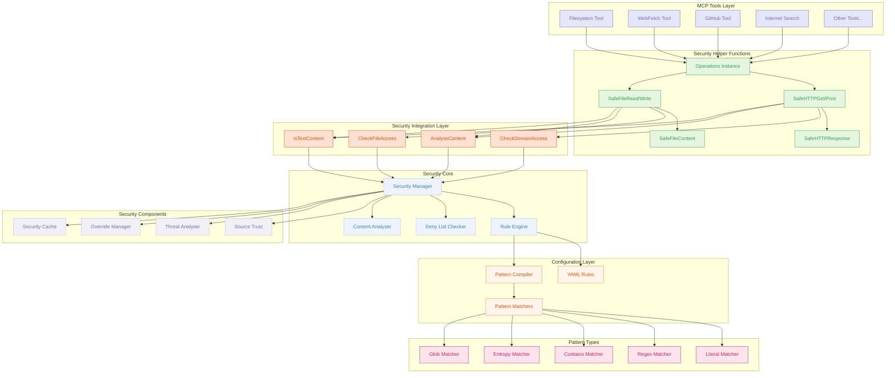
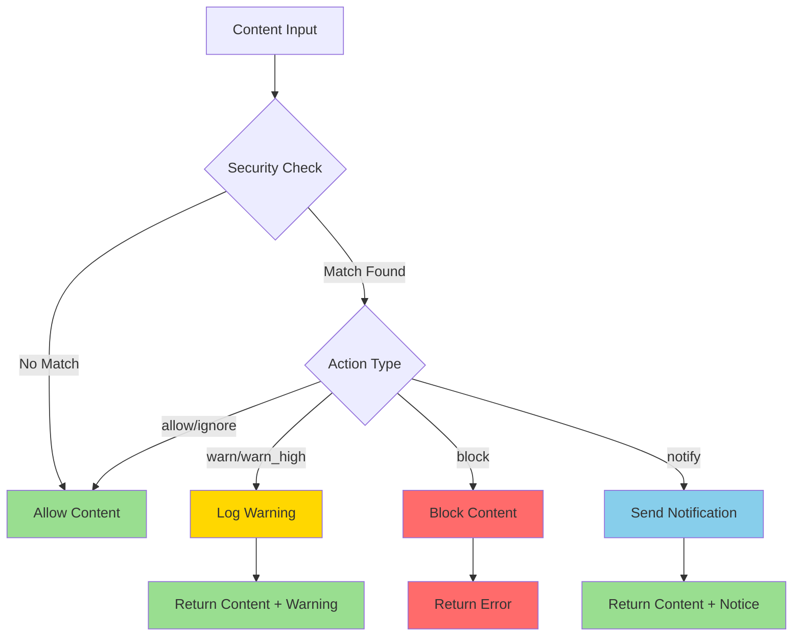

# MCP DevTools Security Framework

The MCP DevTools security framework provides a layer protection to help protect against malicious content, unauthorised file access, and dangerous network requests. It operates as a configurable, multi-layered security framework that can be enabled or disabled as needed.

## Table of Contents

- [Overview](#overview)
- [Architecture](#architecture)
- [Configuration](#configuration)
- [Security Rules](#security-rules)
- [Integration Patterns](#integration-patterns)
- [Enabling Security](#enabling-security)
- [Security Actions](#security-actions)
- [Override System](#override-system)
- [Performance Considerations](#performance-considerations)
- [Troubleshooting](#troubleshooting)
- [Security Caveats](#security-caveats)

## Overview

The security framework provides three main layers of protection:

1. **Access Control**: Prevents tools from accessing sensitive files and domains
2. **Content Analysis**: Scans returned content for security threats
3. **Lightweight Audit Logging**: Tracks all security events for review

The intent with the security framework is that the tool (software) fetches the content and checks there are not warn/block rules that match it and then it returns it to the AI model / AI agent so that the agent does not end up with potentially malicious content in it's context.

### Key Features

- **Configurable Rules**: YAML-based security rules with pattern matching
- **Domain Filtering**: Block access to dangerous or untrusted domains
- **File Access Control**: Prevent access to sensitive system files
- **Content Scanning**: Detect malicious patterns in returned content
- **Override System**: Allow bypassing security blocks when needed
- **Performance Optimised**: Minimal impact when disabled, efficient when enabled
- **Graceful Degradation**: Tools work normally when security is disabled

## Architecture



### Component Description

- **Security Manager**: Central coordinator that manages all security operations
- **Rule Engine**: Loads and compiles YAML security rules into efficient matchers
- **Deny List Checker**: Blocks access to explicitly denied files and domains
- **Content Analyser**: Scans content for security threats using pattern matching
- **Source Trust**: Manages trusted domains and exception handling
- **Override Manager**: Handles security bypasses when authorised
- **Pattern Matchers**: Efficient pattern matching implementations for different content types

## Configuration

Security configuration is managed primarily through YAML files, with minimal environment variable support.

### Configuration File Location

By default, the security configuration is stored at:
- **Rules**: `~/.mcp-devtools/security.yaml`
- **Logs**: `~/.mcp-devtools/logs/security.log` (or as configured in rules file)

Override rules file path with environment variable:
```bash
MCP_SECURITY_RULES_PATH="/custom/path/security.yaml"
```

### Environment Variables

Only minimal environment variables are supported. Most configuration is done via the YAML rules file.

| Variable                        | Default                               | Description                          |
|---------------------------------|---------------------------------------|--------------------------------------|
| `MCP_SECURITY_RULES_PATH`       | `~/.mcp-devtools/security.yaml` | Custom rules file path               |

All other configuration options are now managed through the YAML rules file configuration.

### Configuration Management Commands

The security system provides CLI commands to help manage configuration:

#### Config Validation
```bash
# Validate security configuration
mcp-devtools security-config-validate

# Validate custom config path
mcp-devtools security-config-validate --config-path /path/to/security.yaml
```

#### Config Diff and Update
```bash
# Show differences between user config and default
mcp-devtools security-config-diff

# Update user config with new defaults (creates backup)
mcp-devtools security-config-diff --update

# Use custom config path
mcp-devtools security-config-diff --config-path /path/to/security.yaml --update
```

### Security Configuration Structure

```yaml
version: "1.0"
metadata:
  description: "MCP DevTools Security Rules"
  created: "2024-01-01T00:00:00Z"

settings:
  enabled: true
  default_action: warn
  auto_reload: true
  case_sensitive: false
  enable_notifications: true
  max_content_size: 1024         # KB - Maximum content size to scan
  max_entropy_size: 64           # KB - Maximum size for entropy analysis
  size_exceeded_behaviour: allow # What to do when size limits exceeded: "allow", "warn", "block"
  log_path: ""                   # Custom log file path (empty = default)
  max_scan_size: 512             # KB - Maximum content size to scan
  threat_threshold: 0.7          # Threat detection threshold
  cache_enabled: true            # Enable security result caching
  cache_max_age: "1h"            # Maximum cache age
  cache_max_size: 1000           # Maximum cache entries

# Trusted sources (exception lists for rules)
trusted_domains:
  - docs.docker.com
  - kubernetes.io
  - "*.github.io"
  - golang.org

# Access Control: Completely block access to these files/domains
access_control:
  deny_files:
    - "~/.ssh/id_rsa"
    - "~/.aws/credentials"
    - "/etc/passwd"

  deny_domains:
    - "malicious-site.com"
    - "*.suspicious-tld"

# Content Analysis Rules
rules:
  # ... (see Security Rules section)
```

### Size Limit Enforcement

The security system enforces size limits on content to prevent processing of extremely large files or responses that could impact performance. The behaviour when these limits are exceeded is configurable:

#### Size Settings

- `max_content_size`: Maximum content size to scan for security threats (KB)
- `max_scan_size`: Maximum overall content size limit (KB)
- `size_exceeded_behaviour`: How to handle size limit violations

#### Size Exceeded Behaviours

| Behaviour | Description | Use Case |
|-----------|-------------|----------|
| `allow` | Log debug message and continue processing (may truncate content) | Default - backward compatible, permissive |
| `warn` | Log warning but allow processing to continue | Monitor size violations without blocking |
| `block` | Prevent processing entirely and return security block | Strict size enforcement |

#### Example Configuration

```yaml
settings:
  max_content_size: 1024           # 1MB content analysis limit
  max_scan_size: 512               # 512KB overall size limit
  size_exceeded_behaviour: warn    # Warn but allow processing
```

When content exceeds limits:
- **allow**: Content is truncated for analysis but processing continues
- **warn**: Warning logged with security ID, processing continues
- **block**: Processing blocked with security ID for override

Security overrides can be used to bypass size limit blocks when needed.

## Security Rules

Security rules define patterns to detect in content and actions to take when patterns match.

### Rule Structure

```yaml
rule_name:
  description: "Human-readable description"
  patterns:
    - literal: "exact string match"
    - contains: "substring match"
    - regex: "(?i)regex pattern"
    - entropy: 6.5  # High entropy threshold
    - file_path: "file path pattern"
  action: warn|warn_high|block|allow|ignore
  severity: low|medium|high|critical
  exceptions: [trusted_domains]
```

### Pattern Types

| Pattern Type  | Description                               | Example                |
|---------------|-------------------------------------------|------------------------|
| `literal`     | Exact string match                        | `"rm -rf /"`           |
| `contains`    | Substring match (supports home expansion) | `"~/.aws/credentials"` |
| `regex`       | Regular expression                        | `"(?i)curl.*\\|.*sh"`  |
| `entropy`     | High entropy detection                    | `6.5`                  |
| `file_path`   | File path matching                        | `"*/etc/passwd"`       |
| `glob`        | Glob pattern matching                     | `"*.exe"`              |
| `starts_with` | Prefix matching                           | `"http://"`            |
| `ends_with`   | Suffix matching                           | `".exe"`               |

### Built-in Security Rules

The system includes comprehensive built-in rules for:

#### Shell Injection Detection
- Command injection via pipes (`curl | bash`)
- Command substitution (`$(command)`)
- Backtick execution (`` `command` ``)
- Base64 encoded commands

#### Data Exfiltration Detection
- DNS exfiltration attempts
- Raw socket operations
- SSH command execution
- Browser credential theft
- Keychain/keyring access

#### Prompt Injection Detection
- "Ignore previous instructions" attacks
- API key/password enumeration requests
- Conversation history extraction
- Environment variable exports
- Invisible Unicode character attacks

#### Persistence Mechanism Detection
- Launchctl persistence (macOS)
- Systemd service persistence (Linux)
- Crontab modifications
- RC script modifications

#### Sensitive File References
- SSH private keys
- AWS credentials
- Database passwords
- Certificate files

### Custom Rules

Add custom rules for specific threats:

```yaml
rules:
  company_secrets:
    description: "Detect company secret patterns"
    patterns:
      - regex: "(?i)company[_-]?(api[_-]?key|secret|token)"
      - contains: "ACME_CORP_SECRET"
    action: block
    severity: high

  internal_domains:
    description: "Detect internal domain references"
    patterns:
      - regex: ".*\\.internal\\.company\\.com"
    action: warn
    severity: medium
    exceptions: [trusted_domains]
```

## Integration Patterns

All MCP tools that access files or make HTTP requests must integrate with the security system. There are two approaches: **Helper Functions (Recommended)** and **Manual Integration**.

### Recommended: Helper Functions Integration

The recommended approach is to use security helper functions that provide simplified APIs with automatic security integration and content integrity preservation.

#### Quick Start with Helper Functions

```go
import "github.com/sammcj/mcp-devtools/internal/security"

func (t *MyTool) Execute(ctx context.Context, logger *logrus.Logger, cache *sync.Map, args map[string]interface{}) (*mcp.CallToolResult, error) {
    // Create operations instance for your tool
    ops := security.NewOperations("my-tool")

    // Secure HTTP GET with content integrity
    safeResp, err := ops.SafeHTTPGet("https://example.com/api/data")
    if err != nil {
        // Handle security blocks or network errors
        if secErr, ok := err.(*security.SecurityError); ok {
            return nil, fmt.Errorf("security block [ID: %s]: %s", secErr.GetSecurityID(), secErr.Error())
        }
        return nil, err
    }

    // Content is EXACT bytes from server
    content := safeResp.Content

    // Check for security warnings (non-blocking)
    if safeResp.SecurityResult != nil && safeResp.SecurityResult.Action == security.ActionWarn {
        logger.Warnf("Security warning: %s", safeResp.SecurityResult.Message)
        // Content is still available despite warning
    }

    return processContent(content)
}
```

#### Helper Functions API

**HTTP Operations:**
```go
// Secure HTTP GET with content integrity preservation
func (o *Operations) SafeHTTPGet(urlStr string) (*SafeHTTPResponse, error)

// Secure HTTP POST with content integrity preservation
func (o *Operations) SafeHTTPPost(urlStr string, body io.Reader) (*SafeHTTPResponse, error)
```

**File Operations:**
```go
// Secure file read with content integrity preservation
func (o *Operations) SafeFileRead(path string) (*SafeFileContent, error)

// Secure file write with access control
func (o *Operations) SafeFileWrite(path string, content []byte) error
```

**Response Types:**
```go
type SafeHTTPResponse struct {
    Content        []byte          // EXACT original bytes - never modified
    ContentType    string          // Original content type
    StatusCode     int             // Original status code
    Headers        http.Header     // Original headers
    SecurityResult *SecurityResult // nil if safe, populated if warn
}

type SafeFileContent struct {
    Content        []byte          // EXACT file bytes - never modified
    Path           string          // Resolved path
    Info           os.FileInfo     // Original file info
    SecurityResult *SecurityResult // nil if safe, populated if warn
}
```

#### Helper Functions Benefits

- **80-90% Boilerplate Reduction**: From 30+ lines to 5-10 lines
- **Content Integrity**: Guaranteed exact byte preservation
- **Security Compliance**: Automatic integration with security framework
- **Error Handling**: Consistent security error patterns
- **Performance**: Same security guarantees with simpler code

## Security Helper Implementation Details

All MCP DevTools now use the standardised security helper functions. The security system automatically handles:

- **Domain Access Control**: Checks against deny lists before making requests
- **Content Analysis**: Scans text content for security threats using pattern matching
- **Binary Content Detection**: Automatically skips analysis for non-text content
- **Content Integrity**: Preserves exact original bytes without modification
- **Error Handling**: Consistent security error patterns with override IDs

### Migration from Manual to Helper Functions

**Before (Manual Integration - 30+ lines):**
```go
// Domain check
parsedURL, err := url.Parse(urlStr)
if err != nil {
    return nil, err
}
if err := security.CheckDomainAccess(parsedURL.Hostname()); err != nil {
    return nil, err
}

// HTTP request
resp, err := http.Get(urlStr)
if err != nil {
    return nil, err
}
defer resp.Body.Close()

content, err := io.ReadAll(resp.Body)
if err != nil {
    return nil, err
}

// Security analysis
sourceCtx := security.SourceContext{
    URL: urlStr,
    Domain: parsedURL.Hostname(),
    ContentType: resp.Header.Get("Content-Type"),
    Tool: "tool-name",
}

secResult, err := security.AnalyseContent(string(content), sourceCtx)
if err != nil {
    logger.WithError(err).Warn("Security analysis failed")
}

if secResult != nil && secResult.Action == security.ActionBlock {
    return nil, &security.SecurityError{
        ID: secResult.ID,
        Message: secResult.Message,
        Action: security.ActionBlock,
    }
}

if secResult != nil && secResult.Action == security.ActionWarn {
    security.LogSecurityEvent(secResult.ID, "warn", secResult.Analysis, urlStr, "tool-name")
    logger.WithField("security_warning", true).Info("Content analysis warning")
}
```

**After (Helper Functions - 5-10 lines):**
```go
ops := security.NewOperations("tool-name")

safeResp, err := ops.SafeHTTPGet(urlStr)
if err != nil {
    if secErr, ok := err.(*security.SecurityError); ok {
        return nil, fmt.Errorf("security block [ID: %s]: %s", secErr.GetSecurityID(), secErr.Error())
    }
    return nil, err
}

// Handle warnings if present
if safeResp.SecurityResult != nil && safeResp.SecurityResult.Action == security.ActionWarn {
    logger.Warnf("Security warning [ID: %s]: %s", safeResp.SecurityResult.ID, safeResp.SecurityResult.Message)
}

// Process exact content
return processContent(safeResp.Content)
```

## Enabling Security

The security system is controlled by the `ENABLE_ADDITIONAL_TOOLS` environment variable and requires the `security` tool to be included.

### Enabling Security

```bash
# Enable security system and override tool
ENABLE_ADDITIONAL_TOOLS="security,security_override"
```

### Checking Security Status

```bash
# Check if security is enabled
./bin/mcp-devtools --help | grep security

# View current security configuration
echo '{"jsonrpc": "2.0", "id": 1, "method": "tools/list"}' | ./bin/mcp-devtools stdio
```

### Disabling Security

```bash
# Disable security by excluding from enabled tools
ENABLE_ADDITIONAL_TOOLS="filesystem,webfetch"  # security not included

# Or disable in rules file settings.enabled: false
```

## Security Actions

The security system supports different action types for handling detected threats:

| Action      | Behaviour                        | Use Case                                 |
|-------------|----------------------------------|------------------------------------------|
| `allow`     | Allow content unconditionally    | Whitelist trusted content                |
| `block`     | Block content completely         | Prevent access to malicious content      |
| `ignore`    | Skip security checks             | Performance optimisation                 |
| `notify`    | Send notification, allow content | Alert on specific patterns               |
| `warn_high` | Log high-priority warning        | Flag dangerous but not malicious content |
| `warn`      | Log warning, allow content       | Monitor suspicious content               |

### Action Processing



## Override System

The security system provides an override mechanism for bypassing security blocks when necessary.

### Using Security Overrides

When content is blocked, users can override the decision using the `security_override` tool:

```json
{
  "name": "security_override",
  "arguments": {
    "security_id": "sec_block_1625234567_abc123",
    "justification": "This content is safe for my use case",
    "duration": "1h"
  }
}
```

### Override Parameters

- `security_id`: Unique ID from the security block message
- `justification`: Human-readable reason for override
- `duration`: How long the override is valid (e.g., "1h", "24h", "permanent")

### Override Management

- **Temporary Overrides**: Expire after specified duration
- **Audit Trail**: All overrides are logged with justification
- **Revocation**: Overrides can be manually revoked
- **Scope**: Overrides apply to specific content patterns, not global bypasses

## Performance Considerations

The security system is designed for minimal performance impact:

### Performance Optimisations

- **Lazy Loading**: Security components loaded only when needed
- **Pattern Compilation**: Regex patterns compiled once at startup
- **Content Size Limits**: Large content truncated before analysis
- **Caching**: Security analysis results cached for repeated content
- **Early Termination**: Stop scanning at first match for block rules

### Performance Metrics

Based on performance testing:

- **File Access Checks**: ~1µs per check
- **Domain Access Checks**: ~1µs per check
- **Content Analysis**: 10-650µs depending on content size and complexity
- **Memory Usage**: <10MB for typical rule sets
- **Startup Overhead**: <100ms for rule compilation

### Tuning Performance

```yaml
settings:
  max_content_size: 512        # Reduce for faster scanning
  max_entropy_size: 32         # Reduce entropy analysis size
  case_sensitive: false        # Faster case-insensitive matching
```

## Troubleshooting

### Common Issues

#### Security Rules Not Loading

**Symptoms**: Security checks not working, no security logs
**Solution**:
1. Check `MCP_SECURITY_ENABLED` environment variable
2. Verify `security` is in `ENABLE_ADDITIONAL_TOOLS`
3. Check rules file path and permissions
4. Review security logs for errors

#### False Positives

**Symptoms**: Legitimate content being blocked
**Solution**:
1. Add content source to `trusted_domains`
2. Create exception patterns in rules
3. Use security override for immediate access
4. Adjust rule sensitivity

#### Performance Issues

**Symptoms**: Tools responding slowly
**Solution**:
1. Reduce `max_content_size` in settings
2. Disable entropy analysis for large content
3. Optimise regex patterns
4. Enable result caching

#### Permission Errors

**Symptoms**: Cannot read security rules file
**Solution**:
1. Check file permissions: `chmod 600 ~/.mcp-devtools/security.yaml`
2. Verify directory permissions: `chmod 700 ~/.mcp-devtools`
3. Check file ownership
4. Use custom path with proper permissions

### Debug Mode

Enable debug logging for detailed security analysis:

```bash
MCP_DEBUG=true
MCP_SECURITY_LOG_LEVEL=debug
./bin/mcp-devtools stdio
```

### Testing Security Rules

Test regex patterns before adding to rules:

```bash
# Test a pattern against sample content
echo "test content" | grep -E "your_regex_pattern"

# Use online regex testers for complex patterns
# https://regex101.com/
```

## Security Caveats

### Important Limitations

#### Content Analysis Timing
- **Content is analysed AFTER fetching**: The security system analyses content after tools have already accessed it
- **Network requests still made**: Domain blocks prevent requests, but content analysis happens post-fetch
- **File access occurs**: File access blocks prevent reading, but content analysis happens post-read

#### Pattern Matching Limitations
- **Regex Performance**: Complex regex patterns can impact performance
- **Encoding Evasion**: Base64 or other encoding may bypass simple patterns
- **Context Loss**: Patterns match content snippets, not semantic meaning
- **False Negatives**: Sophisticated attacks may evade pattern detection

#### Configuration Security
- **Rules File Access**: Security rules file must be protected from modification
- **Environment Variables**: Security settings in environment variables can be modified
- **Override Abuse**: Security overrides can be misused if not properly managed

#### Bypass Mechanisms
- **Direct File Access**: Local file system access outside MCP tools bypasses security
- **Alternative Tools**: Non-MCP tools not subject to security controls
- **Configuration Changes**: Security can be disabled via environment variables

### Security Recommendations

#### For Production Use
1. **Restrict Configuration Access**: Protect security rules files and environment variables
2. **Monitor Override Usage**: Track and audit security override usage
3. **Regular Rule Updates**: Keep security patterns updated for new threats
4. **Performance Testing**: Monitor performance impact of security rules
5. **Incident Response**: Establish procedures for security alert handling

#### For Development Use
1. **Test Security Rules**: Verify rules work as expected before deployment
2. **Document Exceptions**: Clearly document why trusted domains are needed
3. **Review Override Justifications**: Ensure overrides have legitimate business reasons
4. **Monitor Security Logs**: Regularly review security event logs

### Defence in Depth

The MCP DevTools security system is one layer of security. For comprehensive protection:

1. **System-Level Security**: Use OS-level access controls and firewalls
2. **Network Security**: Implement network-level filtering and monitoring
3. **Application Security**: Validate all user inputs and outputs
4. **Monitoring**: Implement comprehensive logging and alerting
5. **Regular Updates**: Keep all software components updated
6. **User Training**: Educate users about security best practices

The security system provides valuable protection but should be part of a broader security strategy, not the sole security measure.
