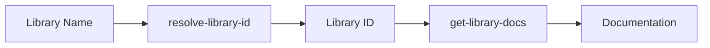

# Package Documentation Tools

The `packagedocs` package provides MCP tools for retrieving comprehensive documentation for libraries and packages through the Context7 API.

## Overview

This tool set enables AI agents and developers to access up-to-date documentation for any library or framework, making it particularly useful for:

- Understanding API references and usage patterns
- Getting code examples and implementation guidance
- Finding specific documentation topics (e.g., hooks, routing, authentication)
- Accessing documentation that may not be available in training data

## Tools

### 1. `resolve-library-id`

Resolves a library name to a Context7-compatible library ID.

**Purpose**: Before fetching documentation, you need to resolve the library name to an exact library ID that Context7 recognises.

**Parameters**:
- `libraryName` (required): The name of the library to search for (e.g., "react", "tensorflow", "express")

**Example Usage**:
```json
{
  "name": "resolve-library-id",
  "arguments": {
    "libraryName": "react"
  }
}
```

**Response**: Returns the best matching library ID along with alternatives and selection rationale based on:
- Name similarity (exact matches prioritised)
- Trust score (7-10 are more authoritative)
- Documentation coverage (number of code snippets and tokens)
- GitHub stars and community adoption

### 2. `get-library-docs`

Fetches comprehensive documentation for a specific library using its Context7-compatible ID.

**Purpose**: Retrieves up-to-date documentation content optimised for AI consumption.

**Parameters**:
- `context7CompatibleLibraryID` (required): The exact library ID from `resolve-library-id` (e.g., "/facebook/react", "/vercel/next.js")
- `topic` (optional): Focus on specific documentation topics (e.g., "hooks", "routing", "authentication")
- `tokens` (optional): Maximum tokens to retrieve (default: 10,000, max: 100,000)

**Example Usage**:
```json
{
  "name": "get-library-docs",
  "arguments": {
    "context7CompatibleLibraryID": "/facebook/react",
    "topic": "hooks",
    "tokens": 15000
  }
}
```

**Response**: Returns formatted documentation with metadata including topic focus, token limits, and content length.

## Workflow

The typical workflow for using these tools is:

1. **Resolve Library ID**: Use `resolve-library-id` to find the correct library identifier
2. **Fetch Documentation**: Use `get-library-docs` with the resolved ID to get the documentation



## Features

- **Intelligent Library Matching**: Finds the most relevant library based on multiple criteria
- **Topic Filtering**: Focus documentation retrieval on specific areas of interest
- **Scalable Content**: Adjust token limits based on your needs (1,000 - 100,000 tokens)
- **Rich Metadata**: Includes trust scores, GitHub stars, and documentation coverage stats
- **Alternative Suggestions**: Shows other potential matches when multiple libraries exist
- **Caching**: Built-in caching reduces API calls and improves performance

## Error Handling

The tools provide clear error messages for common issues:
- Invalid library names or IDs
- No matching libraries found
- API communication failures
- Token limit violations

## Implementation Details

- **Client**: HTTP client with 30-second timeout for Context7 API communication
- **Caching**: In-memory cache with 30-minute expiry for search results
- **Validation**: Library ID format validation and parameter sanitisation
- **Logging**: Comprehensive logging for debugging and monitoring

## Context7 Integration

These tools integrate with the Context7 API, which provides:
- Curated documentation from official sources
- AI-optimised content formatting
- Real-time updates from library maintainers
- Quality scoring and trust metrics
- Comprehensive coverage across programming languages and frameworks