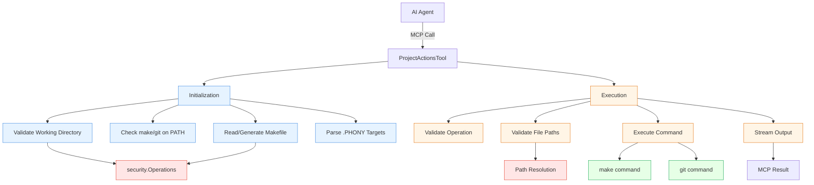

# Project Actions Tool Design

## Overview

The project-actions tool provides a security-aware interface for executing common development tasks (tests, linters, formatters) and git operations through a project's Makefile. It acts as a thin, controlled wrapper around `make` and `git` commands, enabling AI agents to perform development workflows without requiring knowledge of project-specific tooling.

**Key Design Principles:**
- **Minimal Abstraction**: Thin wrapper around make/git with minimal logic
- **Security-First**: Validates all paths, restricts operations to project directory
- **Makefile-Centric**: Single source of truth for available actions
- **Real-Time Feedback**: Stream command output for long-running operations
- **Fail-Fast**: Simple error propagation without retry logic
- **Dynamic Operations**: Available operations determined by Makefile .PHONY targets (plus git add/commit)

## Architecture



## Components and Interfaces

### 1. ProjectActionsTool Struct

```go
type ProjectActionsTool struct {
    workingDir           string              // Validated working directory
    makefileTargets      []string            // Parsed .PHONY targets
    maxCommitMessageSize int                 // Commit message size limit
    secOps               *security.Operations // Security helper
}
```

### 2. Tool Interface Implementation

```go
// Definition returns MCP tool definition
func (t *ProjectActionsTool) Definition() mcp.Tool

// Execute handles tool invocation
func (t *ProjectActionsTool) Execute(ctx context.Context, logger *logrus.Logger,
    cache *sync.Map, args map[string]any) (*mcp.CallToolResult, error)
```

### 3. Core Operations

#### Initialization
```go
// init registers tool and performs one-time setup
func init() {
    tool := &ProjectActionsTool{}
    tool.initialize()
    registry.Register(tool)
}

// initialize performs startup validation and discovery
func (t *ProjectActionsTool) initialize(language string) error {
    // 1. Validate working directory
    // 2. Check make/git availability - fail if not found
    // 3. If Makefile exists, read it; else generate from language parameter
    // 4. Parse .PHONY targets
    // 5. Validate target names (alphanumeric, hyphen, underscore only)
}
```

#### Working Directory Validation
```go
func (t *ProjectActionsTool) validateWorkingDirectory(dir string) error {
    // 1. Resolve to absolute path
    // 2. Check not system directory
    // 3. Verify owner is calling user
    // 4. Check owner write bit set
}
```

#### Makefile Operations
```go
func (t *ProjectActionsTool) generateMakefile(language string) (string, error) {
    // Generate language-specific Makefile with tabs
    // Return Makefile content as string
}

func (t *ProjectActionsTool) parsePhonyTargets(makefileContent string) ([]string, error) {
    // Extract .PHONY target names
    // Validate each target name
    // Return list of valid targets
}
```

#### Command Execution
```go
func (t *ProjectActionsTool) executeMakeTarget(ctx context.Context, target string,
    dryRun bool) (*CommandResult, error) {
    // 1. Validate target in makefileTargets
    // 2. Build command: make TARGET_NAME
    // 3. Execute with streaming output
    // 4. Return result with exit code and timing
}

func (t *ProjectActionsTool) executeGitAdd(ctx context.Context, paths []string,
    dryRun bool) (*CommandResult, error) {
    // 1. Validate and resolve each path
    // 2. Build command: git add path1 path2 path3
    // 3. Execute with streaming output
    // 4. Return result
}

func (t *ProjectActionsTool) executeGitCommit(ctx context.Context, message string,
    dryRun bool) (*CommandResult, error) {
    // 1. Validate message size
    // 2. Build command: git commit --file=-
    // 3. Pass message via stdin
    // 4. Execute with streaming output
    // 5. Return result
}
```

#### Path Validation
```go
func (t *ProjectActionsTool) validateAndResolvePath(relativePath string) (string, error) {
    // 1. Clean path with filepath.Clean()
    // 2. Resolve to absolute with filepath.Abs()
    // 3. Verify within working directory
    // 4. Return absolute path
}
```

#### Command Streaming
```go
func (t *ProjectActionsTool) executeCommand(ctx context.Context, cmd *exec.Cmd) (*CommandResult, error) {
    // 1. Set up stdout/stderr pipes with separate buffers
    // 2. Start command
    // 3. Stream both stdout and stderr in real-time (separate goroutines)
    // 4. Wait for completion
    // 5. Return result with captured stdout, stderr, exit code and duration
}
```

## Data Models

### Input Parameters

```go
// MCP tool arguments
type ToolArgs struct {
    Operation       string   `json:"operation"`        // "add", "commit", or any .PHONY target from Makefile
    WorkingDir      string   `json:"working_directory,omitempty"` // Optional
    Paths           []string `json:"paths,omitempty"`  // For git add
    Message         string   `json:"message,omitempty"` // For git commit
    Language        string   `json:"language,omitempty"` // For Makefile generation
    DryRun          bool     `json:"dry_run,omitempty"` // Preview mode
}
```

### Output Models

```go
type CommandResult struct {
    Command      string        `json:"command"`       // Executed command
    Stdout       string        `json:"stdout"`        // Standard output
    Stderr       string        `json:"stderr"`        // Standard error
    ExitCode     int           `json:"exit_code"`     // Command exit code
    Duration     time.Duration `json:"duration"`      // Execution time
    WorkingDir   string        `json:"working_dir"`   // Where command ran
}
```

### Makefile Templates

```go
var makefileTemplates = map[string]string{
    "python": `...`,  // Python Makefile template
    "rust":   `...`,  // Rust Makefile template
    "go":     `...`,  // Go Makefile template
    "nodejs": `...`,  // Node.js Makefile template
}
```

## Error Handling

### Error Types

```go
type ProjectActionsError struct {
    Type    ErrorType
    Message string
    Cause   error
}

type ErrorType int

const (
    ErrorInvalidDirectory ErrorType = iota
    ErrorToolNotFound
    ErrorInvalidTarget
    ErrorInvalidPath
    ErrorCommandFailed
    ErrorMakefileInvalid
    ErrorCommitTooLarge
)
```

### Error Handling Strategy

1. **Validation Errors**: Return immediately with clear message
2. **Command Failures**: Pass through exit code and output
3. **Security Errors**: Format using `security.FormatSecurityBlockError()`
4. **Path Errors**: Include hint about directory traversal
5. **Git Errors**: Include hint about `git init`

### Error Messages

```go
const (
    ErrMsgSystemDir = "working directory cannot be a system directory: %s"
    ErrMsgNotWritable = "working directory not writable by current user: %s"
    ErrMsgMakeNotFound = "make not found on PATH - install make to use this tool"
    ErrMsgGitNotFound = "git not found on PATH - install git to use git operations"
    ErrMsgInvalidTarget = "target '%s' not found in Makefile .PHONY targets"
    ErrMsgPathEscape = "path escapes working directory: %s"
    ErrMsgCommitTooLarge = "commit message exceeds %d KB limit (use PROJECT_ACTIONS_MAX_COMMIT_SIZE to adjust)"
    ErrMsgGitFailed = "git command failed - you may need to run 'git init' or specify another directory"
)
```

## Testing Strategy

### Unit Tests

```go
// Test working directory validation
func TestValidateWorkingDirectory(t *testing.T) {
    tests := []struct {
        name    string
        dir     string
        wantErr bool
    }{
        {"valid directory", "/tmp/test", false},
        {"root directory", "/", true},
        {"system directory", "/bin", true},
    }
    // ...
}

// Test Makefile parsing
func TestParsePhonyTargets(t *testing.T) {
    // Test valid and invalid target names
}

// Test path validation
func TestValidateAndResolvePath(t *testing.T) {
    // Test path traversal prevention
}

// Test Makefile generation
func TestGenerateMakefile(t *testing.T) {
    // Test each language template
}
```

### Integration Tests

```go
// Test full workflow with temporary directory
func TestMakeTargetExecution(t *testing.T) {
    // 1. Create temp directory
    // 2. Generate Makefile
    // 3. Execute target
    // 4. Verify output
}

// Test git operations
func TestGitOperations(t *testing.T) {
    // 1. Initialize git repo
    // 2. Test add and commit
    // 3. Verify git state
}
```

### Test Coverage Goals

- **Unit Tests**: >80% coverage
- **Integration Tests**: Cover all operations
- **Error Paths**: Test all error conditions
- **Security**: Test path traversal, system directory blocking

## Implementation Phases

### Phase 1: Core Structure (Foundation)
- [ ] Create tool struct and registration
- [ ] Implement working directory validation
- [ ] Implement tool availability checking
- [ ] Add basic error types

### Phase 2: Makefile Operations
- [ ] Implement Makefile reading with security integration
- [ ] Implement .PHONY target parsing
- [ ] Create Makefile templates for all languages
- [ ] Implement Makefile generation
- [ ] Add target name validation

### Phase 3: Command Execution
- [ ] Implement make target execution
- [ ] Implement real-time output streaming
- [ ] Add dry-run mode support
- [ ] Implement timing and exit code capture

### Phase 4: Git Operations
- [ ] Implement path validation and resolution
- [ ] Implement git add (batch)
- [ ] Implement git commit with stdin
- [ ] Add commit size validation

### Phase 5: Polish
- [ ] Add comprehensive error messages
- [ ] Implement extended help
- [ ] Add MCP annotations
- [ ] Write documentation

### Phase 6: Testing
- [ ] Write unit tests
- [ ] Write integration tests
- [ ] Test with real projects
- [ ] Performance testing

## Security Considerations

### Security Integration Points

1. **Makefile Reading**: Use `security.Operations.SafeFileRead()`
2. **Working Directory**: Validate ownership and permissions
3. **Path Resolution**: Prevent directory traversal
4. **Command Execution**: No shell interpretation
5. **Commit Messages**: Pass via stdin to prevent injection

### Security Boundaries

- **No Cross-Boundary**: Tool runs as user in their repository
- **Path Containment**: All operations within working directory
- **Command Isolation**: Direct execution, no shell pipes
- **Input Validation**: Strict validation of all parameters

### Threat Model

**Threats Mitigated:**
- Directory traversal attacks
- Command injection via target names
- System directory modification
- Unauthorized file access

**Threats Not Mitigated:**
- Malicious Makefile content (user's responsibility)
- Malicious git hooks (user's responsibility)
- Resource exhaustion from long-running commands

## Performance Considerations

### Optimization Strategies

1. **Lazy Initialization**: Parse Makefile only once at startup
2. **Batch Operations**: Single git add for multiple files
3. **Streaming Output**: Real-time feedback without buffering
4. **No Caching**: Simple stateless execution

### Resource Limits

- **Commit Message**: 16 KB default (configurable)
- **Command Timeout**: Inherit from context
- **Memory**: Minimal - streaming output

## Dependencies

### External Dependencies

- `github.com/mark3labs/mcp-go/mcp` - MCP protocol
- `github.com/sirupsen/logrus` - Logging
- Standard library: `os/exec`, `filepath`, `strings`, `time`

### Internal Dependencies

- `internal/registry` - Tool registration
- `internal/security` - Security operations
- `internal/tools` - Tool interface

### System Dependencies

- `make` - Required for make operations
- `git` - Required for git operations
- Unix/Linux/macOS - Platform support

## Configuration

### Environment Variables

```go
const (
    EnvMaxCommitSize = "PROJECT_ACTIONS_MAX_COMMIT_SIZE" // Commit message size limit in bytes
)
```

### Default Values

```go
const (
    DefaultMaxCommitMessageSize = 16 * 1024 // 16 KB
    DefaultWorkingDir           = "."       // Current directory
)
```

## Open Questions

1. **Makefile Location**: Should we support Makefile in subdirectories?
   - **Decision**: No, only working directory root

2. **Multiple Languages**: How to handle multi-language projects?
   - **Decision**: Require explicit language parameter, one Makefile per generation

3. **Makefile Updates**: Should we reload Makefile during execution?
   - **Decision**: No, capabilities fixed at initialization

4. **Git Hooks**: Should we warn about git hooks?
   - **Decision**: No, pass through git output as-is
